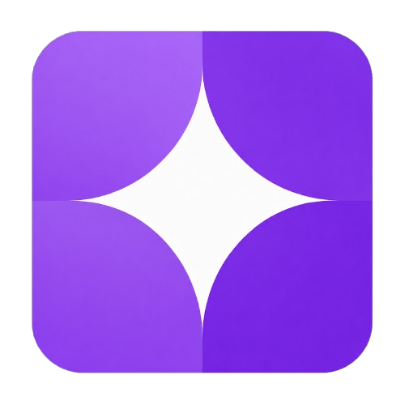

<div align="center">
  <br />
  <a href="https://github.com/manypost/manypost-app">
    <picture>
      
    </picture>
  </a>
  <br />
  <p><strong>Agendador e publicador de posts para redes sociais — 100% open source</strong></p>
  <p>
    Alternativa self-hosted ao Buffer, Hootsuite, Hypefury e Later.<br />
    Compositor multicanal, calendário + kanban, publicação durável com retry e rate-limit,<br />
    aprovação de cliente por link, API REST pública e servidor MCP para agentes de IA.
  </p>
</div>

<p align="center">
  <a href="LICENSE"></a>
  <a href="#-community-x-cloud-a-mesma-base-de-c%C3%B3digo"></a>
  <a href="https://bun.sh"></a>
  <a href="https://hono.dev"></a>
  <a href="https://nextjs.org"></a>
  <a href="https://orm.drizzle.team"></a>
  <a href="docs/principal/STATUS.md"></a>
</p>

## 📋 Índice

- [Sobre o projeto](#-sobre-o-projeto)
- [O que já funciona](#-o-que-já-funciona)
- [Redes suportadas](#-redes-suportadas)
- [Community × Cloud: a mesma base de código](#-community--cloud-a-mesma-base-de-código)
- [Instalação](#-instalação)
- [API pública e servidor MCP](#-api-pública-e-servidor-mcp)
- [Estrutura do monorepo](#️-estrutura-do-monorepo)
- [Mapa de arquitetura e manutenção](#-mapa-de-arquitetura-e-manutenção)
- [Regras invioláveis](#-regras-invioláveis)
- [Documentação](#-documentação)
- [Como contribuir](#-como-contribuir)
- [Atribuição ao Postiz e licença](#️-atribuição-ao-postiz-e-licença)

## 💡 Sobre o projeto

O **manypost** agenda e publica posts em várias redes sociais a partir de um lugar só, rodando na
sua própria infraestrutura — três containers (app, Postgres, Redis), sem stack pesada.

**100% open source, de verdade:** todo o código da aplicação vive neste monorepo sob
[AGPL-3.0](LICENSE) — inclusive billing, workspaces e IA operacional. Não existe repositório
privado, edição enterprise nem feature escondida atrás de licença comercial. A diferença entre a
instalação comunitária e o serviço gerenciado é [uma variável de ambiente](#-community--cloud-a-mesma-base-de-código),
não uma diferença de código. → [por que essa decisão](docs/principal/DECISIONS.md#adendo-v12-2026-07-17--monorepo-único-100-open-source-estratégia-postiz)

- **📅 Agendamento multicanal** — um compositor, N redes, com texto e configurações próprias por
  canal, calendário (dia/semana/mês/lista) e kanban por estado. → [SPEC_FRONTEND](docs/specs/SPEC_FRONTEND.md)
- **🧵 Threads nativas** — sequências com atraso configurável entre itens. O cursor de envio é
  persistido: uma falha no meio retoma de onde parou e **nunca reposta** o que já foi publicado.
  → [SPEC_QUEUE_PUBLISHING §7](docs/specs/SPEC_QUEUE_PUBLISHING.md)
- **🤝 Aprovação de cliente sem login** — link público com validade configurável; o cliente vê o
  preview exato e aprova com um clique (`DRAFT → SCHEDULED`). → [SPEC_API_MCP §3](docs/specs/SPEC_API_MCP.md)
- **🤖 API REST + servidor MCP nativo** — a mesma regra de negócio servindo pessoas e máquinas.
  Conecte um agente (Claude, Cursor) ou automação (n8n, Make). → [detalhes](#-api-pública-e-servidor-mcp)
- **⚡ Publicação durável** — fila no próprio Postgres, retry com backoff exponencial e jitter,
  rate-limit atômico em Redis, semáforo de concorrência por rede e scanner que recupera o que
  ficou para trás. → [SPEC_QUEUE_PUBLISHING](docs/specs/SPEC_QUEUE_PUBLISHING.md)
- **🔐 Segurança de ponta a ponta** — tokens de canal e segredos de webhook cifrados em repouso
  (AES-256-GCM com AAD), rotação de refresh token com detecção de reuso, anti-SSRF em todo fetch de
  URL do usuário. → [SPEC_DATA §5](docs/specs/SPEC_DATA.md)
- **🚫 Nunca repostar na dúvida** — se a rede não confirma o resultado, a publicação vai para
  `NEEDS_REVIEW` e espera um humano. Duplicar post de cliente é dano irreversível.
  → [DECISIONS §7](docs/principal/DECISIONS.md)

## ✅ O que já funciona

O projeto está na **fase 1 (MVP)**. Cada item abaixo tem teste automatizado e/ou E2E real contra
Postgres + Redis + worker de verdade — a lista completa, com a prova e o arquivo de código de cada
um, está no [STATUS.md](docs/principal/STATUS.md#2-o-que-já-está-pronto-e-verificado).

| Área | Estado |
|---|---|
| Conta, login social, JWT com rotação de refresh, API keys com escopo | ✅ |
| Conexão de canais por OAuth ou credenciais, tokens cifrados | ✅ |
| Composer multicanal: texto por canal, mídia, threads, preview por rede | ✅ |
| Calendário, kanban, arrastar para reagendar, retry manual | ✅ |
| Publicação com retry, rate-limit, semáforo e recuperação | ✅ |
| Aprovação por link público, sem login | ✅ |
| Webhooks de saída assinados (HMAC) + eventos em tempo real (SSE) | ✅ |
| Biblioteca de mídia com detecção real de MIME | ✅ |
| API REST pública + servidor MCP + `/metrics` Prometheus | ✅ |
| Billing do serviço gerenciado (desligado por padrão) | ✅ |
| IA de criação · analytics · multi-organização | ⏳ [no backlog](docs/principal/STATUS.md#4-o-que-falta--em-ordem-sugerida-com-referências) |

**Verifique você mesmo:** `bun run check` roda os dois typechecks, a suíte
vigente, fronteiras de arquitetura e checks próprios de IA/marca. →
[como rodar os E2E](docs/operations/development.md#e2e-http)

## 🔌 Redes suportadas

| Rede | Como conecta | Publica | Threads |
|---|---|---|---|
| **Mastodon** | OAuth por instância | texto + mídia | ✅ |
| **Bluesky** | handle + app password | texto + imagens | ✅ |
| **Telegram** | bot token (`/connect` no canal) | texto, foto, vídeo, álbum | ✅ |
| **Discord** (bot) | OAuth2 + bot oficial | texto + mídia, escolha do canal | — |
| **Discord** (webhook) | cola a URL do webhook — sem app | texto + mídia | — |
| **LinkedIn** | OAuth (perfil de membro) | texto + até 20 imagens | ✅ comentários |
| **X** | OAuth2 PKCE (traga sua chave) | texto, imagens, vídeo | ✅ |
| **TikTok** | OAuth2 PKCE | vídeo e foto | — |
| **Threads** | OAuth | texto, mídia e carrossel | ✅ |
| **Instagram** | Instagram Login | imagem, vídeo e carrossel | — |
| **Facebook** | OAuth + Página | texto e mídia | — |
| **Twitch / Kick** | OAuth | chat ao vivo | — |

Configurar as credenciais de cada uma, passo a passo e sem tecniquês:
**[docs/principal/INTEGRATIONS_SETUP.md](docs/principal/INTEGRATIONS_SETUP.md)**.
Provider sem credencial no `.env` simplesmente não aparece na tela de conexões.
Quer adicionar uma rede? → [SPEC_INTEGRATIONS](docs/specs/SPEC_INTEGRATIONS.md) +
[o estado dos gates de cada plataforma](docs/principal/platform-gates.md).

## 🔓 Community × Cloud: a mesma base de código

O modelo é o do [Postiz](https://github.com/gitroomhq/postiz-app): **um monorepo, tudo aberto**.
O que separa a instalação que você roda em casa do serviço gerenciado é o valor de duas variáveis
de ambiente — o binário é o mesmo, e você pode ligar ou desligar qualquer lado.

```bash
IS_SELF_HOSTED=true   # tudo liberado, sem limite de plano
HIDE_BILLING=true     # nenhuma tela de cobrança na interface
```

| | **manypost Community** (você hospeda) | **manypost Cloud** (gerenciado) |
|---|---|---|
| Código | o mesmo deste repositório | o mesmo deste repositório |
| Limites de plano | nenhum | aplicados por `PlanPolicy` |
| Cobrança | inexistente — as rotas nem são montadas | Stripe |
| Redes | todas, com as suas chaves (BYO-key) | todas, chaves inclusas |
| IA | sua própria chave de provedor | franquia inclusa |
| Custo | grátis | assinatura |

Sem `STRIPE_SECRET_KEY` não há cobrança nem bloqueio: a instalação roda liberada, e as rotas de
billing retornam 404 porque nem chegam a existir. → [PLANS.md](docs/principal/PLANS.md) ·
[DECISIONS §15-16](docs/principal/DECISIONS.md#adendo-v12-2026-07-17--monorepo-único-100-open-source-estratégia-postiz) ·
[SPEC_ARCHITECTURE §5](docs/specs/SPEC_ARCHITECTURE.md)

## 🚀 Instalação

### Testar o backend em 5 minutos (só Docker)

```bash
git clone https://github.com/manypost/manypost-app.git manypost
cd manypost
docker compose up
```

Sobe API + worker, Postgres e Redis, aplica as migrations e abre o explorador
em **<http://localhost:3000/docs>**. Esse compose não inicia a interface Next.js.
O guia passo a passo — criar conta, conectar um canal de mentira e ver um post publicar — está em
**[TESTING.md](TESTING.md)**, escrito para quem não programa.

### Desenvolvimento

```bash
bun install
cp .env.example .env      # gere os segredos: openssl rand -hex 32
docker compose up postgres redis -d
bun run dev:all           # API em :3100 + web em :3000
```

| Comando | O que faz |
|---|---|
| `bun run dev:all` | API + web juntos, com hot reload |
| `bun run dev` / `dev:worker` / `dev:web` | cada processo isolado |
| `bun run check` | typecheck + testes + fronteiras + lints de IA e de marca — **rode antes de todo PR** |
| `bun run stripe:sync` | cria o catálogo de planos na sua conta Stripe (só no modo gerenciado) |

Todas as variáveis estão comentadas no [`.env.example`](.env.example).
Deploy, observabilidade e topologia: [SPEC_INFRA](docs/specs/SPEC_INFRA.md).

## 🤖 API pública e servidor MCP

As duas superfícies de máquina são fachadas sobre **os mesmos use-cases** da aplicação — nunca uma
regra de negócio duplicada. → [SPEC_API_MCP](docs/specs/SPEC_API_MCP.md)

- **REST** com API key (`mp_live_`), escopos por chave, `Idempotency-Key` nos POST, rate-limit por
  credencial e OpenAPI 3.1 completo. Explorador ao vivo em `/docs` da sua instância.
- **MCP** (Model Context Protocol) por Streamable HTTP: `list_channels`, `list_posts`, `get_post`,
  `schedule_post`, `update_post`, `cancel_post`, `upload_media_from_url` — com limite anti-loop de
  agente e auditoria de origem em cada mutação.

Em produção elas podem ganhar hosts dedicados (`api.seudominio` e `mcp.seudominio`) apontando para o
mesmo serviço; num self-host de um domínio só, ficam em `/public/v1` e `/mcp`. A tela de
Configurações mostra os endereços e um prompt pronto para colar no seu agente.

## 🏗️ Estrutura do monorepo

```text
apps/api           Bun + Hono: REST (/v1), servidor MCP, webhooks, SSE, OpenAPI
apps/worker        Bun: consumidores da fila (publicação, retry, scanner de zumbis)
apps/web           Next.js + Tailwind: a interface
packages/core      Domínio, use-cases, ports e infra compartilhada (crypto/mídia)
packages/db        Drizzle: schema, migrations e repositórios
packages/providers  Um diretório por rede social
packages/contracts Tipos, schemas e o catálogo de planos — zero lógica
packages/queue     pg-boss, rate-limiter e idempotência em Redis
packages/config    Validação tipada do ambiente (falha rápido no boot)
docs/              Toda a documentação — specs, decisões, status, marca
```

Detalhe de cada fronteira: [SPEC_ARCHITECTURE §4](docs/specs/SPEC_ARCHITECTURE.md).

## 🗺 Mapa de arquitetura e manutenção

A documentação canônica do código vigente começa em
**[docs/architecture/README.md](docs/architecture/README.md)**. O
[mapa do repositório](docs/architecture/repository-map.md) mostra, para cada
app/package, responsabilidade, entradas, dependências, consumidores, riscos,
comandos e onde alterar.

Antes de contribuir, leia [`AGENTS.md`](AGENTS.md) e use o
[workflow OpenSpec](docs/openspec.md). Os documentos históricos em
`docs/principal/` e as specs anteriores continuam preservados, mas podem conter
números e topologias do momento em que foram escritos.

## 🔒 Regras invioláveis

Verificadas por CI em todo PR (`bun run check`):

1. **Monorepo 100% aberto** — nenhuma dependência de código fechado; a separação Community × Cloud é
   sempre de ambiente, nunca de código. → [DECISIONS §15](docs/principal/DECISIONS.md)
2. **Dependência dirigida ao core** — `packages/core` não importa de `apps/*`,
   `packages/db` ou `packages/providers`; o domínio não importa framework
   (`dependency-cruiser`). `packages/core/src/infra` é uma exceção histórica
   documentada. → [arquitetura](docs/architecture/README.md)
3. **Multi-tenant** — toda operação prova escopo por organização diretamente
   ou por pai já escopado; várias tabelas filhas não possuem `org_id`.
   → [dados e riscos](docs/audits/2026-07-23-initial-diagnosis.md)
4. **IA agnóstica** — nenhum provedor de IA nominal fora de `infra/ai/*`, e toda operação passa por
   um teto de custo. → [SPEC_AI](docs/specs/SPEC_AI.md)
5. **Segredos protegidos** — tokens cifrados com chave dedicada, nunca logados.
6. **Derivação declarada** — trecho reconhecivelmente portado do Postiz leva
   `// Derived from Postiz (AGPL-3.0): <arquivo>`. → [ATTRIBUTION.md](ATTRIBUTION.md)
7. **Zero sombras na UI** — hierarquia por borda e camada de fundo, hover sem deslocamento, cores só
   por token. → [BRAND_SYSTEM.md](docs/brand/BRAND_SYSTEM.md)

## 📚 Documentação

Tudo está em **[docs/](docs/README.md)** — comece pelo índice, que roteia por perfil (quem só quer
usar, quem vai contribuir, quem integra por API).

**Código vigente** — [arquitetura](docs/architecture/README.md) ·
[mapa do repositório](docs/architecture/repository-map.md) ·
[OpenSpec](docs/openspec.md) · [`AGENTS.md`](AGENTS.md)

**Estado e planejamento** — [docs/principal/](docs/README.md#principal--estado-decisões-e-planejamento)

| | |
|---|---|
| [STATUS.md](docs/principal/STATUS.md) ⭐ | o que funciona, o que falta, como verificar |
| [CHANGELOG_ONDAS.md](docs/principal/CHANGELOG_ONDAS.md) | cada entrega, com suas provas |
| [DECISIONS.md](docs/principal/DECISIONS.md) | decisões congeladas e o porquê de cada uma |
| [PLANS.md](docs/principal/PLANS.md) | planos do gerenciado e gates comerciais |
| [platform-gates.md](docs/principal/platform-gates.md) | aprovações pendentes por plataforma |
| [INTEGRATIONS_SETUP.md](docs/principal/INTEGRATIONS_SETUP.md) | credenciais de cada rede, sem tecniquês |
| [POSTIZ_ANALYSIS.md](docs/principal/POSTIZ_ANALYSIS.md) | a análise que fundamenta a arquitetura |

**Specs técnicas** — [docs/specs/](docs/README.md#specs--especificações-técnicas)

[ARCHITECTURE](docs/specs/SPEC_ARCHITECTURE.md) ·
[BACKEND](docs/specs/SPEC_BACKEND.md) ·
[FRONTEND](docs/specs/SPEC_FRONTEND.md) ·
[DATA](docs/specs/SPEC_DATA.md) ·
[QUEUE_PUBLISHING](docs/specs/SPEC_QUEUE_PUBLISHING.md) ·
[INTEGRATIONS](docs/specs/SPEC_INTEGRATIONS.md) ·
[API_MCP](docs/specs/SPEC_API_MCP.md) ·
[AI](docs/specs/SPEC_AI.md) ·
[INFRA](docs/specs/SPEC_INFRA.md) ·
[ROADMAP](docs/specs/SPEC_ROADMAP.md)

**Marca e interface** — [docs/brand/](docs/README.md#brand--identidade-visual-normativo-para-ui):
[BRAND_SYSTEM.md](docs/brand/BRAND_SYSTEM.md) (normativo para qualquer tela) ·
[guia de adaptação](docs/brand/README.md)

**Na raiz:** [TESTING.md](TESTING.md) (testar sem programar) ·
[CONTRIBUTING.md](CONTRIBUTING.md) · [CODE_OF_CONDUCT.md](CODE_OF_CONDUCT.md) ·
[ATTRIBUTION.md](ATTRIBUTION.md) · [NOTICE](NOTICE) · [LICENSE](LICENSE) ·
[AGENTS.md](AGENTS.md) (instruções canônicas para humanos e agentes) ·
[CLAUDE.md](CLAUDE.md) (instruções legadas específicas)

## 🤝 Como contribuir

Toda contribuição é bem-vinda — código, documentação, tradução, um provider novo ou um bug bem
descrito. O contrato técnico (branches, commits, `bun run check`) está em
**[CONTRIBUTING.md](CONTRIBUTING.md)**, e a convivência em
[CODE_OF_CONDUCT.md](CODE_OF_CONDUCT.md).

Bons pontos de partida: o [backlog do STATUS](docs/principal/STATUS.md#4-o-que-falta--em-ordem-sugerida-com-referências)
lista o que ficou de fora de cada fatia entregue, com a spec de referência.
Para adicionar uma rede social, [SPEC_INTEGRATIONS](docs/specs/SPEC_INTEGRATIONS.md) descreve o
contrato e existe um test-kit que valida qualquer provider novo.

## ⚖️ Atribuição ao Postiz e licença

O manypost é **derivado em conceito e arquitetura do [Postiz](https://github.com/gitroomhq/postiz-app)**
(AGPL-3.0), estudado no commit `84edda5b02ea4a0aa31263a6aa52bc02b50f109f`.

Não é uma cópia literal — a stack é outra (Bun/Hono/Drizzle no lugar de NestJS/Prisma) —, mas o
contrato de provider, a taxonomia de erros, o pipeline de publicação e o modelo de dados essencial
seguem a direção deles. Por respeito ao trabalho original e em conformidade com a licença,
**este repositório inteiro é AGPL-3.0**. Cada elemento derivado está listado em
[ATTRIBUTION.md](ATTRIBUTION.md) e analisado em
[POSTIZ_ANALYSIS.md](docs/principal/POSTIZ_ANALYSIS.md).

Licença completa: [LICENSE](LICENSE) · avisos de terceiros: [NOTICE](NOTICE).

---

<div align="center">
  <sub>
    <a href="#-sobre-o-projeto">Topo</a> ·
    <a href="docs/README.md">Documentação</a> ·
    <a href="docs/principal/STATUS.md">Status</a> ·
    <a href="TESTING.md">Testar</a> ·
    <a href="CONTRIBUTING.md">Contribuir</a> ·
    <a href="LICENSE">AGPL-3.0</a>
  </sub>
</div>
