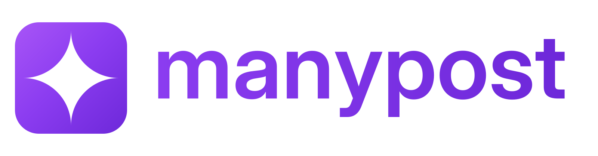
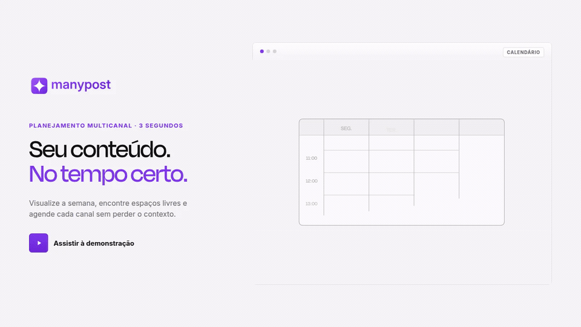
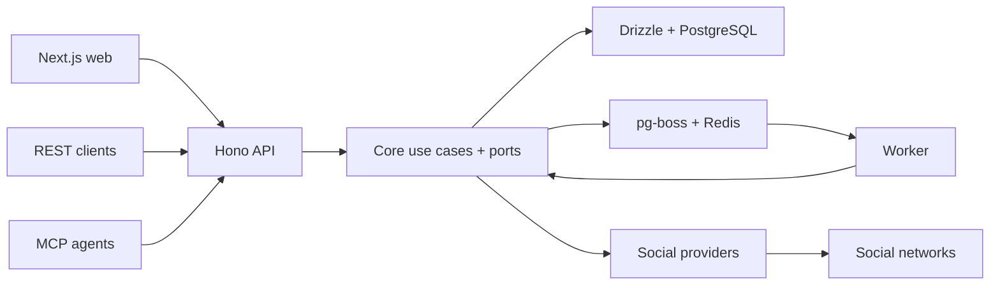

<h1 align="center">
  <a href="https://github.com/manypost/manypost-app">
    
  </a>
</h1>

<p align="center">
  <strong>Crie, aprove, agende e publique em todas as suas redes a partir de um só lugar.</strong>
</p>

<p align="center">
  Plataforma open source de publicação multicanal para equipes, automações e agentes de IA.<br />
  Um compositor, um calendário e uma infraestrutura confiável — da ideia ao post publicado.
</p>

<p align="center">
  <a href="https://github.com/manypost/manypost-app/actions/workflows/ci.yml">
    
  </a>
  <a href="LICENSE">
    
  </a>
  <a href="https://bun.sh">
    
  </a>
  <a href="https://www.typescriptlang.org">
    
  </a>
  <a href="apps/web/openapi.json">
    
  </a>
  <a href="#community-e-cloud">
    
  </a>
</p>

<p align="center">
  <a href="#início-rápido">Início rápido</a> ·
  <a href="#o-que-o-manypost-entrega">Recursos</a> ·
  <a href="#redes-e-destinos">Integrações</a> ·
  <a href="#arquitetura">Arquitetura</a> ·
  <a href="docs/README.md">Documentação</a> ·
  <a href="CONTRIBUTING.md">Contribuir</a>
</p>

<br />

<a href="docs/media/manypost-calendar.mp4">
  
</a>

<p align="center">
  <sub>▶ A demonstração inicia automaticamente e reinicia em loop. Clique para abrir o MP4.</sub>
</p>

## Visão geral

O **manypost** reúne o ciclo de conteúdo social em uma única plataforma:
conexão de canais, criação por rede, calendário, aprovação externa, publicação
assíncrona, recuperação de falhas e automação por API ou MCP.

Ele foi desenhado para dois usos que compartilham a mesma regra de negócio:

- **equipes e agências** trabalham pela interface web, com previews por canal,
  calendário, kanban, threads e aprovação de cliente sem login;
- **desenvolvedores e agentes** operam pela API REST pública ou pelo servidor
  MCP, com escopos, idempotência, rate limit e auditoria.

> [!IMPORTANT]
> Community e Cloud usam exatamente este monorepo AGPL-3.0. Não existe edição
> enterprise fechada nem recurso mantido em outro repositório.

## O que o manypost entrega

<table>
  <tr>
    <td width="33%" valign="top">
      <strong>Compositor multicanal</strong><br />
      Texto global ou por rede, mídia, threads, previews e validações específicas
      de cada destino.
    </td>
    <td width="33%" valign="top">
      <strong>Calendário e kanban</strong><br />
      Visualizações por dia, semana, mês ou lista, com drag-and-drop e estados de
      publicação.
    </td>
    <td width="33%" valign="top">
      <strong>Aprovação sem login</strong><br />
      Compartilhe um link temporário para o cliente revisar e aprovar o conteúdo.
    </td>
  </tr>
  <tr>
    <td width="33%" valign="top">
      <strong>Publicação durável</strong><br />
      pg-boss, retry com backoff, rate limit, fencing, idempotência e recuperação
      de jobs interrompidos.
    </td>
    <td width="33%" valign="top">
      <strong>IA dentro do fluxo</strong><br />
      Legendas, reescrita, hashtags, alt text, rascunhos multicanal e sugestões de
      horário com orçamento controlado.
    </td>
    <td width="33%" valign="top">
      <strong>REST + MCP nativos</strong><br />
      OpenAPI 3.1, API keys com escopos, webhooks assinados e ferramentas para
      agentes de IA.
    </td>
  </tr>
</table>

### Segurança como comportamento de produto

- tokens de canais e segredos de webhook cifrados em repouso com AES-256-GCM;
- isolamento multi-tenant por organização em toda operação;
- proteção anti-SSRF com validação e pin de DNS nos fetches externos;
- estados de publicação condicionais para impedir concorrência e jobs obsoletos;
- resultado externo incerto vai para `NEEDS_REVIEW`, nunca para retry cego;
- logs estruturados com request/correlation IDs, sem tokens ou conteúdo sensível.

## Início rápido

### Explorar o backend com Docker

O ambiente local sobe API, worker, PostgreSQL e Redis e disponibiliza o
explorador OpenAPI em **<http://localhost:3000/docs>**.

```bash
git clone https://github.com/manypost/manypost-app.git
cd manypost-app
cp .env.example .env
# Preencha no .env as chaves de teste do Clerk indicadas no arquivo.
docker compose up --build
```

Para conectar o provider de teste e acompanhar uma publicação completa, siga o
guia [TESTING.md](TESTING.md).

### Rodar a aplicação completa em desenvolvimento

Pré-requisitos: [Bun 1.3.14](https://bun.sh), PostgreSQL, Redis e credenciais de
teste do Clerk.

```bash
bun install --frozen-lockfile
cp .env.example .env
# Configure as variáveis obrigatórias descritas no arquivo.
docker compose up postgres redis -d
PORT=3100 bun run dev:all
```

- web: <http://localhost:3000>
- API: <http://localhost:3100>
- documentação OpenAPI: <http://localhost:3100/docs>

O guia de desenvolvimento cobre setup, testes, debug e E2E:
[docs/operations/development.md](docs/operations/development.md).

## Redes e destinos

O registry atual possui **16 adapters reais**. A disponibilidade na interface
depende das credenciais da instalação e dos gates externos de cada plataforma.

| Categoria | Destinos |
| --- | --- |
| Redes sociais | Instagram, Facebook Pages, Threads, TikTok, X, LinkedIn, Bluesky e Mastodon |
| Vídeo e artigos | YouTube e Dev.to |
| Comunidades | Telegram e Discord, por OAuth ou webhook |
| Live chat | Twitch e Kick |

Cada adapter declara limites de texto e mídia, settings próprios, classificação
de erro e suporte a replies/threads. Veja como configurar credenciais em
[INTEGRATIONS_SETUP.md](docs/principal/INTEGRATIONS_SETUP.md) e como adicionar
um provider no [guia de integrações](docs/specs/SPEC_INTEGRATIONS.md).

## Arquitetura

Todas as superfícies chegam aos mesmos casos de uso. HTTP adapta transporte,
repositories adaptam persistência e providers adaptam cada rede social.


```mermaid
flowchart LR
  Web["Next.js web"] --> API["Hono API"]
  REST["REST clients"] --> API
  Agents["MCP agents"] --> API

  API --> Core["Core use cases + ports"]
  Core --> DB["Drizzle + PostgreSQL"]
  Core --> Queue["pg-boss + Redis"]
  Core --> Providers["Social providers"]

  Queue --> Worker["Worker"]
  Worker --> Core
  Providers --> Networks["Social networks"]
```

| Módulo | Responsabilidade |
| --- | --- |
| `apps/web` | Next.js App Router, interface e cliente OpenAPI gerado |
| `apps/api` | Hono, auth, REST interna/pública, MCP, webhooks e OpenAPI |
| `apps/worker` | entrada dedicada do runtime pg-boss |
| `packages/core` | domínio, casos de uso e ports |
| `packages/db` | Drizzle, migrations e repositories PostgreSQL |
| `packages/providers` | adapters das redes sociais |
| `packages/queue` | jobs, Redis, rate limit, idempotência e realtime |
| `packages/contracts` | tipos, schemas, enums e eventos compartilhados |

Comece pela [arquitetura vigente](docs/architecture/README.md) e pelo
[mapa do repositório](docs/architecture/repository-map.md). As fronteiras são
verificadas automaticamente pelo CI.

## API pública e servidor MCP

A API pública usa chaves `mp_live_`, escopos por credencial,
`Idempotency-Key` nas mutações e problem+json com códigos estáveis. O contrato
OpenAPI 3.1 fica disponível em `/openapi.json` e `/docs` de cada instância.

O servidor MCP expõe operações de consulta e agendamento sobre os mesmos casos
de uso da API. A coleção completa para desenvolvimento e integração está em
[`postman/`](postman/README.md).

## Community e Cloud

O binário e o banco de código são os mesmos nos dois modos. A diferença é
operacional, configurada por ambiente:

```bash
IS_SELF_HOSTED=true
HIDE_BILLING=true
```

| | Community | Cloud gerenciado |
| --- | --- | --- |
| Código | este monorepo | este monorepo |
| Licença | AGPL-3.0 | AGPL-3.0 |
| Limites de plano | desativados | aplicados por `PlanPolicy` |
| Billing | rotas não montadas | Stripe |
| Credenciais das redes | fornecidas por você | operadas pelo serviço |
| Infraestrutura | sua | gerenciada |

Sem configuração Stripe, a instalação self-hosted não cobra nem aplica limites
comerciais. A decisão e suas implicações estão documentadas em
[DECISIONS.md](docs/principal/DECISIONS.md) e
[PLANS.md](docs/principal/PLANS.md).

## Desenvolvimento e qualidade

Bun é obrigatório; o projeto não usa npm, pnpm ou Yarn.

```bash
bun run check          # typechecks, testes, fronteiras, IA e identidade
bun run db:check       # schema e migrations Drizzle
bun run build:web      # build Next.js de produção
bun run spec:validate  # OpenSpec estrito
```

Features e mudanças de comportamento seguem o fluxo
[OpenSpec](docs/openspec.md): proposta, requisitos, design quando necessário,
tasks test-first, validação e archive depois da implementação.

## Documentação

| Quero… | Começar por |
| --- | --- |
| testar sem conhecer a codebase | [TESTING.md](TESTING.md) |
| instalar e desenvolver | [guia de desenvolvimento](docs/operations/development.md) |
| entender componentes e fluxos | [arquitetura](docs/architecture/README.md) |
| integrar via REST ou MCP | [spec de API/MCP](docs/specs/SPEC_API_MCP.md) e [Postman](postman/README.md) |
| configurar uma rede | [guia de integrações](docs/principal/INTEGRATIONS_SETUP.md) |
| conhecer o estado do projeto | [STATUS.md](docs/principal/STATUS.md) |
| entender decisões técnicas | [DECISIONS.md](docs/principal/DECISIONS.md) |
| contribuir | [CONTRIBUTING.md](CONTRIBUTING.md) e [AGENTS.md](AGENTS.md) |

O índice completo está em [docs/README.md](docs/README.md).

## Contribuição e licença

Contribuições de código, documentação, traduções e novos providers são
bem-vindas. Antes de começar, leia o [guia de contribuição](CONTRIBUTING.md), o
[código de conduta](CODE_OF_CONDUCT.md) e as regras operacionais em
[AGENTS.md](AGENTS.md).

O manypost é derivado em conceito e arquitetura do
[Postiz](https://github.com/gitroomhq/postiz-app), também AGPL-3.0. A stack é
própria, mas contratos e decisões reconhecidamente derivados são preservados e
declarados em [ATTRIBUTION.md](ATTRIBUTION.md) e
[POSTIZ_ANALYSIS.md](docs/principal/POSTIZ_ANALYSIS.md).

Distribuído sob a [GNU Affero General Public License v3.0](LICENSE). Avisos de
terceiros estão em [NOTICE](NOTICE).

---

<p align="center">
  <a href="#visão-geral">Topo</a> ·
  <a href="docs/README.md">Documentação</a> ·
  <a href="docs/principal/STATUS.md">Status</a> ·
  <a href="CHANGELOG.md">Changelog</a> ·
  <a href="LICENSE">AGPL-3.0</a>
</p>
