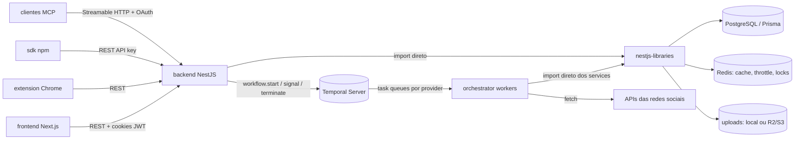
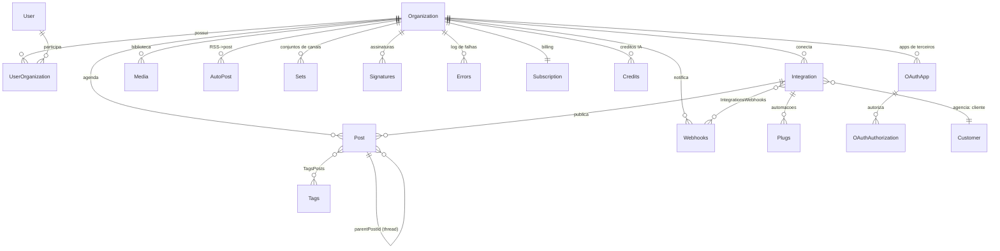

# POSTIZ_ANALYSIS.md — Avaliação técnica do Postiz

> **Objeto de estudo:** [gitroomhq/postiz-app](https://github.com/gitroomhq/postiz-app), licença **AGPL-3.0**.
> **Commit analisado:** `84edda5b02ea4a0aa31263a6aa52bc02b50f109f` (2026-07-05).
> **Propósito:** base de decisão para o **manypost**, reimplementação das soluções do Postiz em nova stack (Bun/TS, Hono, Next.js, Drizzle/Postgres, Redis). O núcleo do manypost é derivado conceitualmente do Postiz e portanto **AGPL-3.0 com atribuição** (ver §8).

---

## 1. Arquitetura geral

### 1.1 Monorepo

Monorepo **pnpm workspaces** (herança de Nx, hoje só pnpm + tsconfig paths), com um único `package.json` de dependências na raiz — todos os apps compartilham as mesmas versões. Aliases `@gitroom/*` apontam para os pacotes internos.

```
postiz-app/
├── apps/
│   ├── backend/        # API HTTP (NestJS 11) — controllers finos
│   ├── orchestrator/   # Workers Temporal (NestJS) — workflows + activities
│   ├── frontend/       # Next.js 16 App Router + React 19 (CLAUDE.md indica migração p/ Vite)
│   ├── commands/       # CLI administrativa (nestjs-command)
│   ├── extension/      # Extensão Chrome (Vite + CRXJS) p/ providers baseados em cookie
│   └── sdk/            # SDK público (npm) sobre a API pública
├── libraries/
│   ├── helpers/            # AuthService (JWT/bcrypt/crypto), swagger, utils, decorators
│   ├── nestjs-libraries/   # O CORAÇÃO: database/prisma, integrations, temporal, redis,
│   │                       # chat (MCP/Mastra), agent, openai, upload, dtos, emails,
│   │                       # short-linking, throttler, track, videos, 3rdparties
│   └── react-shared-libraries/  # componentes/hooks compartilhados com a extensão
└── docker-compose.yaml # postiz + postgres 17 + redis 7.2 + stack Temporal completa
```

**Princípio central (documentado no CLAUDE.md deles):** a lógica de negócio vive em `libraries/nestjs-libraries`; `apps/backend` é quase só controllers. Camadas obrigatórias: `Controller → (Manager) → Service → Repository`, sem atalhos. Backend e orchestrator importam **os mesmos services** — a activity Temporal chama `PostsService`/`IntegrationService` diretamente, sem RPC entre apps.

### 1.2 Comunicação entre módulos



Não há barramento de eventos próprio: o acoplamento é por **biblioteca compartilhada + banco + Temporal**. Simples e eficaz para monólito modular; o custo é que backend e workers precisam ser deployados da mesma árvore de código.

---

## 2. Stack e as decisões por trás

| Camada | Escolha do Postiz | Racional aparente / observações |
|---|---|---|
| Backend | NestJS 11 + Express | DI, guards, pipes, decorators; convenção forte de camadas. Verboso, mas disciplina o time. |
| Jobs | **Temporal** (migrado de BullMQ) | Necessidade real: timers duráveis de dias/semanas, retry com histórico, visibilidade (Temporal UI + ES), concorrência por task queue. A migração é a maior lição do projeto (ver §3.4). |
| ORM/DB | Prisma 6.5 + PostgreSQL | Produtividade; porém usam `prisma db push` (sem migrations versionadas!) — risco em produção, admitido no próprio script `prisma-db-push --accept-data-loss`. |
| Cache/infra | Redis (ioredis) | throttling da API (`@nest-lab/throttler-storage-redis`), cache de mentions, locks. |
| Frontend | Next.js 16 App Router, React 19, Mantine 5 + Tailwind 3, SWR, Zustand | UI própria acumulada; CLAUDE.md declara migração para Vite (SSR do Next é pouco usado — o app é essencialmente um SPA autenticado). |
| Editor | TipTap 3 (rich) + `@uiw/react-md-editor` (markdown) + Polotno (design de imagem) | Editor por tipo declarado pelo provider (`editor: 'normal' | 'markdown' | 'html' | 'none'`). |
| Upload | Uppy + local ou Cloudflare R2 (SDK S3) | `UploadFactory` por env. |
| Auth | JWT próprio (`jsonwebtoken`, HS256) + bcrypt; providers LOCAL/GITHUB/GOOGLE/FARCASTER/WALLET/GENERIC(OIDC) | **Sem refresh token, sem expiração do JWT** — cookie de sessão eterno. Fraqueza (ver §5). |
| Billing | Stripe (+ marketplace com Connect) | Fechado ao SaaS deles via env. |
| IA | OpenAI SDK + Mastra (agente) + LangChain/LangGraph + CopilotKit (UI) | Agente "postiz" com tools; MCP server exposto por cima (ver §3.10). |
| Observabilidade | Sentry (+ Spotlight local), PostHog/Plausible | Sem OpenTelemetry estruturado; logging ad-hoc. |

---

## 3. Como resolvem cada problema-chave

### 3.1 Integração por rede social

**Um provider = uma classe** que estende `SocialAbstract` e implementa `SocialProvider` (`libraries/nestjs-libraries/src/integrations/social/social.integrations.interface.ts`). A interface unifica **três papéis**: autenticador OAuth (`generateAuthUrl`, `authenticate`, `refreshToken`), publicador (`post`, `comment`) e capacidades opcionais (`analytics`, `mention`, `changeNickname`, `fetchPageInformation`…).

Metadados declarativos por provider (verificados no código):

| Campo | Função |
|---|---|
| `identifier` | chave do provider (`x`, `linkedin`, `linkedin-page`, …) |
| `maxConcurrentJob` | **concorrência global de publicação** (X=1, Reddit=1, LinkedIn=2, Pinterest=3, YouTube=200, Instagram=400, Facebook=500, TikTok=10000) — vira a concorrência do worker Temporal da task queue do provider |
| `isBetweenSteps` | conexão em 2 passos (Facebook/Instagram/YouTube: escolher página/conta após OAuth) |
| `scopes` | escopos exigidos; `checkScopes()` valida o retorno e lança `NotEnoughScopes` |
| `editor` | tipo de editor no composer |
| `maxLength(settings)` | limite de caracteres dinâmico (X muda com premium) |
| `checkValidity(posts, settings)` | regras de mídia por plataforma (dimensões via sharp, contagens, formatos) — roda **no servidor** |
| `customFields()` | providers self-hosted (Mastodon custom, WordPress, Listmonk, Skool…) pedem credenciais próprias |
| `externalUrl` | instância custom (client_id/secret por instância) |
| `isChromeExtension` + `extensionCookies` | providers sem API pública operados via extensão (cookies) |
| `@Tool/@Plug/@InternalPlug` (decorators + `reflect-metadata`) | expõem ações extras (ex.: auto-repost ao atingir N likes) descobertas pelo `IntegrationManager` |

Um `IntegrationManager` mantém a lista estática dos **34 providers** e serve de registry (lookup por identifier, catálogo para o frontend, catálogo de tools/plugs).

**Avaliação:** ótima direção — o registry declarativo é o que permite 34 redes com um só pipeline. Fraquezas: a interface acumulou responsabilidades demais (auth + publish + analytics + UI hints num só contrato); tudo é `any`/JSON string em `settings`; não há testes de contrato por provider.

### 3.2 Fluxo OAuth por plataforma

1. `POST /integrations/provider/:id/connect` → `generateAuthUrl()` do provider retorna `{url, codeVerifier, state}`. O par state/verifier é persistido temporariamente; o frontend redireciona.
2. Callback `GET /integrations/social/:integration` → `authenticate({code, codeVerifier})` troca o code, retorna `AuthTokenDetails` (id externo, name, username, picture, accessToken, refreshToken, expiresIn).
3. `IntegrationService.createOrUpdateIntegration` grava a `Integration` (upsert por `organizationId + internalId`).
4. Se `isBetweenSteps` → flag `inBetweenSteps` na Integration e o frontend abre o passo 2 (ex.: seleção de página do Facebook via `fetchPageInformation`), com `reConnect`/`saveProviderPage` concluindo.
5. Refresh: proativo via workflow Temporal (`refresh.token.workflow` para providers com `refreshCron`) **e** reativo — erro classificado como `refresh-token` durante publicação dispara `refreshTokenWithCause` e retry (ver §3.5). Se o refresh falha, `refreshNeeded=true` e o usuário é notificado para reconectar.

Variações por plataforma tratadas via campos da interface: PKCE onde a rede exige (codeVerifier no contrato), OAuth1.0a no X (twitter-api-v2), instâncias custom (Mastodon), device/credentials para self-hosted (Bluesky app password, etc.).

**Avaliação:** o contrato `generateAuthUrl/authenticate/reConnect` cobre bem a variedade real. **Fraqueza crítica confirmada:** `Integration.token`/`refreshToken` são gravados **sem criptografia** (nenhum uso de `fixedEncryption` no repositório de integrations; a criptografia AES existe em `helpers/auth.service.ts` mas só é usada para credenciais de providers custom, apiKeys e OAuth apps). Além disso, a criptografia disponível é AES-256-**CBC** com chave e **IV fixos** derivados do `JWT_SECRET` via `EVP_BytesToKey` (MD5) — determinística e acoplada ao segredo do JWT.

### 3.3 Agendamento

Modelo: **1 linha `Post` por canal por item de conteúdo**. Um "post multi-canal" é um conjunto de linhas ligadas por `group` (uuid); uma thread (X) ou comentários encadeados são linhas ligadas por `parentPostId`. Campos-chave: `publishDate`, `state` (`QUEUE|PUBLISHED|ERROR|DRAFT`), `settings` (JSON string por provider), `intervalInDays` (repetição), `error`, `releaseURL`.

Ao criar/atualizar um post agendado, `PostsService.startWorkflow`:
- consulta workflows Temporal rodando com search attribute `postId` e **termina** os antigos;
- inicia `postWorkflowV105` com `workflowId: post_{postId}` e `workflowIdConflictPolicy: 'TERMINATE_EXISTING'` — **idempotência por workflow id**;
- o workflow dorme (`sleep`) até `publishDate` — **timer durável**: sobrevive a restart de worker, é cancelado junto com o workflow se o post for deletado/editado.

Horários preferidos por canal (`postingTimes` na Integration) e `findFreeDateTime` calculam o próximo slot livre. Repetição (`intervalInDays`) é feita pelo próprio workflow disparando um child workflow com `parentClosePolicy: 'ABANDON'`.

**Avaliação:** editar/deletar = terminar workflow e recriar é elegante e evita o inferno de "cancelar delayed job na fila". A versão de workflow no nome (`v1.0.1`→`v1.0.5`) resolve o determinismo do Temporal em deploys — boa prática deles que vale copiar como conceito.

### 3.4 Fila / workers

A configuração Temporal (`libraries/nestjs-libraries/src/temporal/temporal.module.ts`) cria **uma task queue por provider** (identifier sem sufixo: `x`, `linkedin`, `reddit`…) mais a `main`. O worker de cada queue tem `maxConcurrentActivityTaskExecutions = maxConcurrentJob` do provider — ou seja, **o rate-limit global por rede é implementado como concorrência da fila**. Para multi-servidor: `WORKER_CONCURRENCY_DIVIDER` divide a cota entre réplicas e `EXCLUDE_QUEUE` "pina" queues de concorrência 1 (X, Reddit) num único servidor.

O workflow `postWorkflowV105` (o pipeline de publicação inteiro):
1. `getPost` → valida existência, estado `QUEUE`, assinatura ativa (se SaaS);
2. `sleep` até `publishDate`;
3. valida canal (`refreshNeeded`? `disabled`? → notifica + `ERROR`);
4. publica post principal, depois comentários/thread em sequência (com `delay` opcional entre eles), cada um via activity `postSocial`/`postComment` na task queue do provider;
5. loop de até 5 tentativas por item interceptando `ApplicationFailure` tipada: `refresh_token` → activity `refreshTokenWithCause` e repete; `bad_body` → falha definitiva com notificação; outros → `ERROR`;
6. `updatePost` (postId externo + releaseURL), notificação in-app, `sendWebhooks`;
7. processa **plugs** (automações pós-publicação) ordenadas por delay, com sleeps duráveis;
8. `intervalInDays` → child workflow de repetição.

**Recuperação de falha:** workflow infinito `missing.post.workflow` roda periodicamente `searchForMissingThreeHoursPosts` e faz `signalWithStart` (`poke`, `USE_EXISTING`) — se o workflow do post morreu/nunca nasceu, renasce; se está vivo, o signal é inócuo. **Rede de segurança essencial** que vale reimplementar.

**Avaliação:** desenho maduro; é o resultado de terem batido nas limitações do BullMQ (timers longos frágeis, sem histórico, rate-limit global multi-processo difícil). Custos: stack Temporal pesada para self-host (server + Postgres próprio + Elasticsearch + UI = 4 containers extras), curva de aprendizado de determinismo, e erros engolidos silenciosamente (`catch (err) {}` em vários pontos do `startWorkflow`).

### 3.5 Retry e rate-limit

Três camadas (confirmadas no código):

1. **HTTP por provider** — `SocialAbstract.fetch()`: em 429 / 500-sem-classificação / corpo contendo "rate limit", espera 5s e tenta de novo (máx. 3); 401 ou classificação `refresh-token` lança `RefreshToken`; resto lança `BadBody`. Cada provider pode sobrescrever `handleErrors(body, status)` para mapear erros idiossincráticos da rede para `refresh-token | bad-body | retry`. Mensagens truncadas (2k/4k chars) para não estourar o limite gRPC do histórico Temporal — detalhe fino de produção.
2. **Activity Temporal** — retry policy 3 tentativas, intervalo 2min, `startToCloseTimeout` 10min. `RefreshToken`/`BadBody` são `ApplicationFailure` **non-retryable**: o retry burro não repete erro de negócio; quem decide é o workflow.
3. **Workflow** — loop de 5 iterações tratando `refresh_token` (refresh + retry) e `bad_body` (aborta).

Rate-limit **de publicação** = concorrência da task queue (§3.4). Rate-limit **da API pública** = `@nestjs/throttler` com storage Redis (default 90 req/h, configurável via `API_LIMIT`).

**Avaliação:** a taxonomia de erros (`retry` / `refresh-token` / `bad-body`) é a peça mais valiosa. Fraquezas: backoff fixo (5s) sem jitter e sem respeitar `Retry-After`; concorrência ≠ rate real (X: 1 concorrente ainda pode exceder janelas por minuto); sem métricas por provider.

### 3.6 Editor / composição de post

`apps/frontend/src/components/new-launch/`: modal de composição com **modo global** (um conteúdo para todos os canais) e **abas por canal** (override de conteúdo + settings específicos). Cada provider tem um componente de settings próprio (`providers/`) validado por DTO (class-validator) — o mesmo DTO valida no backend. Editor conforme `provider.editor`; mentions com autocomplete por rede (`mention()` no provider, cache na tabela `Mentions`); mídia via biblioteca (Uppy, compressão client-side); preview por rede (`provider-preview/`); IA embutida (CopilotKit) para gerar/reescrever texto e imagem (créditos). Validação server-side consolidada em `PostsService.validatePosts` (conteúdo vazio, `maxLength`, `checkValidity` de mídia, DTO por provider) — migraram a validação do client para o server (comentário explícito no código).

**Avaliação:** o dual global/per-canal com settings tipados por provider é a UX correta para multi-rede e vale seguir. A implementação React é pesada (estado gigante em um modal, Mantine+SCSS+Tailwind misturados).

### 3.7 Kanban / calendário

O Postiz **não tem kanban**: a tela "launches" é um calendário com modos `week | month | day | list` (`calendar.context.tsx`, confirmado) + drag-and-drop (react-dnd) para reagendar, filtros por customer/tag/canal. Fluxo de aprovação existe só no marketplace (buyer/seller) e num campo `approvedSubmitForOrder`.

**Para o manypost:** o kanban por estado (Draft → Aguardando aprovação → Agendado → Publicado/Erro) será **design original nosso no núcleo AGPL**, reusando os estados que o Postiz já modela; aprovação avançada/governança fica no premium.

### 3.8 Analytics

Interface opcional no provider: `analytics(id, token, days)` e `postAnalytics(...)` → `AnalyticsData[] {label, data[{date,total}], percentageChange}`. O backend agrega sob demanda (com cache Redis) e o frontend plota (chart.js). Sem warehouse próprio: os números vêm da API de cada rede na hora. Há ainda `Star`/`Trending` (herança GitHub/gitroom) — irrelevante para o manypost.

**Avaliação:** suficiente para "analytics por canal", limitado para comparação/benchmarking (não persiste séries históricas — cada consulta re-busca). No manypost: núcleo segue essa direção (fetch on-demand por provider + cache); benchmarking/histórico/alertas = premium original.

### 3.9 API pública

`/public/v1` (controller único `public.integrations.controller.ts`): auth por header `Authorization` com **API key da organização** (`Organization.apiKey`) ou token OAuth `pos_*` (apps de terceiros via `OAuthApp`/`OAuthAuthorization` — o Postiz é *authorization server*). Throttle Redis. Endpoints: upload (com allowlist de MIME real via magic bytes + dispatcher anti-SSRF — cuidado de segurança recente e correto), posts CRUD, integrations list, etc. Swagger via decorators. O `apps/sdk` publica cliente npm sobre essa API. Fraquezas: API key única por organização (sem escopos, sem rotação, comparação direta no banco sem hash), versionamento só no path.

### 3.10 MCP

`libraries/nestjs-libraries/src/chat/start.mcp.ts` (montado no bootstrap do backend): um `MCPServer` (Mastra) expõe o **agente "postiz" + tools** (agendar post, listar integrações/grupos, gerar imagem/vídeo, upload por URL — mesmos services da API). Dois modos de auth:
- **API key** direta;
- **OAuth 2.1 completo para MCP**: `/.well-known/oauth-protected-resource` (RFC 9728) + `/.well-known/oauth-authorization-server`, authorization code + PKCE S256, scopes `mcp:read/mcp:write`, tokens `pos_*` — compatível com ChatGPT Apps/Claude.

`CreationMethod` no Post registra a origem (`WEB|MCP|API|AUTOPOST|CLI`) — auditoria simples de canal de criação.

**Avaliação:** direção certíssima (MCP sobre o mesmo core, OAuth spec-compliant). No manypost, seguir a direção mas com o SDK oficial `@modelcontextprotocol/sdk` em vez de acoplar o MCP ao framework de agente (no Postiz, o MCP depende do Mastra).

---

## 4. Modelo de dados (essência)



Pontos dignos de nota:
- `Integration` concentra tudo do canal: tokens, `providerIdentifier`, `postingTimes` (JSON), `customInstanceDetails`, `additionalSettings` (JSON), `customerId` (modo agência), `rootInternalId` (conta raiz de páginas), flags `refreshNeeded/inBetweenSteps/disabled`.
- `Post.group` (multi-canal) + `parentPostId` (thread) + `intervalInDays` (recorrência) + `settings` JSON por provider.
- Soft-delete (`deletedAt`) em quase tudo; índices generosos (ver schema).
- Muita coisa é **String contendo JSON** (settings, postingTimes, additionalSettings) — sem `jsonb`, sem validação no banco.
- Subsistema de marketplace (Orders/Messages/PayoutProblems/SocialMediaAgency) e tabelas `mastra_*` (memória/traces do agente) — fora do escopo do manypost MVP.

---

## 5. Pontos fortes e fracos — o que seguir vs. melhorar

| Área | Forte (seguir a direção) | Fraco (melhorar no manypost) |
|---|---|---|
| Registry de providers | Interface única + metadados declarativos + registry; escala p/ dezenas de redes | Interface monolítica → separar ports (Auth/Publish/Analytics/Capabilities); tipar `settings` com Zod por provider |
| Publicação durável | Workflow por post, timer durável, terminate-e-recria na edição, workflow versionado, scanner de posts perdidos | Stack Temporal pesada p/ self-host; erros engolidos; sem outbox transacional (start do workflow pode falhar após commit) |
| Taxonomia de erros | `retry / refresh-token / bad-body` + `handleErrors` por provider | Backoff fixo sem jitter/`Retry-After`; concorrência como proxy de rate-limit; sem token bucket real por conta |
| Modelo de dados | Post por canal + group + parent; Integration rica; soft-delete | JSON em string; `db push` sem migrations; tokens **em claro**; crypto legada CBC/IV fixo |
| Auth | Multi-provider, multi-org com roles | JWT eterno sem refresh/rotação; API key sem hash/escopo; segredo único p/ tudo |
| Composer | Global + per-canal, settings DTO compartilhado client/server, validação server-side, mentions por rede | Estado frontend gigante; mistura Mantine/SCSS/Tailwind |
| API pública | API key + OAuth provider próprio, anti-SSRF, MIME real, throttle Redis | Sem escopos/rotação de key; um controller só; OpenAPI pobre |
| MCP | OAuth 2.1 spec-compliant, tools = services da API, `CreationMethod` p/ auditoria | Acoplado ao Mastra; sem políticas por tool |
| Infra | Imagem única fácil de self-hostar; env-driven; ConfigurationChecker | 4 containers extras p/ Temporal (com Elasticsearch!); observabilidade só Sentry |
| IA | Créditos por org; agente com tools reais; CopilotKit no composer | Provider hard-coded (OpenAI espalhado); sem teto de custo por operação |

---

## 6. Núcleo (seguir direção do Postiz, AGPL) vs. premium (original)

**Núcleo manypost — seguindo a direção do Postiz (AGPL):**
- Registry de providers + interface de canal (§3.1, §3.2) — com as correções de design acima.
- Agendamento durável + pipeline de publicação + recuperação (§3.3–3.5).
- Modelo de dados essencial (§4, sem marketplace/mastra).
- Composer global/per-canal com validação compartilhada (§3.6).
- Calendário (e o kanban, design nosso) (§3.7).
- Analytics on-demand por provider (§3.8).
- API pública + MCP sobre o mesmo core (§3.9, §3.10).
- IA de criação com franquia por plano (créditos, como o Postiz).

**Premium manypost — implementação original, não derivada:**
- IA operacional: assistente de respostas, roteamento de menções, benchmarking histórico, alertas.
- Governança: workspaces avançados, papéis finos, fluxos de aprovação multi-estágio, políticas.
- Billing e admin do gerenciado.
- *Regra de projeto:* nada do premium referencia estrutura/código do Postiz; só consome contratos públicos do núcleo.

---

## 7. Decisões do Postiz que o manypost NÃO vai copiar

1. **Temporal como dependência de infra obrigatória** — o núcleo self-hosted usará fila Postgres-nativa com orquestração explícita (ver SPEC_QUEUE_PUBLISHING; decisão sujeita a aval em DECISIONS.md).
2. Prisma + `db push` → Drizzle + migrations versionadas (SPEC_DATA).
3. JWT eterno → access/refresh com rotação (SPEC_API_MCP).
4. Tokens em claro → AES-256-GCM com chave dedicada (SPEC_DATA/SPEC_API_MCP).
5. NestJS → Hono + DDD explícito em Bun (SPEC_BACKEND).
6. Mantine/SCSS → shadcn/ui + Tailwind puros (SPEC_FRONTEND).
7. Marketplace, extensão Chrome, web3 (Farcaster/Nostr/wallet), newsletter — fora do escopo.

---

## 8. Derivação e atribuição (crítico)

O manypost **não copiará código-fonte** do Postiz (stack diferente torna cópia literal inviável), mas as seguintes soluções são **derivação conceitual direta e documentada**, e o núcleo permanece AGPL-3.0 com atribuição em `NOTICE`/`ATTRIBUTION.md`:

| Elemento derivado | Origem no Postiz |
|---|---|
| Contrato do provider de canal (auth url/authenticate/refresh/post/comment/analytics/mention + metadados `maxConcurrentJob`, `isBetweenSteps`, `editor`, `maxLength`, `checkValidity`) | `social.integrations.interface.ts`, `social.abstract.ts` |
| Taxonomia de erros `retry/refresh-token/bad-body` e o fluxo refresh-e-repete | `social.abstract.ts`, `post.workflow.v1.0.5.ts` |
| Pipeline de publicação (validações → post → thread/comentários com delay → webhooks → repetição) e o scanner de posts perdidos | `post.workflow.v1.0.5.ts`, `missing.post.workflow.ts` |
| Modelo Post-por-canal com `group`/`parentPostId`/`settings`; modelo de Integration | `schema.prisma` |
| Mapa de concorrência por provider (X=1, Reddit=1, LinkedIn=2, …) | valores `maxConcurrentJob` dos providers |
| Padrão MCP-sobre-o-core com OAuth de recurso protegido | `chat/start.mcp.ts` |

Qualquer trecho que venha a ser portado de forma reconhecível deve ser marcado no código com `// Derived from Postiz (AGPL-3.0): <arquivo>` — regra de contribuição do repositório núcleo.
