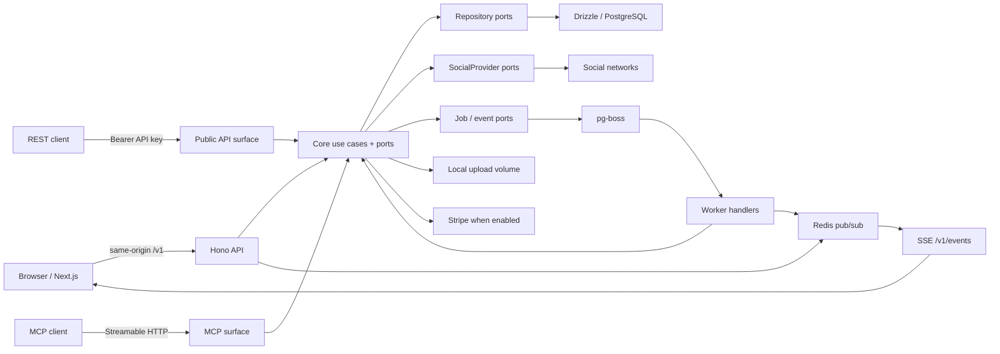

# Arquitetura do Manypost

Este é o ponto de entrada canônico para entender a codebase vigente. Ele
descreve o código observado em 2026-07-23; documentos em `docs/specs/` e
`docs/principal/` preservam decisões e planejamento históricos, mas podem
incluir capacidades aspiracionais ou números antigos.

## O que o sistema faz

Manypost permite autenticar pessoas e agentes, conectar canais de redes sociais,
compor/agendar posts, publicar de forma assíncrona, aprovar conteúdo por link,
armazenar mídia, entregar webhooks e operar por interface, API REST ou MCP.

O produto é multi-tenant por organização. Um usuário pertence a uma organização
por membership; canais, posts, mídia, webhooks, API keys, billing e auditoria
derivam desse escopo.

## Documentos relacionados

| Pergunta | Documento |
| --- | --- |
| O que existe e onde? | [Mapa do repositório](repository-map.md) |
| Como uma ação atravessa as camadas? | [Fluxos ponta a ponta](flows.md) |
| Como funcionam dados, filas, env e deploy? | [Dados e infraestrutura](data-and-infrastructure.md) |
| Como instalar, testar, depurar ou alterar? | [Guia de desenvolvimento](../operations/development.md) |
| Quais problemas foram confirmados? | [Diagnóstico inicial](../audits/2026-07-23-initial-diagnosis.md) |
| O que permanece no backlog? | [Backlog técnico](../audits/technical-backlog.md) |
| Como especificar uma mudança? | [OpenSpec no Manypost](../openspec.md) |
| Quais regras um agente deve cumprir? | [`AGENTS.md`](../../AGENTS.md) |

## Stack vigente

| Camada | Componentes |
| --- | --- |
| Runtime/workspace | Bun 1.3.14, TypeScript, workspaces |
| HTTP | Hono, `@hono/zod-openapi`, OpenAPI 3.1, Scalar |
| Web | Next.js 16.2.11 App Router, React 19, next-intl, Tailwind 4 |
| Estado/UI | TanStack Query, Zustand, TipTap |
| Domínio | casos de uso e ports TypeScript em `packages/core` |
| Persistência | PostgreSQL, Drizzle ORM 0.45.2/Kit |
| Assíncrono | pg-boss no PostgreSQL |
| Coordenação | Redis para rate limit, semáforo, idempotência e pub/sub |
| Integrações | adaptadores próprios em `packages/providers` |
| Contratos | `packages/contracts` e cliente OpenAPI gerado |
| Qualidade | `bun:test`, TypeScript, dependency-cruiser, checks próprios |
| Deploy | Dockerfile em Railway; compose para backend local |

## Componentes e relações



O diagrama mostra dependências lógicas. Em produção atual, Next.js, API e
worker rodam como processos do mesmo container Railway; PostgreSQL e Redis são
serviços separados.

## Dependência entre módulos

```text
packages/contracts ───────────────┐
packages/config ───────────────┐  │
packages/core ───────────────┐ │  │
packages/db ─────────────────┤ │  │
packages/providers ──────────┤ │  │
packages/queue ──────────────┤ │  │
                             ▼ ▼  ▼
                       apps/api + apps/worker
                                │
                         HTTP/OpenAPI
                                ▼
                            apps/web
```

Regras verificadas por `.dependency-cruiser.cjs`:

- contracts não depende de lógica interna;
- core não depende de apps, db ou providers;
- somente `packages/core/src/domain` é exigido como livre de framework;
- web não importa packages de servidor.

`packages/core/src/infra` contém crypto e detecção de mídia. Portanto, “core
inteiro sem I/O/infra” não descreve o estado real; novas exceções ainda exigem
design.

## Aplicações e processos

### API

`apps/api/src/main.ts` carrega env, aplica migrations quando configurado,
constrói dependências em `container.ts`, inicia o worker quando o modo inclui
backend combinado e monta as superfícies por host.

Rotas internas ficam em `/v1`; aprovação e uploads possuem superfícies públicas.
REST de máquina e MCP podem usar hosts dedicados, com aliases de compatibilidade
no host principal em self-host.

### Web

`apps/web/src/app/layout.tsx` é a entrada Next.js. Route groups separam auth,
onboarding e shell autenticado. Features reúnem componentes e hooks por domínio
de interface. `next.config.ts` proxeia `/v1`, `/public` e `/uploads` para a API.

O único cliente HTTP de aplicação é `src/lib/api/client.ts`, tipado pelo
snapshot OpenAPI. `EventSource` é exceção deliberada para streaming SSE.

### Worker

O worker consome quatro filas: publicação, continuação de thread, entrega de
webhook e recovery. `apps/worker/src/main.ts` permite separá-lo; em
`MODE=all`, a própria API inicia o runtime. Em `MODE=standalone`, o shell do
container inicia o worker dedicado, a API em `3100` e o Next na porta pública.

## Modos de runtime

| `MODE` | Processo iniciado pelo container | Uso |
| --- | --- | --- |
| `standalone` / `full` | worker + API `:3100` + Next em `$PORT` | produção Railway atual |
| `all` | API + worker no processo API | compose/teste de backend |
| `api` | somente API | split de escala |
| `worker` | somente entrada worker | split de escala |
| `web` | somente Next | split de escala |

O shell de start está duplicado em Docker/Railpack e não é um supervisor. A
separação em serviços requer que API e worker compartilhem banco, Redis,
chave de criptografia, secrets de provider e versão compatível.

## Superfícies HTTP

| Superfície | Auth | Responsabilidade |
| --- | --- | --- |
| app `/v1/*` | cookies JWT ou bearer humano conforme rota | UI e operações autenticadas |
| app `/public/approval/*` | token de aprovação | aprovação sem login |
| app `/uploads/*` | público por URL | mídia servida a UI/providers |
| API host `/v1/*` | API key/JWT e scopes | automação REST |
| API host `/openapi.json`, `/docs` | pública | contrato/explorador |
| MCP host `/` e `/mcp` | API key com scope `mcp` | ferramentas de agentes |
| `/metrics` | bearer se `METRICS_TOKEN` existe | Prometheus |
| `/health` | pública | saúde e providers configurados |

O roteamento usa o `Host` em `apps/api/src/http/surfaces.ts`. Em produção
Railway, `api.manypost.com.br` e `mcp.manypost.com.br` apontam para a porta
interna `3100`; `app.manypost.com.br` aponta para Next.js.

## Persistência e assíncrono

PostgreSQL é a fonte de verdade para identidade, canais, conteúdo, publicação,
mídia, webhooks, auditoria e billing. pg-boss grava jobs no mesmo banco.

Redis não substitui dados de negócio. Ele coordena:

- janelas de rate limit e semáforo por provider/canal;
- idempotência de mutações da API pública;
- realtime entre worker e API.

No nível do package, sem adapter Redis, publish/filas continuam pelo pg-boss e
rate limit, idempotência/realtime degradam conforme políticas de falha aberta.
O env da aplicação, porém, exige `REDIS_URL`; deployment normal sem URL Redis
não é suportado.

Uploads ficam no volume local `/app/uploads`. O enum aceita `s3`, mas o adapter
S3 ainda não existe; não escale horizontalmente a mídia supondo storage
compartilhado.

## Providers disponíveis no código

Mastodon, Telegram, Bluesky, Discord OAuth, Discord webhook, LinkedIn, X,
TikTok, Threads, Instagram standalone, Facebook, Twitch, Kick e o provider
`fake` para testes. A presença na tela depende dos secrets/configuração e de
gates externos da plataforma.

O registry está em `packages/providers/src/index.ts`; requisitos específicos
ficam no `settingsSchema` de cada adapter.

## Onde implementar

| Mudança | Comece por | Também revise |
| --- | --- | --- |
| regra de negócio | `packages/core/src/application/use-cases/` | port, testes, route e adapter |
| estado de publicação | `packages/core/src/domain/publishing/` | repository, queue, recovery e provider ambiguity |
| rota interna | `apps/api/src/http/routes/` | schema OpenAPI, auth, cliente web |
| API pública | `apps/api/src/http/routes/public/` | scopes, rate limit, idempotência, audit |
| ferramenta MCP | `apps/api/src/mcp/` | mesmos use cases/scopes da API |
| tela/fluxo UI | `apps/web/src/features/` | route em `app/`, i18n, query invalidation |
| tabela/query | `packages/db/src/schema/` / `repositories/` | port core, migration, tenant scope |
| rede social | `packages/providers/src/<rede>/` | env, registry, catálogo, preview e gates |
| job/retry/realtime | `packages/queue/src/` | state fencing, Redis ausente, métricas |
| variável de ambiente | `packages/config/src/env.ts` | `.env.example`, deploy e docs |
| billing | `packages/contracts/src/billing.ts`, core/API/db | Stripe sync, flags e E2E |
| deploy | `docker/`, `railway.toml`, `.github/workflows/` | todos os modos e rollback |

## Instalar e executar

Pré-requisitos: Bun `1.3.14` para o baseline reproduzível, Docker/Compose para
PostgreSQL/Redis e Node.js `>=20.19.0` para o OpenSpec 1.6.0.

```bash
bun install --frozen-lockfile
cp .env.example .env
docker compose up postgres redis -d
bun run dev:all
```

Abra a web em `http://localhost:3000` e a API em
`http://localhost:3100`. Não use os valores públicos do compose fora de teste
local.

Validação básica:

```bash
bun run check
bun run db:check
bun run build:web
bun run spec:validate
```

## Áreas de maior cuidado

- publicação externa e continuação de thread: efeito não transacional e risco de
  duplicidade;
- SSRF em mídia/webhooks: DNS, redirects e endereços reservados;
- rotação concorrente de refresh token;
- escopo de organização em tabelas filhas sem `org_id`;
- fila: decidir quando exceção deve retornar erro ao pg-boss;
- armazenamento local e recovery/backup;
- contratos gerados OpenAPI e migrations aplicadas;
- nomes Postiz preservados por licença, história ou compatibilidade.

O backlog com evidência e recomendação é mantido separadamente para que esses
riscos não sejam “corrigidos” incidentalmente.
