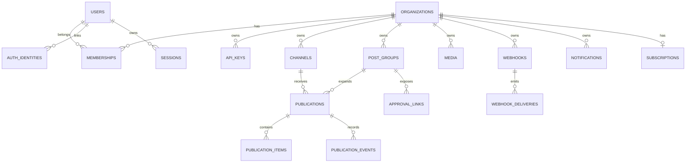

# Dados e infraestrutura

Este documento descreve o estado operacional confirmado em 2026-07-23. Não
contém valores de ambiente, credenciais ou connection strings reais.

## Modelo de dados

O schema canônico está em `packages/db/src/schema/` e é exportado por
`packages/db/src/schema/index.ts`.



O diagrama mostra relações principais, não todas as tabelas auxiliares.

### Identidade e tenant

| Tabela | Papel | Relacionamentos/constraints |
| --- | --- | --- |
| `users` | conta global, perfil, timezone/locale | email único normalizado |
| `organizations` | tenant e customer Stripe opcional | slug/customer únicos |
| `memberships` | usuário ↔ organização e role | único por org+user |
| `auth_identities` | vínculo Google/GitHub | provider+external user único |
| `sessions` | família de refresh token | hash atual único, hash anterior, revogação |
| `api_keys` | credencial de máquina escopada | hash único, org, scopes, soft revoke |

JWT carrega `sub`, `org` e `role`. Refresh token e API key em claro não são
persistidos. O sistema hoje escolhe o primeiro membership ao emitir/renovar
sessão; multi-organização interativa ainda não está implementada.

### Canais

`channels` pertence à organização e é único por
`org_id + provider + external_id`. Access/refresh tokens são bytea cifrado,
associados a `token_key_version` e AAD derivado do tenant/provider/identidade.
`deleted_at` e `status` preservam histórico/reconexão.

### Conteúdo e publicação

| Tabela | Papel |
| --- | --- |
| `post_groups` | intenção do usuário, conteúdo base, horário, origem e estado agregado |
| `publications` | uma execução por grupo+canal, conteúdo/settings resolvidos e máquina de estado |
| `publication_items` | itens ordenados de thread/reply e cursor externo |
| `publication_events` | transições de estado append-only |
| `media` | metadata/path de asset por organização |
| `tags`, `post_group_tags` | classificação de grupos |
| `channel_sets` | coleções de IDs de canal |
| `signatures` | conteúdo auto-adicionado |
| `approval_links` | token hash, validade, status e feedback |
| `channel_metrics` | série diária por canal/métrica |

`publications` desnormaliza `org_id` e `publish_at` para feed/scanners. O
`job_version` invalida job antigo; `last_published_index` é cursor de thread;
`attempt_id` identifica tentativa.

### Plataforma

| Tabela | Papel |
| --- | --- |
| `webhooks` | configuração e secret cifrado |
| `webhook_deliveries` | payload, tentativa, status e próximo retry |
| `notifications` | caixa in-app por organização/usuário |
| `audit_log` | ator, ação, alvo, IP e detalhe |
| `ai_credits` | janela de franquia de IA |
| `oauth_apps`, `oauth_grants` | authorization server futuro para MCP/terceiros |
| `idempotency_keys` | modelo PostgreSQL de idempotência |
| `subscriptions` | espelho da assinatura Stripe por organização |

`ai_credits`, OAuth server, idempotência PostgreSQL, `channel_sets`,
`signatures` e `channel_metrics` não possuem consumidor funcional completo
confirmado. Não remova: são dados/roadmap e exigem decisão/migration.

## Isolamento por organização

Tabelas diretamente escopadas: organizations, memberships, API keys, channels,
post groups, publications, media, tags, sets, signatures, approval links,
webhooks, notifications, audit, AI credits, OAuth apps/grants, idempotency e
subscriptions.

Tabelas filhas sem `org_id`: auth identities/sessions (escopo por user),
publication items/events (por publication), group tags (por group/tag),
channel metrics (por channel) e webhook deliveries (por webhook).

Consequências:

- route nunca chama lookup filho usando ID arbitrário sem validar o pai;
- repository interno sem `orgId` só recebe IDs derivados de lookup já escopado;
- nova query direta em tabela filha precisa join ao pai e teste de outro tenant;
- adicionar `org_id` por performance/defesa exige migration/backfill, não edição
  incidental.

PostgreSQL Row Level Security não está configurado; o isolamento é
responsabilidade da aplicação/repositories.

## Migrations

Arquivos vigentes:

- `0000_init.sql`;
- `0001_social_login.sql`;
- `0002_job_version.sql`;
- `0003_billing.sql`;
- snapshots e `_journal.json` em `migrations/meta/`.

`runMigrations` usa Drizzle migrator e advisory lock `72019001`, limitando
migration concorrente entre processos/réplicas. API e worker podem chamar o
migrator no boot quando `DB_MIGRATE=auto`; o lock serializa.

### Ciclo seguro

1. Abra/atualize OpenSpec com compatibilidade e rollback.
2. Altere `packages/db/src/schema/*.ts`.
3. Gere:

   ```bash
   bun run --cwd packages/db generate -- --name <nome-kebab-case>
   ```

4. Revise SQL e metadata gerados.
5. Teste banco limpo e upgrade do schema anterior em PostgreSQL descartável.
6. Execute `bun run db:check`, testes de repository e E2E afetados.
7. Faça rollout expand/contract para remoção/rename/restrição.

Migrations já aplicadas são append-only. `drizzle-kit check` valida
consistência estrutural, mas não prova duração de lock, backfill, compatibilidade
rolling ou recuperação de backup.

## PostgreSQL

Usos:

- dados de negócio;
- sessões/hashes e tokens cifrados;
- pg-boss (`pgboss.*`);
- transações e advisory lock.

`createDb` usa `postgres-js`; pool padrão é 10 conexões por processo, ajustável
por `DB_POOL_MAX`. O runtime pg-boss e queries auxiliares abrem conexões
adicionais. Ao separar/replicar API e worker, dimensione o limite total contra o
PostgreSQL.

Índices importantes:

- organização+estado/data para feed;
- partial due/stuck para recovery;
- token/hash para auth/aprovação;
- tenant+external identity para canais;
- retry de webhook por `next_retry_at`.

Não existe job de backup/restauração versionado no repositório.

## pg-boss e filas

| Fila | Payload principal | Produtor | Consumidor/resultado |
| --- | --- | --- | --- |
| `publish` | publication ID + job version | schedule/retry/recovery | publish inicial |
| `publish-thread-item` | publication ID + version + after index | publish de item anterior | reply atrasado |
| `webhook-delivery` | delivery ID | evento de domínio | POST assinado |
| `recover-scan` | vazio | cron a cada minuto | reprograma due/stuck |

`retryLimit` do pg-boss é zero por padrão: retry de negócio vive na máquina de
estados. Portanto, handler que captura exceção sem rethrow pode encerrar o job
sem retry do pg-boss; isso é risco registrado.

Singleton keys reduzem duplicidade de enqueue, mas corretude deve continuar
baseada em estado/versão/claim persistido.

## Redis

O package `packages/queue` permite ausência de `redisUrl` e então não cria:

- rate limiter/janelas;
- semáforo de concorrência;
- idempotency store;
- realtime bus.

Nessa configuração programática, os consumidores falham abertos onde o port é
opcional. Contudo, o schema atual da aplicação exige `REDIS_URL` e
`container.ts` sempre o repassa. Portanto, deployments normais precisam de uma
URL Redis; “rodar sem Redis” não é um modo suportado pelo env atual.

Redis não guarda a fonte de verdade de posts/jobs. Perda do Redis afeta
coordenação e realtime; perda do PostgreSQL afeta negócio e fila.

## Storage e mídia

Implementação ativa: `apps/api/src/infra/storage/local.storage.ts`.

- raiz configurada por `UPLOAD_DIR`;
- path separado por organização;
- URL pública baseada em `PUBLIC_URL`;
- volume Railway montado em `/app/uploads`;
- soft delete de metadata não é garantia de política de retenção/backup.

`STORAGE_PROVIDER` aceita `local`/`s3`, mas `container.ts` lança erro para
qualquer valor diferente de `local`. Não existe adapter S3/R2. Uma réplica nova
sem volume compartilhado não verá arquivos da outra.

Tamanho é controlado por `MEDIA_MAX_IMAGE_MB` e `MEDIA_MAX_VIDEO_MB`; MIME é
detectado pelo conteúdo. Importação remota possui limites/redirects, com risco
SSRF residual documentado.

## Catálogo de ambiente

### Runtime e roteamento

| Nome | Obrigatório/default | Formato e finalidade |
| --- | --- | --- |
| `MODE` | default `all` | enum `api`, `worker`, `all`, `web`, `standalone`, `full` |
| `PORT` | default numérico | porta pública do processo |
| `PUBLIC_URL` | obrigatório | URL absoluta da origem humana/cookies/mídia/OAuth |
| `API_PUBLIC_URL` | opcional | URL absoluta; host diferente de `PUBLIC_URL` |
| `MCP_PUBLIC_URL` | opcional | URL absoluta; host diferente de `PUBLIC_URL` |
| `API_URL` | web/standalone | URL interna da API usada pelos rewrites do Next |
| `IS_SELF_HOSTED` | default booleano verdadeiro | libera limites comerciais |
| `HIDE_BILLING` | default booleano verdadeiro | oculta/desmonta experiência de cobrança |

`API_PUBLIC_URL` e `MCP_PUBLIC_URL` podem compartilhar host entre si, mas não
com `PUBLIC_URL`.

### Banco, Redis e jobs

| Nome | Obrigatório/default | Formato e finalidade |
| --- | --- | --- |
| `DATABASE_URL` | obrigatório | connection string PostgreSQL; valor secreto |
| `DB_POOL_MAX` | default `10`, fora do Zod | inteiro positivo por processo |
| `REDIS_URL` | obrigatório no env atual | URL Redis; valor secreto |
| `DB_MIGRATE` | default `auto` | `auto` ou `off` |
| `PUBLISH_RETRY_BASE_SEC` | default positivo | segundos, aceita decimal para E2E |

### Criptografia, auth e SSRF

| Nome | Obrigatório/default | Formato e finalidade |
| --- | --- | --- |
| `JWT_SECRET` | obrigatório | string com pelo menos 32 caracteres |
| `ENCRYPTION_KEY` | obrigatório | 64 caracteres hex/32 bytes, diferente do JWT secret |
| `WEBHOOKS_ALLOW_PRIVATE` | default falso | boolean string; somente dev/E2E controlado |
| `MEDIA_ALLOW_PRIVATE_URLS` | default falso | boolean string; somente dev/E2E controlado |
| `METRICS_TOKEN` | opcional | bearer; ausente deixa `/metrics` público |

### Billing

| Nome | Obrigatório/default | Formato e finalidade |
| --- | --- | --- |
| `STRIPE_SECRET_KEY` | opcional | segredo da API Stripe; habilita billing somente com flags managed |
| `STRIPE_WEBHOOK_SECRET` | opcional | segredo de assinatura de webhook |
| `BILLING_TRIAL_DAYS` | default `0` | inteiro 0–90 |

Billing só monta quando `IS_SELF_HOSTED=false`, `HIDE_BILLING=false` e
`STRIPE_SECRET_KEY` existe.

### Login social

| Provider | Nomes | Formato/finalidade |
| --- | --- | --- |
| Google | `GOOGLE_CLIENT_ID`, `GOOGLE_CLIENT_SECRET` | strings OAuth; ambos opcionais |
| GitHub | `GITHUB_CLIENT_ID`, `GITHUB_CLIENT_SECRET` | strings OAuth; ambos opcionais |

Ausência remove o provider de login do catálogo.

### Redes sociais

| Provider | Nomes de ambiente |
| --- | --- |
| Mastodon | `MASTODON_DEFAULT_INSTANCE` (URL opcional) |
| Telegram | `TELEGRAM_BOT_TOKEN` |
| Discord | `DISCORD_CLIENT_ID`, `DISCORD_CLIENT_SECRET`, `DISCORD_BOT_TOKEN` |
| LinkedIn | `LINKEDIN_CLIENT_ID`, `LINKEDIN_CLIENT_SECRET` |
| X | `X_CLIENT_ID`, `X_CLIENT_SECRET` |
| TikTok | `TIKTOK_CLIENT_KEY`, `TIKTOK_CLIENT_SECRET` |
| Threads | `THREADS_APP_ID`, `THREADS_APP_SECRET` |
| Instagram standalone | `INSTAGRAM_APP_ID`, `INSTAGRAM_APP_SECRET` |
| Facebook | `FACEBOOK_APP_ID`, `FACEBOOK_APP_SECRET` |
| Twitch | `TWITCH_CLIENT_ID`, `TWITCH_CLIENT_SECRET` |
| Kick | `KICK_CLIENT_ID`, `KICK_CLIENT_SECRET` |

Todos são strings opcionais no schema. `requiredSecrets` do provider determina
se ele fica disponível. Bluesky e Discord webhook recebem credencial do usuário
e não exigem app secret global.

API e worker precisam do mesmo conjunto para connect/refresh. Nunca documente o
valor, mesmo de sandbox.

### Mídia

| Nome | Obrigatório/default | Formato e finalidade |
| --- | --- | --- |
| `STORAGE_PROVIDER` | default `local` | enum `local`/`s3`; apenas local implementado |
| `UPLOAD_DIR` | default path local | diretório gravável/persistente |
| `MEDIA_MAX_IMAGE_MB` | default numérico >=1 | limite de imagem |
| `MEDIA_MAX_VIDEO_MB` | default numérico >=1 | limite de vídeo |

### IA e observabilidade

| Nome | Obrigatório/default | Formato e estado |
| --- | --- | --- |
| `AI_PROVIDER` | default `none` | enum aceita compatible/anthropic, sem fluxo funcional completo confirmado |
| `AI_BASE_URL` | opcional | URL de endpoint compatible |
| `AI_API_KEY` | opcional | segredo, nunca logar |
| `AI_MODEL` | opcional | identificador de modelo |
| `LOG_LEVEL` | default `info` | `debug`, `info`, `warn`, `error` |
| `OTEL_EXPORTER_OTLP_ENDPOINT` | opcional | URL aceita no env; wiring OTel não confirmado |

Variável aceita não prova feature implementada. IA/OTel permanecem backlog até
adapter/use case/exporter e testes.

### Scripts locais/E2E

`BASE_URL`, `API_BASE_URL`, `MCP_URL`, `SELF_HOSTED_BASE_URL`, `WEB_PORT`,
`WHEN_SEC`, `TG_CHAT` e `TEXT` são entradas de scripts, não configuração do
servidor. `TG_CHAT`/`TEXT` pertencem a operação live do Telegram e não devem
aparecer em CI com valor real.

## Docker e compose

### `compose.yaml`

Stack de teste local:

- `app`: `MODE=all`, API+worker na porta 3000;
- PostgreSQL 17;
- Redis 7;
- volumes para banco, Redis e uploads.

Os valores declarados ali são públicos e deliberadamente locais. Não são
aceitáveis em produção. Esse compose não inicia Next.js; `/docs` é o ponto de
entrada.

### `docker/Dockerfile`

Imagem Bun única, instala dependências, compila Next e seleciona processo por
`MODE`. Em standalone usa shell para três processos sem supervisor. O build
web precisa ser bloqueante.

`docker/docker-compose.yml` é uma variante self-host que duplica parte do
compose raiz. `railpack.json` e `railway.json` duplicam build/start, mas a
produção atual usa `railway.toml` + Dockerfile.

## Railway production

Projeto: `manypost`
(`e1e95da7-8df9-4e16-8075-7adefa113572`), ambiente `production`.

Topologia confirmada:

- `manypost-app`: repo atual, Dockerfile, `MODE=standalone`, volume de uploads;
- PostgreSQL: serviço gerenciado com volume;
- Redis: serviço gerenciado com volume;
- `manypost-lp`: landing page de outro repositório/root.

Domínios públicos:

- `app.manypost.com.br` → Next.js/porta pública;
- `api.manypost.com.br` → porta interna API `3100`;
- `mcp.manypost.com.br` → porta interna API `3100`.

O volume de uploads estava abaixo de 1 GB de 50 GB na medição do diagnóstico.
Isso não substitui política de backup/restauração.

O deploy acompanha Git; não use `railway up` para contornar um PR/CI. Depois do
merge, confirme commit-fonte, estado terminal `SUCCESS`, health `/login` e logs.

## Observabilidade

Confirmado:

- logs JSON em API/queue e correlation ID HTTP;
- métricas Prometheus locais para requests, publish/recovery e queue depth;
- health endpoint;
- logs/métricas/deployment state Railway.

Limitações:

- `/metrics` pode ficar público sem token;
- `queueDepths` falha aberta para `{}`;
- não há tracing OTel/exporter confirmado;
- não há Sentry confirmado;
- não há alertas/SLOs codificados;
- logs Railway mostraram timeout Bun de SSE antes desta iniciativa e repetição
  de 401 após sessão expirada.

Nunca aumente `LOG_LEVEL` em produção ou colete corpo/header sem revisar PII e
tokens.

## CI/CD

O workflow atual sobe PostgreSQL/Redis e roda testes/E2E. Antes desta iniciativa
ele não congelava lock, não pinava Bun, não executava typecheck/build web,
brand completo ou OpenSpec. A mudança `establish-maintenance-baseline` torna
esses gates obrigatórios.

O CI não testa:

- browser E2E/visual;
- backup/restore;
- migration em dataset grande;
- APIs sociais reais;
- comportamento multi-réplica;
- todos os modos do shell Docker.

Essas limitações devem aparecer no PR quando relevantes.

## Deploy e rollback

Mudanças sem migration:

1. CI/build produz imagem;
2. Railway substitui container;
3. health valida Next;
4. operador verifica API/MCP/logs;
5. rollback redeploya commit/imagem anterior.

Mudanças com migration automática exigem compatibilidade backward/forward; a
imagem anterior pode não funcionar depois de DDL destrutivo. Use expand/contract
e teste restauração antes de declarar rollback seguro.

Storage local exige preservar o volume durante rollback/redeploy. Nunca recrie
ou remova volume como parte de “limpar deploy”.
