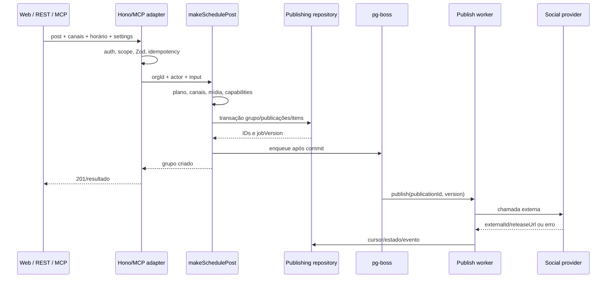

# Fluxos ponta a ponta

Este documento segue as ações desde a entrada até o resultado. Paths são
relativos à raiz; nomes de estado e filas correspondem ao código vigente.

## Convenções transversais

Antes de um handler:

1. `apps/api/src/http/surfaces.ts` seleciona app, API ou MCP pelo host.
2. `installBaseMiddleware` adiciona correlation ID, métricas HTTP, logging e
   conversão de erro para problem+json.
3. Middleware de autenticação constrói um `Principal` com `userId`, `orgId`,
   role, tipo de ator e API-key/scopes quando aplicável.
4. A route valida path/query/body com Zod/OpenAPI.
5. O caso de uso recebe IDs já autenticados; repository ainda precisa preservar
   isolamento de organização.

Erros de domínio usam códigos estáveis de
`packages/contracts/src/error-codes.ts`.
Erros externos são normalizados pelo provider. Logs não devem incluir tokens ou
segredos.

## Registro e login por senha

**Entrada:** rotas de register/login em
`apps/api/src/http/routes/auth.routes.ts`, chamadas por
`apps/web/src/features/auth/`.

**Validação e autorização**

- email/senha são validados pelo schema da route;
- password hasher usa implementação em
  `apps/api/src/infra/auth/password.hasher.ts`;
- login compara o hash sem revelar se detalhes internos existem;
- register cria o primeiro contexto de organização/membership conforme o
  repository de identidade.

**Regra e persistência**

1. `makeRegister` ou `makeLogin` em
   `packages/core/src/application/use-cases/auth.ts` valida a operação.
2. `packages/db/src/repositories/identity.repo.ts` lê/cria usuário,
   organização, membership e sessão.
3. O access JWT expira em 15 minutos.
4. O refresh token aleatório expira em 30 dias; somente seu hash é persistido.

**Resultado**

- a API grava `mp_at` e `mp_rt` como cookies HttpOnly e `mp_session=1` como
  marcador não sensível;
- o web segue para onboarding ou shell conforme `/v1/auth/me`;
- credenciais inválidas viram problem+json sem criar sessão.

**Assíncrono/integração:** não há fila nem serviço externo no login por senha.

**Pontos de cuidado:** cookies/path/sameSite, enumeration, rate limit de login,
sessões por organização e segredo JWT.

## Refresh, expiração e logout

**Entrada:** `POST /v1/auth/refresh`, `POST /v1/auth/logout` e
`GET /v1/auth/me` em `auth.routes.ts`; o wrapper
`apps/web/src/lib/api/client.ts` chama refresh uma vez após 401.

**Sequência**

1. O cliente deduplica refresh concorrente no processo browser.
2. `makeRefreshSession` calcula o hash e busca sessão por token atual/anterior.
3. Token anterior indica reuso e revoga a família.
4. Token atual válido gera um novo par e rotaciona hashes na sessão.
5. A route substitui cookies; logout revoga a sessão e apaga cookies.

**Resultado/erro**

- refresh bem-sucedido repete a requisição original;
- refresh inválido mantém o 401 como falha real;
- o hook realtime deve abrir EventSource somente após `/auth/me` bem-sucedido;
- logout é seguro mesmo quando o token já não é utilizável.

**Risco conhecido:** a leitura e a rotação do hash não são compare-and-swap em
uma transação; duas requisições reais simultâneas podem competir. O cliente
reduz concorrência por aba, mas não elimina múltiplos dispositivos/processos.

## Login social Google/GitHub

**Entrada:** `GET /v1/auth/social`, `/:provider` e
`/:provider/callback` em `social-auth.routes.ts`.

**Sequência**

1. O registry de identidade em `apps/api/src/infra/identity/` seleciona Google
   ou GitHub configurado.
2. A route cria state/cookie de curta duração e redireciona ao consentimento.
3. O callback valida state e troca code por identidade externa.
4. `makeLoginWithIdentity` localiza/cria vínculo, usuário e sessão.
5. Cookies são gravados e o browser retorna ao app.

**Erros:** provider ausente não é anunciado; state/callback inválido falha sem
sessão; conflito de identidade exige tratamento explícito do caso de uso.

**Persistência:** `auth_identities`, `users`, `organizations`, `memberships`,
`sessions`.

## API keys

**Entrada:** rotas em `apps/api/src/http/routes/api-keys.routes.ts`.

1. Usuário autenticado e autorizado escolhe nome/scopes.
2. `makeCreateApiKey` gera prefixo `mp_live_`, persiste apenas hash e devolve o
   segredo uma única vez.
3. `makeVerifyApiKey` autentica superfícies de máquina e inclui key ID/scopes no
   `Principal`.
4. Listagem nunca devolve o segredo; delete revoga no escopo da organização.

Na API pública, middleware em `public-api.ts` aplica scope, rate limit e
idempotência. No MCP, exige scope `mcp`.

## Conexão de canal por OAuth

**Entrada:** `POST /v1/channels/connect` e
`GET /v1/channels/callback/:provider` em `channels.routes.ts`; UI em
`apps/web/src/features/channels/`.

**Validação**

- provider deve existir no registry e estar habilitado/configurado;
- plano pode limitar conexão no modo gerenciado;
- callback valida state, provider e origem da conexão;
- popup web aceita conclusão apenas da janela/origem esperadas.

**Sequência**

1. `connect` pede ao provider URL OAuth/PKCE e grava state em cookie.
2. O browser autoriza na rede externa.
3. O callback troca code por token e obtém identidade/capabilities.
4. `makeConnectChannel` em `packages/core/src/application/use-cases/channels.ts`
   cria o AAD `channel:<org>:<provider>:<externalId>`.
5. Access/refresh tokens são cifrados por `AesGcmCryptoService`.
6. `channels.repo.ts` cria/atualiza o canal na organização.
7. A resposta do callback notifica/fecha o popup; a UI refaz a query.

**Erros**

- secret, escopo, state ou code ausente falha sem persistir token em claro;
- provider pode exigir reconexão se refresh for impossível;
- popup bloqueado navega a aba atual como fallback.

## Conexão por campos e subcontas

Providers como Telegram, Bluesky ou Discord webhook aceitam campos em
`POST /v1/channels/connect`.

1. O `settingsSchema`/connect schema do provider valida formato.
2. O provider confirma credencial e resolve identidade externa.
3. O mesmo `makeConnectChannel` cifra e persiste tokens/settings.
4. `GET /v1/channels/:id/sub-accounts` consulta provider para escolhas como
   Página/canal, sempre a partir de um canal pertencente à organização.

Desconexão em `DELETE /v1/channels/:id` faz soft delete/revogação local; não
presuma que a plataforma externa revogou o token se o provider não oferece essa
operação.

## Composer, rascunho e agendamento

**Entrada**

- UI: `apps/web/src/features/composer/`;
- API interna: `POST /v1/posts`;
- API pública/MCP: adapters em `public-v1.routes.ts` e
  `apps/api/src/mcp/mcp-server.ts`;
- caso de uso: `makeSchedulePost` em `publishing.ts`.

**Validações**

- organização/role/plan;
- pelo menos um canal pertencente à organização e provider disponível;
- texto/mídia/settings compatíveis com capabilities de cada provider;
- horário, thread/delay e limites de conteúdo;
- mídia referenciada pertence à organização;
- idempotency key e scope nas superfícies públicas.

**Persistência**

Uma transação cria `post_groups`, uma `publication` por canal e
`publication_items` para thread. O `origin` distingue UI/API/MCP. Estado inicial
é draft ou scheduled conforme entrada; `job_version` invalida jobs antigos.

**Assíncrono**

Somente depois do commit o scheduler cria job `publish`. Um scanner periódico
recupera agendamentos vencidos que não receberam job.

**Resultado/erro**

O cliente recebe o grupo antes da publicação externa. Erro de validação não cria
efeito. Falha de enqueue posterior ao commit é recuperável pelo scanner; por
isso grupo e publicação são a fonte de verdade.

## Edição, reagendamento, cancelamento e retry

**Entradas:** `GET/PATCH /v1/posts/:groupId`,
`POST /cancel`, `POST /retry`; equivalentes na API pública/MCP.

- `makeReschedulePost`/update valida estado editável, incrementa `jobVersion`,
  atualiza conteúdo/settings/horário e agenda nova versão.
- Cancelamento transiciona estados permitidos, revoga aprovação ativa e remove
  job quando possível. Job obsoleto vira no-op pelo version/state fencing.
- Retry manual só aceita falhas permitidas, limpa erro/transiciona e enfileira
  nova tentativa.
- `GET` monta grupo/publicações/itens escopados para UI/automação.

Nunca edite/reagende presumindo que um efeito externo incerto não aconteceu.
Estados finais/revisão existem para impedir repostagem cega.

## Publicação inicial

**Entrada assíncrona:** job `publish` consumido em
`packages/queue/src/runtime.ts`; regra em `makePublishPublication`.

1. Carrega publicação, canal e grupo.
2. Descarta estado ou `jobVersion` obsoleto.
3. Tenta semáforo Redis por provider e janela por provider/canal. Negação
   reprograma sem consumir tentativa de publish.
4. Faz transição condicional de `RUNNABLE` para `PUBLISHING`, incrementando
   tentativa/attempt ID.
5. Decifra token com AAD do canal.
6. Para item zero, chama `provider.publish`; para respostas, `publishReply`.
7. Depois da confirmação externa, grava `externalId`, URL e cursor.
8. Se o próximo item possui delay, agenda `publish-thread-item` e mantém
   `PUBLISHING`; caso contrário, finaliza `PUBLISHED`.
9. Atualiza grupo, métrica, realtime e deliveries de webhook.

**Classificação de erro**

- `permanent`: `FAILED`, sem retry automático;
- `refresh-token`: transição para refresh, provider renova, persiste token e
  reprograma; se impossível, canal vira `REFRESH_REQUIRED`;
- `transient`: backoff/jitter e limite de tentativas;
- resultado externo incerto deve resultar em estado de revisão, não repostagem.

**Recovery:** `recover-scan` procura scheduled vencido e publicação presa;
reagenda conforme estado/versão e atualiza métricas.

## Continuação de thread

**Entrada:** job `publish-thread-item` com `publicationId`, `v` e
`afterIndex`.

1. Recarrega publicação/canal.
2. Exige `PUBLISHING`, versão igual e cursor exatamente no item anterior.
3. Retoma em `lastPublishedIndex + 1`.
4. Publica reply usando o `externalId` anterior.
5. Persiste cursor após confirmação e agenda próximo delay/finaliza.

**Risco confirmado:** duas continuações concorrentes podem passar a leitura do
mesmo cursor antes do efeito externo; a atualização condicional posterior evita
duplo avanço, não necessariamente dupla publicação. O backlog exige claim/lease
atômico por item antes de alterar esse fluxo.

## Feed de publicações e realtime

**Feed:** `GET /v1/publications` em `publications.routes.ts` consulta
publicações da organização com filtros/paginação para calendário, kanban e
detalhe.

**Realtime:** `GET /v1/events` em `events.routes.ts`.

1. Auth fornece `orgId`.
2. API assina o canal Redis da organização antes do handshake.
3. Envia `hello` e pings a cada 25 segundos.
4. Worker publica eventos de domínio no bus.
5. `useRealtime` invalida queries TanStack; polling continua como fallback.
6. Abort fecha subscription.

Sem Redis, o stream envia handshake/keepalive, mas não eventos de worker. A UI
não trata SSE como fonte de verdade.

## Aprovação pública

**Criação:** `POST /v1/posts/:groupId/approval-link`.

1. Usuário/automação autorizado escolhe validade.
2. `makeCreateApprovalLink` gera token aleatório, persiste somente hash,
   validade e vínculo ao grupo.
3. O token em claro é devolvido apenas para formar a URL.

**Consumo público:** `GET /public/approval/:token` monta preview sem login;
`POST /approve` ou `/request-changes` resolve o link.

**Regra**

- hash válido, não expirado/revogado/resolvido;
- grupo ainda em estado compatível;
- approve transiciona draft para scheduled e enfileira publicações após
  persistência;
- request changes registra decisão/comentário e mantém fluxo humano;
- auditoria recebe ator de aprovação.

Revogar o link não apaga o histórico. A página
`apps/web/src/features/approval/approval-view.tsx` reutiliza previews do
composer.

## Upload e ingestão de mídia

**Entradas:** `POST /v1/media/upload`, `POST /v1/media/from-url`,
list/alt/delete em `media.routes.ts`; equivalentes na API pública.

### Upload

1. Route limita multipart/tamanho e encaminha bytes/metadados.
2. `makeUploadMedia` detecta MIME por conteúdo em
   `packages/core/src/infra/media/sniff.ts`.
3. Valida tipo/tamanho e quota/plano.
4. `local.storage.ts` grava arquivo sob diretório da organização.
5. `media.repo.ts` persiste metadata e URL pública.

### URL remota

1. `makeIngestMediaFromUrl` exige HTTP(S), resolve hostname e rejeita endereço
   privado conhecido.
2. Fetch manual segue redirects limitados, revalidando cada destino.
3. O stream é cortado no limite; MIME é detectado pelos bytes.
4. O mesmo storage/repository finaliza o asset.

**Erros:** URL privada/inválida, redirect proibido, MIME não aceito, excesso de
bytes, storage/repository. Arquivo órfão e compensação precisam ser considerados
quando gravação e persistência falham em etapas diferentes.

**Risco:** DNS é resolvido antes do fetch, portanto a defesa atual não fixa a
resolução contra rebinding e a regex não modela todos os CIDRs.

## Webhooks de saída

**Configuração:** rotas em `webhooks.routes.ts`; regra em `webhooks.ts`.

1. Usuário/API com permissão informa nome, eventos, canais e URL.
2. `assertPublicUrl` valida protocolo/resolução pública.
3. `makeCreateWebhook` gera `whsec_...`, cifra para persistência e devolve o
   segredo uma única vez.

**Emissão e entrega**

1. Um evento de domínio chama `makeEmitEvent`.
2. O repository encontra webhooks inscritos na organização/canal.
3. Cria um delivery por webhook e job `webhook-delivery`.
4. Worker carrega delivery/webhook, decifra segredo e assina
   `timestamp.body` com HMAC.
5. Faz POST; 2xx marca sucesso. Erros atualizam tentativa e usam backoff
   `[1,5,25,120,360]` minutos até limite.
6. Falha final marca o delivery como `FAILED`; desativação do webhook é uma
   condição separada e deliveries de webhook já desativado também falham.

Redirect de webhook não é seguido implicitamente. Payload e assinatura não são
logados com segredo.

## Notificações

`GET /v1/notifications`, `POST /read-all` e `POST /:id/read` usam o principal
para listar/marcar notificações da organização/usuário. Eventos relevantes são
persistidos por repositories de platform e `notification.created` invalida a
query web pelo realtime.

Não confundir notificação in-app com webhook; são consumidores diferentes do
evento e possuem persistência/entrega distintas.

## API REST pública

**Entrada:** host de API em `/v1` ou alias self-host `/public/v1`, routes em
`apps/api/src/http/routes/public/public-v1.routes.ts`.

1. Middleware aceita API key e constrói principal escopado.
2. Cada rota exige scope (`posts:*`, `channels:*`, `media:*`,
   `webhooks:manage`).
3. Redis aplica rate limit por credencial quando disponível e devolve headers.
4. Mutações POST usam `Idempotency-Key`: claim atômico, replay do mesmo corpo,
   conflito para corpo diferente/em andamento.
5. Adapter traduz o contrato público para os mesmos casos de uso internos.
6. Mutações registram ator/origin API.

Quando o runtime é construído sem adapter Redis, rate limit/idempotência falham
abertos por decisão atual. A aplicação normal exige `REDIS_URL`; indisponibilidade
do servidor não deve ser confundida com ausência deliberada do adapter. A
autorização por organização e scope não depende do Redis.

## MCP

**Entrada:** host MCP na raiz/`/mcp`, route em `mcp.routes.ts`, servidor em
`apps/api/src/mcp/mcp-server.ts`.

1. API key com scope `mcp` autentica toda requisição.
2. `initialize` cria transporte stateful e `mcp-session-id` em memória com TTL.
3. Requests seguintes precisam da mesma sessão e organização.
4. Tools validam input e chamam os mesmos casos de uso de canais/posts/mídia.
5. Mutações usam origin/actor MCP, audit log e limite anti-loop de
   agendamentos.
6. Erro de domínio vira resultado de tool controlado; auth/sessão inválida vira
   erro HTTP.

Sessões MCP não são compartilhadas entre réplicas; escala horizontal exige
store externo ou afinidade. OAuth 2.1 para MCP não está implementado.

## Billing e Stripe

**Montagem:** rotas só existem quando billing está habilitado/configurado.
Código em `billing.routes.ts`, `packages/core/src/application/use-cases/billing.ts`,
`stripe.gateway.ts` e repositories de billing.

**Checkout/portal**

1. Usuário autorizado consulta plano/uso.
2. `PlanPolicy` diferencia self-host (liberado) e managed (catálogo/limites).
3. Gateway cria checkout ou portal Stripe.
4. A API devolve URL/preview sem persistir secret.

**Webhook Stripe**

1. `stripe-webhook.routes.ts` lê corpo bruto e valida assinatura.
2. Deduplica evento e traduz subscription/customer/price para o contrato local.
3. `makeApplyRemoteSubscription`/remove atualiza subscription.
4. Eventos fora de ordem usam timestamps/IDs conforme repository.

`/sync` consulta Stripe explicitamente para reconciliar; invoices/portal são
best-effort externos. Sem `STRIPE_SECRET_KEY` ou com `HIDE_BILLING`, a
superfície pode não ser montada.

## Métricas, health e documentação da API

- `/health`: estado básico e providers configurados;
- `/metrics`: contadores/histogramas e profundidade pg-boss; bearer opcional por
  `METRICS_TOKEN`;
- `/openapi.json`: contrato montado das rotas registradas;
- `/docs`: Scalar para o OpenAPI.

Métrica de profundidade falha aberta e retorna vazio se a query interna falhar.
Logs usam correlation ID, mas não há implementação completa confirmada de
tracing distribuído/Sentry apesar de referências históricas.

## Tratamento de impacto

Ao alterar um fluxo, revise sempre:

- todas as entradas (web interna, API pública, MCP e worker);
- autorização, scope e organização;
- transação/efeito externo e possível partial success;
- job obsoleto, duplicado, retry e recovery;
- contrato OpenAPI/cliente gerado;
- evento realtime, webhook, notificação e audit log;
- configuração sem Redis/billing/provider;
- teste focado, suíte, build e documentação/changelog.
