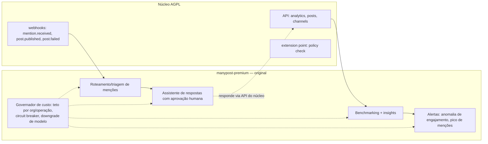

# SPEC_AI.md — manypost: IA de criação (núcleo) e IA operacional (premium)

> **Escopo:** contexto **AI Creation** [AGPL núcleo] + fronteira com **AI Operations** [premium]. Regra de ouro: **nenhum provedor de IA é citado no código** — tudo atrás de ports. Depende de: SPEC_BACKEND (ports), SPEC_DATA (ai_credits), SPEC_API_MCP (tool `generate_content`), SPEC_ARCHITECTURE (fronteira premium).

## 1. Divisão núcleo × premium

| | IA de criação [AGPL núcleo] | IA operacional [premium, original] |
|---|---|---|
| O quê | Gerar/reescrever legenda, hashtags, variações por canal, alt text, imagem simples no composer | Assistente de respostas a menções/comentários, roteamento/triagem, benchmarking com insights, alertas inteligentes |
| Direção | *Seguindo a direção do Postiz (créditos por org, IA no composer)* | **Implementação original, não derivada** — não espelhar Postiz |
| Onde roda | `packages/core` + adapter | repo `manypost-premium`, consome API pública do núcleo |
| Custo | Franquia por plano (créditos) | Teto de custo por org + por operação |

## 2. Abstração de provedor (núcleo)

```ts
// application/ports/ai.ts — provedores NUNCA aparecem fora do adapter
interface AiProvider {
  generateText(req: { system: string; prompt: string; maxTokens: number;
                      temperature?: number }): Promise<{ text: string; usage: TokenUsage }>;
  generateImage?(req: { prompt: string; size: ImageSize }): Promise<{ url: string; usage: ImageUsage }>;
  moderate?(text: string): Promise<{ flagged: boolean; categories: string[] }>;
}
```

- Adapter configurado por env: `AI_PROVIDER=openai-compatible | anthropic | none` + `AI_BASE_URL`/`AI_API_KEY`/`AI_MODEL`. `openai-compatible` cobre a maioria dos gateways e modelos locais (Ollama/vLLM) — essencial para self-host. `none` desliga toda a IA com UI degradando graciosamente (botões somem — capacidade vem de `GET /v1/capabilities`).
- Nome de modelo/provedor jamais hard-coded em use-case, prompt ou frontend (grep no CI: `openai|anthropic|gpt-|claude` proibidos fora de `infra/ai/*`).
- Prompts do núcleo versionados em `packages/core/src/application/prompts/` como templates puros testáveis (snapshot tests).

## 3. Casos de uso do núcleo

| Use-case | Entrada | Saída | Custo (créditos) |
|---|---|---|---|
| `ai.captionFromBrief` | brief + canais alvo + tom | 1 variação por canal respeitando `maxLength` | 1 |
| `ai.rewrite` | texto + instrução (encurtar, formal, emoji…) | texto | 1 |
| `ai.hashtags` | texto + rede | lista | 1 |
| `ai.altText` | imagem (url) | alt descritivo | 1 |
| `ai.image` | prompt + tamanho | media na biblioteca | 5 |
| `ai.bestTimes` | canal + histórico | melhores horários por rede (PLANS: feature Pro) | 0 — **heurística estatística sobre `channel_metrics`/histórico de engajamento, sem LLM**; entra aqui só por ser vendida como "IA" |

Todos passam por: (a) checagem de créditos (`ai_credits`, decremento transacional); (b) moderação quando disponível; (c) registro em `audit_log` + usage (tokens/custo estimado) para telemetria do operador.

### Franquia por plano (*direção do Postiz: Credits*)
- Self-host: franquia default infinita (o operador paga o próprio provedor) — configurável.
- Gerenciado: créditos mensais por plano; excedente bloqueia com CTA de upgrade (nunca cobra surpresa).

## 4. IA operacional (código fechado — apenas fronteira, design em repo privado)

Escopo concreto ratificado pela matriz de planos (`docs/PLANS.md`, plano Premium): responder comentários e DMs num lugar só; classificar e direcionar mensagens; acompanhar campanhas e gerar relatórios; avisar quando um post perde engajamento; montar e otimizar o calendário da semana. (Análise de concorrentes: confirmada como feature futura, PLANS PL4.)

O núcleo fornece os insumos via contratos públicos; o código fechado implementa a inteligência:



Requisitos de fronteira (obrigações do núcleo):
1. Evento `mention.received` no webhook de saída quando um provider suportar ingestão de menções (fase 2 de INTEGRATIONS).
2. API de analytics expõe séries históricas (`channel_metrics`) paginadas.
3. Nenhum código de IA operacional no repo AGPL — CI do núcleo não conhece esses módulos.

### BudgetGuard — requisito de ARQUITETURA, não placeholder (DECISIONS v1 §8)
O **mecanismo** de teto de custo existe desde o dia 1, nos dois lados; apenas os **números** (franquias, tetos por plano) são config adiada para a v2:
- Toda operação de IA (criação no núcleo, operacional no premium) **declara orçamento máximo** (tokens/custo estimado) antes de executar.
- Contadores por org/período (mesma infraestrutura de `ai_credits` no núcleo; espelho próprio no premium) com decremento transacional.
- **Circuit breaker**: orçamento estourado → operação recusada com `ai.budget_exceeded` (nunca degrada silenciosamente para custo aberto); degradação de modelo é opt-in explícito.
- Zero operação de IA no caminho de código que não passe pelo guard — regra de lint/review nos dois repos.

## 5. Critérios de aceite (núcleo)

1. Trocar `AI_PROVIDER` entre um provedor OpenAI-compatible local e um remoto sem mudança de código — teste com dois adapters fake.
2. `AI_PROVIDER=none`: API responde `capability.disabled` e o composer não exibe IA.
3. Créditos: decremento transacional; concorrência de 10 gerações simultâneas não fura a franquia (teste).
4. Grep de provedores nominais fora de `infra/ai/*` falha o CI.
5. Prompt de legenda respeita `maxLength` do canal em 100% dos casos de teste (com margem de 10%).
