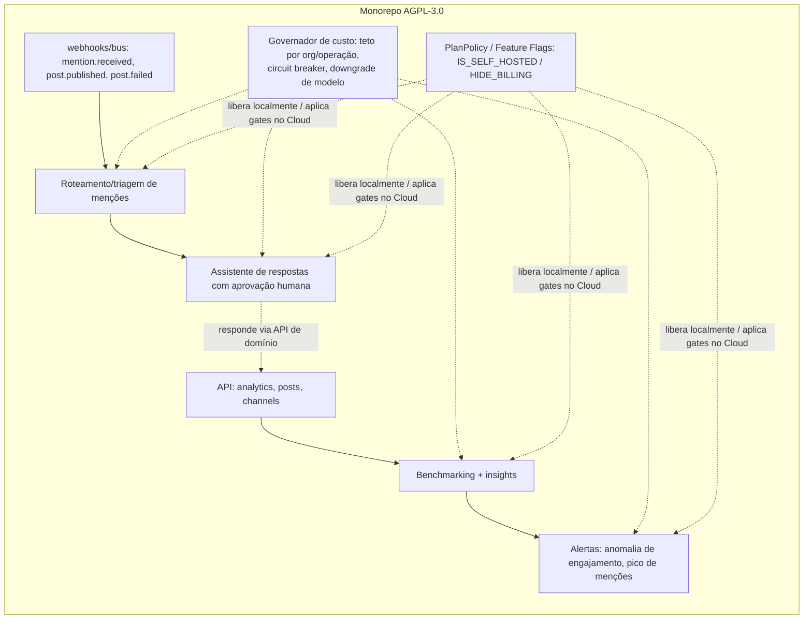

# SPEC_AI.md — manypost: IA de criação e IA operacional (Monorepo 100% Open Source)

[← Índice da documentação](../README.md) · [STATUS do projeto](../principal/STATUS.md) · [Decisões](../principal/DECISIONS.md) · [README do projeto](../../README.md)

> **Escopo:** contexto **AI Creation** e **AI Operations** no monorepo AGPL-3.0. Regra de ouro: **nenhum provedor de IA é citado no código** — tudo atrás de ports. Depende de: SPEC_BACKEND (ports), SPEC_DATA (ai_credits), SPEC_API_MCP (tool `generate_content`), SPEC_ARCHITECTURE (feature flags).
>
> **Estado de verdade (2026-07-27):** a **IA de criação (§2, §3, §5) está entregue e verificada**; a **IA operacional (§4) segue aspiracional**, e o que a bloqueia não é IA.
>
> | O que | Estado | Onde |
> |---|---|---|
> | Abstração de provedor (§2) | ✅ entregue — dois protocolos, seleção por `AI_PROVIDER`, `none` degrada a UI | `packages/core/src/infra/ai/` |
> | BudgetGuard (§4, DECISIONS v1 §8) | ✅ entregue — reserva transacional, lease, self-hosted contabiliza sem recusar | `use-cases/ai-budget.ts`, `ai_credits` + `ai_grants` |
> | `ai.captionFromBrief`, `ai.rewrite`, `ai.hashtags`, `ai.altText` (§3) | ✅ entregue (feature `ai_caption`, plano Pro) | `use-cases/ai.ts`, `POST /v1/ai/*` |
> | `ai.bestTimes` (§3) | ✅ entregue como **heurística sem LLM e sem custo de franquia**, com `confidence`/`sampleSize` | `use-cases/ai-best-times.ts` |
> | Rascunho multicanal e calendário da semana | ✅ entregue (features `ai_multichannel_draft`, `ai_calendar`, plano Premium) | idem |
> | `ai.image` (§3) | ✅ entregue — port/fábrica independentes, modos economy/quality e mídia persistida | `use-cases/ai-image.ts`, `infra/ai/image-generations.ts` |
> | **IA operacional (§4)**: inbox, triagem, relatórios de campanha, alertas de engajamento | ❌ **bloqueado por INGESTÃO, não por IA** | ver abaixo |
>
> As quatro features de IA operacional (`ai_inbox`, `ai_triage`, `ai_campaign_reports`, `ai_engagement_alerts`) dependem de dado que a plataforma **ainda não coleta**: nenhum provider lê comentário ou DM (o evento `mention.received` do §4.1 não existe), e `channel_metrics` está vazia porque nada escreve nela. Enquanto essas duas ingestões não existirem, ligar essas features produziria resposta inventada — por isso elas continuam gateadas no catálogo e sem implementação. Os critérios de aceite do §5 estão cobertos por teste; o §5.3 (dez gerações simultâneas não furam a franquia) roda contra Postgres real em `packages/db/src/repositories/ai-credits.repo.integration.test.ts`, e a fatia inteira em `scripts/e2e-ai.ts`.

## 1. Divisão de capacidades (Criação vs Operacional)

| | IA de criação [AGPL monorepo] | IA operacional [AGPL monorepo, gates de plano no SaaS] |
|---|---|---|
| O quê | Gerar/reescrever legenda, hashtags, variações por canal, alt text, imagem simples no composer | Assistente de respostas a menções/comentários, roteamento/triagem, benchmarking com insights, alertas inteligentes |
| Direção | *Seguindo a direção do Postiz (créditos por org, IA no composer)* | **Implementação original no monorepo, controlada por feature flags** |
| Onde roda | `packages/core` + adapter | módulos integrados no monorepo, consumindo contratos e APIs de domínio |
| Custo | Franquia por plano no SaaS Cloud (`IS_SELF_HOSTED=false`) ou BYO-key no self-hosted | Teto de custo por org + por operação via BudgetGuard |

## 2. Abstração de provedor (núcleo)

```ts
// application/ports/ai.ts — provedores NUNCA aparecem fora do adapter
interface AiProvider {
  generateText(req: { system: string; prompt: string; maxTokens: number;
                      temperature?: number }): Promise<{ text: string; usage: TokenUsage }>;
  moderate?(text: string): Promise<{ flagged: boolean; categories: string[] }>;
}

interface ImageGenerationProvider {
  generateImage(req: { prompt: string; aspect: ImageAspect;
                       mode: ImageQualityMode }): Promise<GeneratedImage>;
}
```

- Adapter configurado por env: `AI_PROVIDER=openai-compatible | anthropic | none` + `AI_BASE_URL`/`AI_API_KEY`/`AI_MODEL`. `openai-compatible` cobre a maioria dos gateways e modelos locais (Ollama/vLLM) — essencial para self-host. `none` desliga toda a IA com UI degradando graciosamente (botões somem — capacidade vem de `GET /v1/capabilities`). **Entregue com três ajustes ao texto original:** (a) `AI_BASE_URL` e `AI_MODEL` são obrigatórias quando o protocolo é selecionado (boot falha fechado nomeando a que falta), mas **`AI_API_KEY` é opcional** — runtime local não pede credencial, e exigir uma forçaria todo self-hoster a inventar um valor; (b) `AI_TIMEOUT_MS` e `AI_MAX_OUTPUT_TOKENS` limitam tempo e custo de cada chamada; (c) `AI_BASE_URL` **não** passa pelo classificador anti-SSRF, de propósito: é configuração do operador, e o self-host legítimo aponta para endereço privado (registrado como decisão em `openspec/changes/add-ai-content-assistance/design.md` D3). Exemplos prontos de seis provedores estão no `.env.example`.
- **Descrever imagem é capacidade opcional do adapter** (`describeImage`): sem modelo com visão, o alt text recusa com `ai.capability_unavailable` (501) em vez de descrever pelo nome do arquivo. `GET /v1/capabilities` expõe `ai.canDescribeImages` para a UI sumir com o botão.
- **Gerar imagem usa port e fábrica próprios.** `AI_IMAGE_PROVIDER`,
  `AI_IMAGE_BASE_URL`, `AI_IMAGE_API_KEY` e `AI_IMAGE_MODEL` permitem trocar um endpoint
  OpenAI-compatible sem tocar no provider de texto nem no código. `AI_IMAGE_MODEL` sozinho herda a
  conexão completa de texto por compatibilidade; provider de imagem explícito nunca herda endpoint
  ou chave. `none` desliga somente imagens. Um protocolo nativo novo fica restrito a um adapter e
  ao registro na fábrica.
- Nome de modelo/provedor jamais hard-coded em use-case, prompt ou frontend (grep no CI: `openai|anthropic|gpt-|claude` proibidos fora de `infra/ai/*`).
- Prompts do núcleo versionados em `packages/core/src/application/prompts/` como templates puros testáveis (snapshot tests).

## 3. Casos de uso do núcleo

| Use-case | Entrada | Saída | Custo (créditos) |
|---|---|---|---|
| `ai.captionFromBrief` | brief + canais alvo + tom | 1 variação por canal respeitando `maxLength` | 1 |
| `ai.rewrite` | texto + instrução (encurtar, formal, emoji…) | texto | 1 |
| `ai.hashtags` | texto + rede | lista | 1 |
| `ai.altText` | imagem (url) | alt descritivo | 1 |
| `ai.image` | prompt + proporção + modo (`economy` ou `quality`) | media na biblioteca | 2 / 5 |
| `ai.bestTimes` | canal + histórico | melhores horários por rede (PLANS: feature Pro) | 0 — **heurística estatística sobre `channel_metrics`/histórico de engajamento, sem LLM**; entra aqui só por ser vendida como "IA" |

Todos passam por: (a) checagem de créditos (`ai_credits`, decremento transacional no SaaS Cloud); (b) moderação quando disponível; (c) registro em `audit_log` + usage (tokens/custo estimado) para telemetria do operador.

**Como ficou na entrega:** a ordem é `plano → franquia → modelo → confirma/devolve → auditoria` — gatear antes de reservar garante que plano sem a feature nunca gaste franquia descobrindo isso. Moderação segue não implementada (o port mantém `moderate?` opcional). O registro é duplo: `audit_log` (quem gerou o quê) e `ai_grants` (quanto custou, por operação); **nenhum dos dois guarda prompt, texto gerado ou credencial**. O custo em créditos por operação: legenda 1 **por canal**, reescrita 1, hashtags 1, alt text 1, rascunho multicanal 2, plano da semana 3; imagem econômica 2, imagem em qualidade final 5; `ai.bestTimes` custa **0** e nem reserva. Falha nossa — provedor fora do ar, resposta que não pôde ser lida — **devolve** a reserva em vez de confirmá-la.

### Franquia por plano (*direção do Postiz: Credits*)
- **Self-host (`IS_SELF_HOSTED=true`):** franquia default infinita e sem cobrança por créditos (o operador usa sua própria chave configurada em `AI_API_KEY`). **Entregue:** o mecanismo roda igual e o consumo continua sendo registrado — o operador que paga a própria chave também quer saber quanto gastou.
- **Gerenciado (`IS_SELF_HOSTED=false` no SaaS Cloud):** créditos mensais por plano (Grátis=0, Pro/Premium com franquia inclusa); excedente bloqueia com CTA de upgrade (nunca cobra surpresa). **Entregue:** os números vivem em `PlanLimits.aiCredits` no catálogo (`packages/contracts/src/billing.ts`) — Grátis 0, Pro 500, Premium 2000 —, a janela é o mês-calendário UTC, e upgrade no meio do período libera a franquia maior na hora sem abrir balde novo. São valores **comerciais**: mudá-los é uma linha, sem migration.

## 4. IA operacional (100% Open Source no monorepo — enforcement comercial no SaaS)

Escopo concreto ratificado pela matriz de planos (`docs/principal/PLANS.md`, plano Premium): responder comentários e DMs num lugar só; classificar e direcionar mensagens; acompanhar campanhas e gerar relatórios; avisar quando um post perde engajamento; montar e otimizar o calendário da semana. (Análise de concorrentes: confirmada como feature futura, PLANS PL4.)

O núcleo fornece os insumos e a lógica vive aberta no monorepo, controlada pelas políticas do SaaS:


```mermaid
flowchart LR
    subgraph nucleo [Monorepo AGPL-3.0]
        EV[webhooks/bus: mention.received, post.published, post.failed]
        API[API: analytics, posts, channels]
        POL[PlanPolicy / Feature Flags: IS_SELF_HOSTED / HIDE_BILLING]
        ROUTE[Roteamento/triagem de menções]
        ASSIST[Assistente de respostas com aprovação humana]
        BENCH[Benchmarking + insights]
        ALERT[Alertas: anomalia de engajamento, pico de menções]
        BUDGET[Governador de custo: teto por org/operação,<br/>circuit breaker, downgrade de modelo]
    end
    EV --> ROUTE --> ASSIST
    API --> BENCH --> ALERT
    ASSIST -. "responde via API de domínio" .-> API
    BUDGET -.-> ROUTE & ASSIST & BENCH & ALERT
    POL -. "libera localmente / aplica gates no Cloud" .-> ROUTE & ASSIST & BENCH & ALERT
```

Requisitos de arquitetura e fronteiras:
1. Evento `mention.received` no webhook de saída quando um provider suportar ingestão de menções (fase 2 de INTEGRATIONS).
2. API de analytics expõe séries históricas (`channel_metrics`) paginadas.
3. Modo de execução limpo: em modo `IS_SELF_HOSTED=true`, todas as operações de IA operacional rodam sem gates com a chave BYO-key configurada no Docker do usuário.

### BudgetGuard — requisito de ARQUITETURA, não placeholder (DECISIONS v1 §8)
O **mecanismo** de teto de custo existe desde o dia 1 no monorepo; apenas os **números** (franquias, tetos por plano) são config de faturamento no SaaS:
- Toda operação de IA (criação e operacional) **declara orçamento máximo** (tokens/custo estimado) antes de executar.
- Contadores por org/período (mesma infraestrutura de `ai_credits`) com decremento transacional.
- **Circuit breaker**: orçamento estourado → operação recusada com `ai.budget_exceeded` (nunca degrada silenciosamente para custo aberto); degradação de modelo é opt-in explícito.
- Zero operação de IA no caminho de código que não passe pelo guard — regra de lint/review contínua.

## 5. Critérios de aceite (núcleo)

1. Trocar `AI_PROVIDER` entre um provedor OpenAI-compatible local e um remoto sem mudança de código — teste com dois adapters fake.
2. Trocar `AI_IMAGE_PROVIDER`/`AI_IMAGE_BASE_URL` entre endpoints de imagem sem mudar texto, rota,
   caso de uso ou browser; configuração explícita nunca herda a chave de texto.
3. `AI_PROVIDER=none`: API responde `capability.disabled` e o composer não exibe IA de texto;
   imagem permanece independente conforme `AI_IMAGE_PROVIDER`.
4. Créditos: decremento transacional; concorrência de 10 gerações simultâneas não fura a franquia (teste).
5. Grep de provedores nominais fora de `infra/ai/*` falha o CI.
6. Prompt de legenda respeita `maxLength` do canal em 100% dos casos de teste (com margem de 10%).

---

**Specs irmãs:** [ARCHITECTURE](SPEC_ARCHITECTURE.md) · [BACKEND](SPEC_BACKEND.md) · [FRONTEND](SPEC_FRONTEND.md) · [DATA](SPEC_DATA.md) · [QUEUE_PUBLISHING](SPEC_QUEUE_PUBLISHING.md) · [INTEGRATIONS](SPEC_INTEGRATIONS.md) · [API_MCP](SPEC_API_MCP.md) · [INFRA](SPEC_INFRA.md) · [ROADMAP](SPEC_ROADMAP.md)

**Navegação:** [Índice da documentação](../README.md) · [STATUS](../principal/STATUS.md) · [Decisões](../principal/DECISIONS.md) · [Marca](../brand/BRAND_SYSTEM.md) · [README do projeto](../../README.md) · [Contribuir](../../CONTRIBUTING.md)
