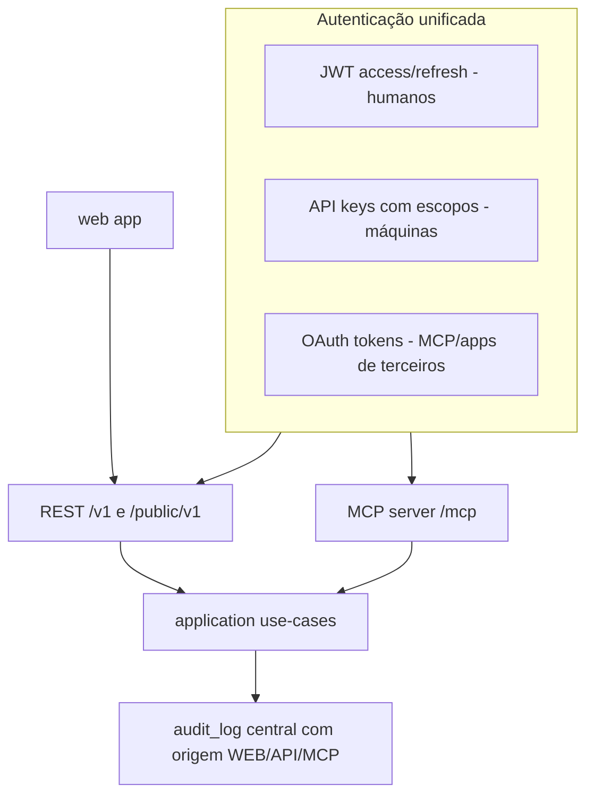

# SPEC_API_MCP.md — manypost: API pública REST + servidor MCP

> **Escopo:** contexto **Surfaces** [AGPL núcleo]. API RESTful pública e servidor MCP **sobre os mesmos use-cases** (nunca duplicar regra). Segue a direção do Postiz (núcleo AGPL) em: MCP sobre o core, OAuth de recurso protegido, origem da mutação auditada. Corrige: JWT eterno, API key sem hash/escopo. Depende de: SPEC_BACKEND (use-cases/OpenAPI), SPEC_DATA (api_keys, oauth_*, audit_log).

## 1. Princípio

Uma única pilha de autorização: qualquer credencial resolve para um **Principal** `{orgId, actorType, actorId, scopes[]}`; políticas por endpoint/tool avaliam escopos sobre o Principal — mesmo código para REST e MCP.

## 2. Autenticação

### Humanos (web) — corrige o JWT eterno do Postiz
- **Access token JWT** (HS256→migração p/ EdDSA quando houver federação), 15 min, claims `{sub, org, role}`; cookie httpOnly `SameSite=Lax`.
- **Refresh token** opaco, 30 dias, rotação a cada uso, hash no banco (`sessions`), detecção de reuso (roubo → revoga a família), logout revoga.
- Troca de organização = novo access token (claim `org`).
- **Login social (Google/GitHub)** — *paridade com o Postiz (providers de login), núcleo AGPL*: OAuth code flow com state anti-CSRF em cookie httpOnly single-use; identidades em `auth_identities` (N por usuário); vínculo automático a conta existente **somente com e-mail verificado no provedor** (`auth.social_email_unverified` caso contrário); avatar do provedor preenche `users.avatar_url` apenas quando vazio; habilitado por env (`GOOGLE_*`/`GITHUB_*` — ausente = botão não existe).

### Máquinas — API keys com escopos
- Formato `mp_live_<prefix8><secret32>`; armazenada **só o hash** (sha256) + prefixo para lookup; exibida uma única vez.
- Escopos: `posts:read`, `posts:write`, `channels:read`, `channels:write`, `media:write`, `analytics:read`, `webhooks:manage`, `mcp` — múltiplas keys por org, revogação individual, `last_used_at`.

### MCP / apps de terceiros — OAuth 2.1 (*direção do Postiz*)
- manypost como **authorization server**: `/.well-known/oauth-protected-resource` (RFC 9728) + `/.well-known/oauth-authorization-server`; authorization code + **PKCE S256** obrigatório; scopes `mcp:read`, `mcp:write`; tokens `mpo_*` opacos com hash no banco, expiração 1h + refresh.
- Tela de consentimento no web app listando escopos e organização.

### Tokens OAuth das redes sociais
Cifrados at-rest (AES-256-GCM, SPEC_DATA §5); nunca expostos por nenhuma superfície; decrypt só no worker no momento do uso.

## 3. API pública `/public/v1`

Recursos (paridade com o Postiz + organização REST):

| Recurso | Endpoints | Escopo |
|---|---|---|
| Posts | `GET/POST /posts`, `GET/PATCH/DELETE /posts/{groupId}`, `POST /posts/{groupId}/retry` | posts:* |
| Publications | `GET /publications?state&from&to` (status por canal) | posts:read |
| Channels | `GET /channels`, `GET /providers` (catálogo + capacidades + settingsSchema como JSON Schema), `DELETE /channels/{id}` | channels:* |
| Media | `POST /media/upload` (multipart, MIME real por magic bytes), `POST /media/from-url` (anti-SSRF), `GET /media` | media:write |
| Analytics | `GET /channels/{id}/analytics?range` | analytics:read |
| Webhooks | CRUD `/webhooks` (+ `POST /webhooks/{id}/test`) | webhooks:manage |
| Aprovação por link | `POST /posts/{groupId}/approval-link` (cria/revoga; retorna URL única) | posts:write |

### Superfície pública de aprovação (sem autenticação — por token, DECISIONS v1.1 §12)
- `GET /public/approval/{token}` → preview do grupo (conteúdo resolvido por canal, mídia, horário) — token opaco ≥ 128 bits, comparado por hash, single-purpose, com expiração; resposta nunca inclui dados da org além do necessário ao preview.
- `POST /public/approval/{token}/approve` e `POST /public/approval/{token}/request-changes` (com feedback) → transiciona o grupo (aprovado → elegível a agendar; ajustes → volta a rascunho com comentário), grava `audit_log` (`actor_type=PUBLIC_LINK`) e notifica a equipe.
- Rate-limit agressivo por IP + token; sem enumeração (404 uniforme para token inválido/expirado); ação é idempotente (segunda chamada retorna o estado resolvido).

Regras:
- **OpenAPI 3.1** gerado do zod é o contrato canônico (`/openapi.json` público); SDK TS gerado dele.
- Erros: RFC 9457 (`application/problem+json`) com `code` estável do domínio.
- Rate limit por credencial: token bucket Redis, default 60 req/min + burst, headers `RateLimit-*`; 429 com `Retry-After`. (*Direção do Postiz — throttler Redis — com resposta padrão.*)
- Paginação por cursor (`?cursor=&limit=`); `Idempotency-Key` em todos os POST de mutação.
- Anti-SSRF em qualquer fetch de URL de usuário (resolver DNS → bloquear IP privado — paridade com o dispatcher do Postiz).
- Versionamento no path (`/public/v1`); breaking → `/v2` com sunset headers.

## 4. Webhooks de saída

Eventos: `post.published`, `post.failed`, `post.scheduled`, `channel.refresh_required`, `channel.disconnected`. Entrega assinada `X-manypost-Signature` (HMAC-SHA256 com timestamp, tolerância 5 min), retries exponenciais (5 tentativas), endpoint de replay, filtro por canal — *direção do Postiz (webhooks pós-publicação), formalizada*.

## 5. Servidor MCP

- **SDK oficial `@modelcontextprotocol/sdk`**, transporte **Streamable HTTP** em `/mcp` no mesmo processo da api (desvio do Postiz: sem dependência de framework de agente; o MCP expõe use-cases direto).
- Auth: API key com escopo `mcp` **ou** OAuth §2; discovery documents servidos pela api.
- **Tools** (paridade com o Postiz + política):

| Tool | Use-case | Escopo exigido |
|---|---|---|
| `list_channels` | listChannels | mcp:read |
| `list_posts` / `get_post` | queries de posts | mcp:read |
| `schedule_post` | schedulePost (mesma validação da API) | mcp:write |
| `update_post` / `cancel_post` | reagendar/cancelar | mcp:write |
| `upload_media_from_url` | ingest de mídia (anti-SSRF) | mcp:write |
| `get_channel_analytics` | analytics | mcp:read |
| `generate_content` | IA de criação (consome créditos) | mcp:write |
| `find_free_slot` | próximo horário livre | mcp:read |

- **Resources**: `manypost://channels`, `manypost://posts/{state}` (leitura de contexto barata para o cliente MCP).
- Políticas por tool: além do escopo, limites específicos (ex.: `schedule_post` máx 30/h por credencial) — mitiga agente em loop.
- Toda chamada de tool grava `audit_log` com `actor_type=MCP` + tool + argumentos resumidos (*generalização do `CreationMethod` do Postiz*).
- Respostas de tool são JSON estruturado estável (contrato versionado junto do OpenAPI).

## 6. Autorização por papel (web)

`OWNER` (tudo), `ADMIN` (tudo menos billing/excluir org), `MEMBER` (criar/editar rascunhos, não aprova nem conecta canais) — matriz endpoint×papel na tabela de rotas, avaliada no mesmo middleware de escopos. Papéis finos/custom = premium (original), via extension point de política (SPEC_ARCHITECTURE §5).

## 7. Critérios de aceite

1. Refresh com rotação + detecção de reuso coberto por testes (reuso → família revogada).
2. API key: criada → usada → revogada → 401; escopo insuficiente → 403 com `problem+json`.
3. Fluxo MCP completo com um cliente real (Claude/Inspector): discovery → OAuth PKCE → `schedule_post` → post aparece no kanban com origem MCP.
4. Mesmo caso de uso inválido retorna o mesmo `code` de erro via REST e via MCP (teste de paridade).
5. `openapi.json` válido (spectral lint) e SDK TS gerado compila.
6. Rate limit e `Idempotency-Key` verificados por testes de integração (retry de POST não duplica post).
