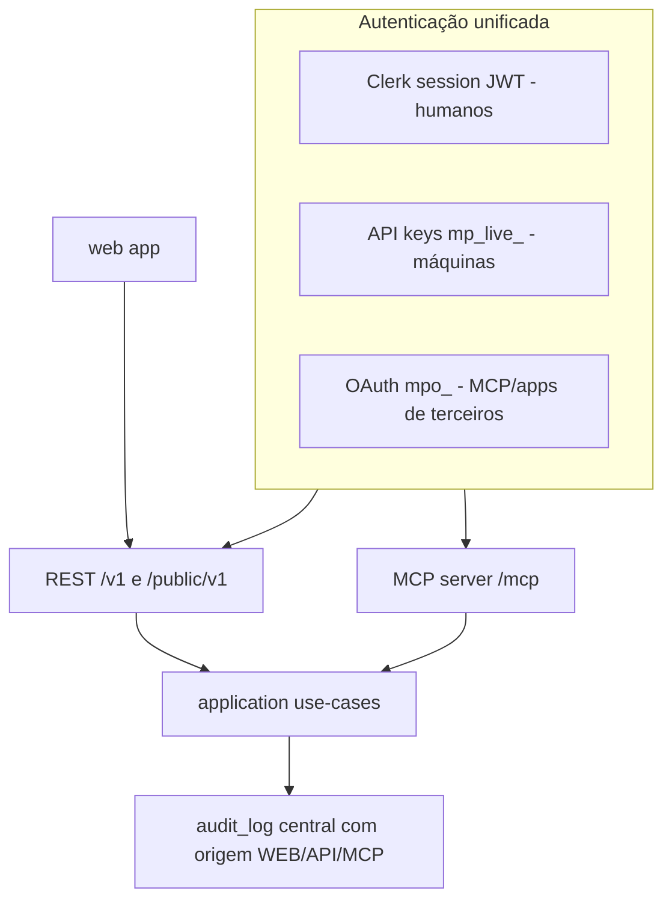

# SPEC_API_MCP.md — manypost: API pública REST + servidor MCP

[← Índice da documentação](../README.md) · [STATUS do projeto](../principal/STATUS.md) · [Decisões](../principal/DECISIONS.md) · [README do projeto](../../README.md)

> **Escopo:** contexto **Surfaces** [AGPL núcleo]. API RESTful pública e servidor MCP **sobre os mesmos use-cases** (nunca duplicar regra). Segue a direção do Postiz (núcleo AGPL) em: MCP sobre o core, OAuth de recurso protegido, origem da mutação auditada. Corrige: JWT eterno, API key sem hash/escopo. Depende de: SPEC_BACKEND (use-cases/OpenAPI), SPEC_DATA (api_keys, oauth_*, audit_log).
>
> **Estado de verdade (2026-07-26):** auth humana no runtime é **Clerk-only** (OpenSpec `clerk-human-authentication`). Trechos que ainda descrevam JWT access/refresh Manypost ou rotas `GOOGLE_*`/`GITHUB_*` na API são **histórico pré-Clerk** e não o comportamento vigente — confirme em `apps/api/src/http/middleware/auth.ts`, `openspec/specs/` e [STATUS.md](../principal/STATUS.md). Este arquivo mistura requisitos históricos/aspiracionais com o runtime; em conflito, prevalecem código + OpenSpec vivo.

## 1. Princípio

```mermaid
flowchart TB
    REST[REST /v1 e /public/v1] --> UC[application use-cases]
    MCP[MCP server /mcp] --> UC
    WEB[web app] --> REST
    subgraph authn [Autenticação unificada]
        CLERK[Clerk session JWT - humanos]
        KEY[API keys mp_live_ - máquinas]
        OAT[OAuth mpo_ - MCP/apps de terceiros]
    end
    authn --> REST & MCP
    UC --> AUD[audit_log central com origem WEB/API/MCP]
```

Uma única pilha de autorização: qualquer credencial resolve para um **Principal** `{orgId, actorType, actorId, scopes[]}`; políticas por endpoint/tool avaliam escopos sobre o Principal — mesmo código para REST e MCP.

## 2. Autenticação

### Humanos (web) — Clerk-only (vigente)
- **Sessão no Clerk** (senha, verificação de e-mail, Google/MFA e demais IdPs no **Clerk Dashboard** — não há rotas `GOOGLE_*`/`GITHUB_*` na API Manypost).
- Cada request humana envia `Authorization: Bearer <Clerk JWT>` (ou cookie `__session` no SSE, onde o EventSource não manda header).
- A API verifica o token (JWKS / chave local de E2E) e resolve **usuário + organização + papel no Postgres** (`auth_identities.provider=clerk`). Claims de tenant do cliente **não** autorizam.
- Superfície humana REST: basicamente `GET /v1/auth/me` + demais `/v1/*` com papel (MEMBER/ADMIN). Sem JWT access/refresh Manypost, sem cookie de sessão Manypost, sem exchange.
- Fail-closed sem chaves Clerk configuradas (exceto `MODE=worker`).
- Tabela `sessions` permanece no schema como **legado** (sem consumidor no runtime Clerk-only).

Histórico pré-Clerk (não implementado no runtime atual)

- Access token JWT Manypost (HS256), 15 min, claims `{sub, org, role}`; cookie httpOnly.
- Refresh opaco 30 dias com rotação e hash em `sessions`.
- Login social via env `GOOGLE_*`/`GITHUB_*` na própria API.

### Máquinas — API keys com escopos
- Formato `mp_live_<prefix8><secret32>`; armazenada **só o hash** (sha256) + prefixo para lookup; exibida uma única vez.
- Escopos: `posts:read`, `posts:write`, `channels:read`, `channels:write`, `media:write`, `analytics:read`, `webhooks:manage`, `mcp` — múltiplas keys por org, revogação individual, `last_used_at`.

### MCP / apps de terceiros — OAuth 2.1 (*direção do Postiz*)
- manypost como **authorization server** no issuer `PUBLIC_URL` (Next reescreve `/.well-known/oauth-authorization-server` e `/oauth/*` para a API): PRM no host MCP (`/.well-known/oauth-protected-resource`, RFC 9728); authorization code + **PKCE S256** obrigatório; scopes `mcp:read`, `mcp:write`; tokens `mpo_*` opacos com hash no banco, expiração curta + refresh com rotação e detecção de reuso.
- Endpoints de máquina do AS (`/oauth/authorize`, `/oauth/register`, `/oauth/token`) são **anônimos** no front door Clerk (DCR/token não redirecionam para HTML de login). Consentimento continua autenticado.
- Redirect URIs em loopback (`127.0.0.1` / `localhost` / `::1`) seguem **RFC 8252 §7.3** (porta ignorada; path/query exatos) para static, DCR e CIMD.
- Clientes: estático público `manypost-mcp` (Cursor + OpenCode loopback); CIMD (ex.: Claude Code); DCR em `/oauth/register` (Codex, VS Code, Inspector, Cursor paste-URL). Preferência: colar só a URL MCP.
- Fallback universal: `Authorization: Bearer mp_live_…` com escopo `mcp`.
- Tela de consentimento em `{PUBLIC_URL}/oauth/consent` (Clerk): lista escopos, organização e hostname do `redirect_uri` (aviso em loopback); approve/deny devolvem o redirect com `code`/`error`.
- Dual-auth nas superfícies de máquina: `mp_live_` (API key) **ou** `mpo_` (OAuth); Clerk continua rejeitado no MCP/REST de máquina.

### Tokens OAuth das redes sociais
Cifrados at-rest (AES-256-GCM, SPEC_DATA §5); nunca expostos por nenhuma superfície; decrypt só no worker no momento do uso.

## 3. API pública para máquinas

### Onde ela vive (hosts)

O serviço de API atende **três hosts** (roteamento por `Host`, mesmo processo, um deploy só):

| Host | Env | Serve |
|---|---|---|
| app (produto) | `PUBLIC_URL` | `/v1` interno (humano: Bearer Clerk ou cookie `__session` no SSE; autorização por **papel**), `/public/approval`, `/uploads`, `/public/v1` (compat) e `/mcp` (compat) |
| `api.dominio` | `API_PUBLIC_URL` | **`/v1` = esta API** (mesmo sub-app de `/public/v1`, re-prefixado) + `/openapi.json` e `/docs` restritos a ela |
| `mcp.dominio` | `MCP_PUBLIC_URL` | **servidor MCP na raiz** (§5), com `/mcp` como alias |

Por que host e não caminho: a superfície de máquina é `Authorization: Bearer` e **nunca cookie**, então não precisa ser same-origin com o web — e o rewrite do Next não é API gateway (bufferiza, tem timeout próprio, atrapalha o streaming do MCP e o pull de mídia grande). Os subdomínios são domínios custom do MESMO serviço, então não há CORS server-to-server, deploy extra nem divergência de código. `PUBLIC_URL` **não se move**: OAuth de canal, link de aprovação, URL pública de mídia e cookies dependem dela.

Sem as duas variáveis (self-host de um domínio só) nada muda: a API de máquina fica em `{PUBLIC_URL}/public/v1` e o MCP em `{PUBLIC_URL}/mcp`. Os endereços efetivos são devolvidos por `GET /v1/capabilities` (`endpoints.restBaseUrl`/`endpoints.mcpUrl`) — é o que a UI mostra ao criar a chave.

**Fronteira humano × máquina:** API key `mp_live_` é **recusada com 403** no `/v1` do host do app (a resposta aponta a superfície de máquina). Sem isso a chave contornaria escopos, gate de plano (`public_api`) e rate-limit por credencial, que só existem na superfície de máquina. **CORS**: qualquer origem, **sem** `credentials` (bearer, sem cookie), expondo `mcp-session-id` e os `RateLimit-*`.

Recursos (paridade com o Postiz + organização REST):

| Recurso | Endpoints | Escopo |
|---|---|---|
| Posts | `GET/POST /posts`, `GET/PATCH/DELETE /posts/{groupId}`, `POST /posts/{groupId}/retry` | posts:* |
| Publications | `GET /publications?state&from&to` (status por canal) | posts:read |
| Channels | `GET /channels`, `GET /providers` (catálogo + capacidades + settingsSchema como JSON Schema), `DELETE /channels/{id}` | channels:* |
| Media | `POST /media/upload` (multipart, MIME real por magic bytes), `POST /media/from-url` (anti-SSRF), `GET /media` | media:write |
| Analytics | `GET /channels/{id}/analytics?range` | analytics:read |
| Webhooks | CRUD `/webhooks` (+ `POST /webhooks/{id}/test`) | webhooks:manage |
| Aprovação por link | `POST /posts/{groupId}/approval-link` (cria/revoga; retorna URL única) | posts:write |

### Superfície pública de aprovação (sem autenticação — por token, DECISIONS v1.1 §12)
- `GET /public/approval/{token}` → preview do grupo (conteúdo resolvido por canal, mídia, horário) — token opaco ≥ 128 bits, comparado por hash, single-purpose, com expiração; resposta nunca inclui dados da org além do necessário ao preview.
- `POST /public/approval/{token}/approve` e `POST /public/approval/{token}/request-changes` (com feedback) → transiciona o grupo (aprovado → elegível a agendar; ajustes → volta a rascunho com comentário), grava `audit_log` (`actor_type=PUBLIC_LINK`) e notifica a equipe.
- Rate-limit agressivo por IP + token; sem enumeração (404 uniforme para token inválido/expirado); ação é idempotente (segunda chamada retorna o estado resolvido).

Regras:
- **OpenAPI 3.1** gerado do zod é o contrato canônico (`/openapi.json` público); SDK TS gerado dele.
- Erros: RFC 9457 (`application/problem+json`) com `code` estável do domínio.
- Rate limit por credencial: token bucket Redis, default 60 req/min + burst, headers `RateLimit-*`; 429 com `Retry-After`. (*Direção do Postiz — throttler Redis — com resposta padrão.*)
- Paginação por cursor (`?cursor=&limit=`); `Idempotency-Key` em todos os POST de mutação.
- Anti-SSRF em qualquer fetch de URL de usuário (resolver DNS → bloquear IP privado — paridade com o dispatcher do Postiz).
- Versionamento no path (`/public/v1`); breaking → `/v2` com sunset headers.

## 4. Webhooks de saída

Eventos: `post.published`, `post.failed`, `post.scheduled`, `channel.refresh_required`, `channel.disconnected`. Entrega assinada `X-manypost-Signature` (HMAC-SHA256 com timestamp, tolerância 5 min), retries exponenciais (5 tentativas), endpoint de replay, filtro por canal — *direção do Postiz (webhooks pós-publicação), formalizada*.

## 5. Servidor MCP

- **SDK oficial `@modelcontextprotocol/sdk`**, transporte **Streamable HTTP** no mesmo processo da api (desvio do Postiz: sem dependência de framework de agente; o MCP expõe use-cases direto). **Endereço canônico = raiz do host `mcp.dominio`** (`MCP_PUBLIC_URL`) — é a URL que o usuário cola no cliente; `/mcp` responde como alias, e no self-host de um domínio só ele fica em `{PUBLIC_URL}/mcp`. Navegação humana no host (GET com `accept: text/html`) recebe uma página explicando como conectar, não um 401 cru.
- Auth: API key com escopo `mcp` (legado) **ou** OAuth §2 (`mpo_` + `mcp:read`/`mcp:write`); 401 sem credencial inclui `WWW-Authenticate` com `resource_metadata`; discovery PRM no host MCP e AS em `PUBLIC_URL`.
- **Tools** (paridade com o Postiz + política):

| Tool | Use-case | Escopo exigido |
|---|---|---|
| `list_channels` | listChannels | mcp:read |
| `list_posts` / `get_post` | queries de posts | mcp:read |
| `schedule_post` | schedulePost (mesma validação da API) | mcp:write |
| `update_post` / `cancel_post` | reagendar/cancelar | mcp:write |
| `upload_media_from_url` | ingest de mídia (anti-SSRF) | mcp:write |
| `get_channel_analytics` | analytics | mcp:read |
| `generate_content` | IA de criação (consome créditos) | mcp:write |
| `find_free_slot` | próximo horário livre | mcp:read |

- **Resources**: `manypost://channels`, `manypost://posts/{state}` (leitura de contexto barata para o cliente MCP).
- Políticas por tool: além do escopo, limites específicos (ex.: `schedule_post` máx 30/h por credencial) — mitiga agente em loop.
- Toda chamada de tool grava `audit_log` com `actor_type=MCP` + tool + argumentos resumidos (*generalização do `CreationMethod` do Postiz*).
- Respostas de tool são JSON estruturado estável (contrato versionado junto do OpenAPI).

## 6. Autorização por papel (web)

`OWNER` (tudo), `ADMIN` (tudo menos billing/excluir org), `MEMBER` (criar/editar rascunhos, não aprova nem conecta canais) — matriz endpoint×papel na tabela de rotas, avaliada no mesmo middleware de escopos. Papéis finos/custom vivem no monorepo e são validados pelo `PlanPolicy` no SaaS ou liberados localmente em `IS_SELF_HOSTED=true` (SPEC_ARCHITECTURE §5).

## 7. Critérios de aceite

1. Refresh com rotação + detecção de reuso coberto por testes (reuso → família revogada).
2. API key: criada → usada → revogada → 401; escopo insuficiente → 403 com `problem+json`.
3. Fluxo MCP completo com um cliente real (Claude/Inspector): discovery → OAuth PKCE → `schedule_post` → post aparece no kanban com origem MCP.
4. Mesmo caso de uso inválido retorna o mesmo `code` de erro via REST e via MCP (teste de paridade).
5. `openapi.json` válido (spectral lint) e SDK TS gerado compila.
6. Rate limit e `Idempotency-Key` verificados por testes de integração (retry de POST não duplica post).

---

**Specs irmãs:** [ARCHITECTURE](SPEC_ARCHITECTURE.md) · [BACKEND](SPEC_BACKEND.md) · [FRONTEND](SPEC_FRONTEND.md) · [DATA](SPEC_DATA.md) · [QUEUE_PUBLISHING](SPEC_QUEUE_PUBLISHING.md) · [INTEGRATIONS](SPEC_INTEGRATIONS.md) · [AI](SPEC_AI.md) · [INFRA](SPEC_INFRA.md) · [ROADMAP](SPEC_ROADMAP.md)

**Navegação:** [Índice da documentação](../README.md) · [STATUS](../principal/STATUS.md) · [Decisões](../principal/DECISIONS.md) · [Marca](../brand/BRAND_SYSTEM.md) · [README do projeto](../../README.md) · [Contribuir](../../CONTRIBUTING.md)
