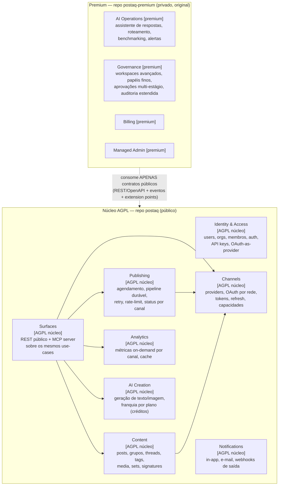
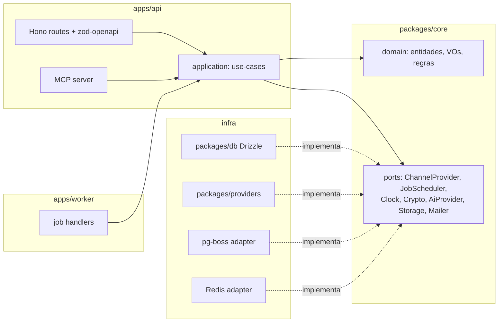

# SPEC_ARCHITECTURE.md — postaq: visão geral e fronteiras

> **Status:** APROVADA (DECISIONS.md v1, 2026-07-10) — exceção: licença dos contratos pendente de validação jurídica (DECISIONS §1c).
> **Contexto:** o postaq reimplementa as soluções do [Postiz](https://github.com/gitroomhq/postiz-app) (AGPL-3.0) em nova stack. Núcleo **AGPL-3.0 com atribuição** (derivação documentada em `POSTIZ_ANALYSIS.md §8`); premium **fechado e original**. Este documento define os bounded contexts, a fronteira aberto/fechado e como as camadas se encaixam. Specs irmãs: BACKEND, FRONTEND, QUEUE_PUBLISHING, INTEGRATIONS, DATA, API_MCP, AI, INFRA, ROADMAP.

## 1. Objetivo do produto

Agendador e publicador de posts para redes sociais, self-hostable, com: conexão de canais via OAuth, composer multi-canal, calendário + kanban, publicação durável com retry/rate-limit, analytics por canal, API pública e servidor MCP. Premium (SaaS/licença): IA operacional, governança avançada, billing, admin.

## 2. Stack alvo (fixa)

| Camada | Tecnologia |
|---|---|
| Runtime backend | **Bun** + TypeScript |
| HTTP | **Hono** (+ `@hono/zod-openapi`) — justificativa em SPEC_BACKEND §2 |
| Frontend | **Next.js** + React + **shadcn/ui** + Tailwind (cliente OpenAPI, não tRPC) |
| Dados | **PostgreSQL** + **Drizzle** (migrations versionadas) |
| Fila | **pg-boss** (Postgres-nativa) + orquestração explícita — avaliação em SPEC_QUEUE_PUBLISHING §2 |
| Cache/locks/rate-limit | **Redis** |
| Arquitetura | **Monólito modular DDD** (domain / application / infra) |

## 3. Bounded contexts



### Responsabilidade de cada contexto (núcleo)

- **Identity & Access** — usuários, organizações, membership com papéis básicos (`OWNER|ADMIN|MEMBER`), sessões JWT access/refresh, API keys com hash+escopos, e o papel de *authorization server* OAuth para MCP/apps de terceiros. *Seguindo a direção do Postiz (núcleo AGPL)* em multi-org e API key por organização; corrigindo JWT eterno e key sem hash.
- **Channels** — registry de `ChannelProvider`s, fluxo de conexão OAuth (incl. 2 passos), armazenamento criptografado de tokens, refresh proativo/reativo, capacidades declarativas por rede. *Seguindo a direção do Postiz.*
- **Content** — post multi-canal (grupo), variantes por canal, threads, tags, biblioteca de mídia, sets de canais, assinaturas. *Seguindo a direção do Postiz.*
- **Publishing** — agendamento, orquestração durável (post agendado → N publicações), retry/backoff, rate-limit por conta/rede, idempotência, status por canal, recuperação. *Seguindo a direção do Postiz*, trocando Temporal por orquestração própria sobre pg-boss (SPEC_QUEUE_PUBLISHING).
- **Analytics** — busca on-demand nos providers + cache + persistência mínima de séries (melhoria nossa). Benchmarking/alertas ficam no premium.
- **AI Creation** — port `AiProvider` (nenhum provedor citado no código), geração de legenda/hashtag/imagem no composer, créditos por organização. *Direção do Postiz* (créditos) com abstração nossa.
- **Surfaces** — a API pública REST (OpenAPI) e o MCP server são **duas fachadas sobre os mesmos use-cases da camada application**; nunca duplicam regra de negócio. *Seguindo a direção do Postiz (MCP sobre o core).* 
- **Notifications** — notificações in-app, e-mails transacionais, webhooks de saída pós-publicação.

### Premium (implementação original, não derivada)
Cada módulo premium é um serviço/pacote separado que se conecta ao núcleo **somente** por: (a) API REST pública com service token; (b) eventos (webhooks/outbox exposto); (c) extension points explícitos (ver §5). Proibido: importar código do núcleo além do pacote de contratos, espelhar estrutura interna do Postiz, acessar o banco do núcleo diretamente (exceção: leitura read-replica para benchmarking, decisão em DECISIONS.md).

## 4. Repositórios e pacotes

```
postaq/                     # repo público, AGPL-3.0
├── NOTICE / ATTRIBUTION.md # origem Postiz, commit analisado, elementos derivados
├── apps/
│   ├── api/                # Bun + Hono: HTTP, MCP, webhooks de entrada
│   ├── worker/             # Bun: consumidores pg-boss (publicação, refresh, digest)
│   └── web/                # Next.js + shadcn/ui
├── packages/
│   ├── core/               # DDD: domain + application (use-cases, ports) — sem IO
│   ├── db/                 # Drizzle schema + migrations + repositórios
│   ├── providers/          # ChannelProviders (1 subpasta por rede)
│   ├── contracts/          # OpenAPI gerado, tipos públicos, eventos, extension points
│   │                       #   → @postaq/contracts: licença permissiva PENDENTE de validação
│   │                       #     jurídica (DECISIONS §1c) — NÃO publicar no npm até parecer;
│   │                       #     conteúdo restrito a tipos/schemas/constantes (zero lógica)
│   └── config/             # env schema (zod), constantes
└── docker/                 # compose self-host: api+worker+web, postgres, redis

postaq-premium/             # repo privado, proprietário, código original
├── services/ai-ops/        # IA operacional
├── services/governance/    # workspaces/aprovações avançadas
├── services/billing/
└── admin/                  # console do gerenciado
```

Regras invioláveis:
1. O núcleo **roda 100% self-hosted sem o premium** — nenhum import, nenhum feature-flag que dependa de código fechado.
2. Premium depende apenas de `@postaq/contracts` (versão semântica; breaking = major).
3. `@postaq/contracts` é gerado a partir do núcleo (OpenAPI + zod schemas) e não contém lógica.

## 5. Extension points do núcleo (como o premium se pluga)

| Ponto | Mecanismo | Exemplo de uso premium |
|---|---|---|
| Eventos de domínio | Webhook de saída assinado + endpoint de subscrição (`post.published`, `post.failed`, `channel.disconnected`, `mention.received`) | IA operacional reage a menções |
| Hooks de decisão | Endpoint de política registrável: antes de `schedule` o núcleo consulta um *policy check* HTTP se configurado | Aprovações multi-estágio da governança |
| UI slots | O web app carrega remotamente módulos declarados em `PREMIUM_UI_URL` (module federation/iframe assinado) | Telas de benchmarking |
| Auth federada | O núcleo aceita JWTs emitidos pelo IdP premium via JWKS configurável | SSO corporativo |

Sem premium configurado, todos os pontos são no-ops — critério de aceite do núcleo.

## 6. Camadas dentro do núcleo (visão vertical)



Regra de dependência: `domain` não importa nada; `application` importa `domain` e ports; `infra` implementa ports; `apps/*` compõem tudo (composition root). API e worker compartilham `core` — mesmo padrão do Postiz (backend e orchestrator importando os mesmos services), que provou funcionar.

## 7. Requisitos não-funcionais

- **Self-host mínimo:** 3 containers (api+worker podem ser 1 processo em `MODE=all`), Postgres, Redis. Nada de Elasticsearch/Temporal.
- **Escala horizontal:** api stateless; workers N réplicas com partição de rate-limit via Redis (SPEC_QUEUE §6).
- **Multi-tenant por organização** em todas as tabelas e queries (org id obrigatório em todo repositório — lint rule).
- **Observabilidade:** logs estruturados JSON com correlation id, métricas Prometheus, tracing OTel (SPEC_INFRA).
- **i18n-ready** no frontend; timezone por usuário, armazenamento UTC.

## 8. Critérios de aceite desta spec

1. Repositório núcleo criado com a estrutura do §4, `NOTICE`/`ATTRIBUTION.md` presentes e CI validando que `packages/core` não importa de `apps/*` nem de `infra`.
2. `docker compose up` sobe o núcleo completo sem qualquer variável/serviço premium.
3. `@postaq/contracts` publicável e consumido por um serviço de exemplo externo (smoke test) — publicação real só após validação jurídica (DECISIONS §1c/P1).
4. Nenhuma referência a código premium no repo AGPL (verificação de CI por dependency-cruiser).
