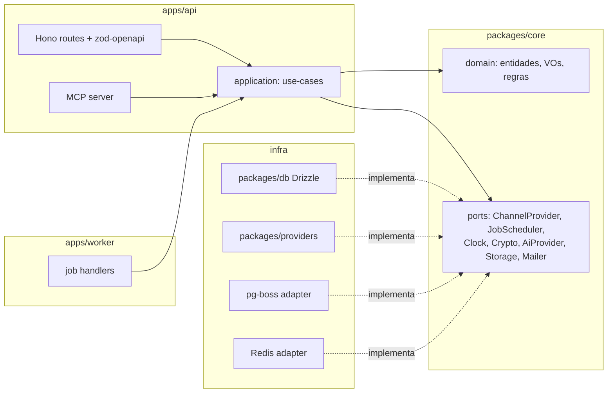

# SPEC_ARCHITECTURE.md — manypost: visão geral e fronteiras

[← Índice da documentação](../README.md) · [STATUS do projeto](../principal/STATUS.md) · [Decisões](../principal/DECISIONS.md) · [README do projeto](../../README.md)

> **Status:** APROVADA (DECISIONS.md v1 + Adendo Open Source v1.2, 2026-07-17) — licença de `@manypost/contracts` validada como AGPL-3.0 integral no monorepo.
> **Contexto:** o manypost reimplementa as soluções do [Postiz](https://github.com/gitroomhq/postiz-app) (AGPL-3.0) em nova stack. **Monorepo unificado 100% Open Source sob AGPL-3.0 com atribuição ao Postiz** (derivação documentada em `POSTIZ_ANALYSIS.md §8`). A separação entre uso grátis self-hosted e portas comerciais no SaaS na nuvem ocorre via variáveis de ambiente (`IS_SELF_HOSTED`, `HIDE_BILLING`). Este documento define os bounded contexts e como as camadas se encaixam. Specs irmãs: BACKEND, FRONTEND, QUEUE_PUBLISHING, INTEGRATIONS, DATA, API_MCP, AI, INFRA, ROADMAP.

## 1. Objetivo do produto

Agendador e publicador de posts para redes sociais, self-hostable, com: conexão de canais via OAuth, composer multi-canal, calendário + kanban, publicação durável com retry/rate-limit, analytics por canal, API pública e servidor MCP. **Tudo isso vive no monorepo aberto** — incluindo IA operacional, governança, billing e admin, que no serviço gerenciado são gateados por `PlanPolicy` e no self-hosted ficam liberados (§3, "Estratégia de Nuvem vs Self-Hosted").

## 2. Stack alvo (fixa)

| Camada | Tecnologia |
|---|---|
| Runtime backend | **Bun** + TypeScript |
| HTTP | **Hono** (+ `@hono/zod-openapi`) — justificativa em SPEC_BACKEND §2 |
| Frontend | **Next.js** + React + **shadcn/ui** + Tailwind (cliente OpenAPI, não tRPC) |
| Dados | **PostgreSQL** + **Drizzle** (migrations versionadas) |
| Fila | **pg-boss** (Postgres-nativa) + orquestração explícita — avaliação em SPEC_QUEUE_PUBLISHING §2 |
| Cache/locks/rate-limit | **Redis** |
| Arquitetura | **Monólito modular DDD** (domain / application / inflowchart TB
    subgraph AGPL["Monorepo Unificado — manypost (100% Open Source / AGPL-3.0)"]
        IDENT["Identity & Access<br/>users, orgs, membros, auth,<br/>API keys, OAuth-as-provider"]
        CHAN["Channels<br/>providers, OAuth por rede,<br/>tokens, refresh, capacidades"]
        CONT["Content<br/>posts, grupos, threads, tags,<br/>media, sets, signatures"]
        PUB["Publishing<br/>agendamento, pipeline durável,<br/>retry, rate-limit, status por canal"]
        ANA["Analytics<br/>métricas on-demand por canal, cache"]
        AICORE["AI Creation<br/>geração de texto/imagem,<br/>franquia por plano (créditos)"]
        SURF["Surfaces<br/>REST público + MCP server<br/>sobre os mesmos use-cases"]
        NOTIF["Notifications<br/>in-app, e-mail, webhooks de saída"]
        AIOPS["AI Operations & Governance<br/>[Monorepo AGPL — gated in Cloud]<br/>assistente, roteamento, workspaces avançados"]
        BILL["Billing & SaaS Admin<br/>[Monorepo AGPL — gated via IS_SELF_HOSTED/HIDE_BILLING]"]
    end
    SURF --> CONT & PUB & CHAN & ANA & AICORE & AIOPS
    PUB --> CHAN
    CONT --> CHAN
    BILL -. "enforces PlanPolicy in SaaS Cloud<br/>(IS_SELF_HOSTED=false)" .-> CONT & PUB & AICORE & AIOPS
```

### Responsabilidade de cada contexto

- **Identity & Access** — usuários, organizações, membership com papéis (`OWNER|ADMIN|MEMBER`), sessões JWT access/refresh, API keys com hash+escopos, e o papel de *authorization server* OAuth para MCP/apps de terceiros. *Seguindo a direção do Postiz (núcleo AGPL)* em multi-org e API key por organização; corrigindo JWT eterno e key sem hash.
- **Channels** — registry de `ChannelProvider`s, fluxo de conexão OAuth (incl. 2 passos), armazenamento criptografado de tokens, refresh proativo/reativo, capacidades declarativas por rede. *Seguindo a direção do Postiz.*
- **Content** — post multi-canal (grupo), variantes por canal, threads, tags, biblioteca de mídia, sets de canais, assinaturas. *Seguindo a direção do Postiz.*
- **Publishing** — agendamento, orquestração durável (post agendado → N publicações), retry/backoff, rate-limit por conta/rede, idempotência, status por canal, recuperação. *Seguindo a direção do Postiz*, trocando Temporal por orquestração própria sobre pg-boss (SPEC_QUEUE_PUBLISHING).
- **Analytics** — busca on-demand nos providers + cache + persistência mínima de séries (melhoria nossa).
- **AI Creation & Operations** — port `AiProvider` (nenhum provedor citado no código), geração no composer, e módulos de assistente de respostas/triagem. Controlados pela franquia no SaaS ou BYO-Key em self-hosted.
- **Surfaces** — a API pública REST (OpenAPI) e o MCP server são **duas fachadas sobre os mesmos use-cases da camada application**; nunca duplicam regra de negócio. *Seguindo a direção do Postiz (MCP sobre o core).* 
- **Notifications** — notificações in-app, e-mails transacionais, webhooks de saída pós-publicação.

### Estratégia de Nuvem vs Self-Hosted (Feature Flags)
O monorepo é 100% open source sob a licença AGPL-3.0. A diferenciação entre quem hospeda localmente (Community) e quem utiliza a plataforma na nuvem (`manypost Cloud`) acontece de forma transparente por variáveis de ambiente:
- Em modo self-hosted (`IS_SELF_HOSTED=true` / `HIDE_BILLING=true`), os adaptadores de política de plano retornam `allowed` e a UI não exibe chamadas comerciais.
- Em modo Cloud (`IS_SELF_HOSTED=false`), o `PlanPolicy` integra-se à cobrança da Stripe para impor os limites dos planos Grátis, Pro e Premium.

## 4. Repositórios e pacotes

```
manypost/                     # monorepo unificado 100% open source, AGPL-3.0
├── NOTICE / ATTRIBUTION.md # origem Postiz, commit analisado, elementos derivados
├── apps/
│   ├── api/                # Bun + Hono: HTTP, MCP, webhooks de entrada e faturamento SaaS
│   ├── worker/             # Bun: consumidores pg-boss (publicação, refresh, digest, automações)
│   └── web/                # Next.js + shadcn/ui (UI reativa a IS_SELF_HOSTED/HIDE_BILLING)
├── packages/
│   ├── core/               # DDD: domain + application (use-cases, ports, PlanPolicy) — sem IO
│   ├── db/                 # Drizzle schema + migrations + repositórios
│   ├── providers/          # ChannelProviders (1 subpasta por rede)
│   ├── contracts/          # OpenAPI gerado, tipos públicos, eventos, extension points
│   │                       #   → @manypost/contracts: licenciado sob AGPL-3.0 junto com
│   │                       #     o monorepo; conteúdo restrito a tipos/schemas (zero lógica)
│   └── config/             # env schema (zod com IS_SELF_HOSTED/HIDE_BILLING), constantes
└── docker/                 # compose self-host: api+worker+web, postgres, redis
```

Regras invioláveis:
1. O monorepo **roda 100% self-hosted com IS_SELF_HOSTED=true** — sem dependências ou bloqueios de componentes fechados.
2. `packages/core` não importa de `apps/*` nem de adaptadores externos (verificação por `dependency-cruiser`).
3. `@manypost/contracts` mantém zero lógica de domínio para possibilitar integrações seguras e está sob AGPL-3.0.

## 5. Extension points do domínio (`PlanPolicy` e Eventos)

| Ponto | Mecanismo | Comportamento Community vs Cloud |
|---|---|---|
| Port `PlanPolicy` | Interface de domínio de validação de capacidades (`canAddChannel`, `canSchedulePost`, `canUseAi`, etc.) | **Self-hosted:** responde `allowed` para tudo sem impor bloqueios.<br/>**Cloud:** valida contra a assinatura/Stripe da organização. |
| Eventos de domínio | Bus de eventos e Webhooks de saída (`post.published`, `post.failed`, `mention.received`) | Assináveis tanto por automações locais quanto por módulos de IA do monorepo. |
| Hooks de governança | Políticas multi-estágio (`approval_links`) e regras finas de workspace | **Self-hosted:** liberado por padrão.<br/>**Cloud:** liberado para planos Pro+ e Premium. |
| SSO / Auth corporativa | Suporte a provedores OAuth/SAML e segredos no monorepo | Configuração por organização no SaaS ou via env local no self-hosted. |

Sem feature flags SaaS ativadas (`IS_SELF_HOSTED=true`), todos os gates comerciais são abertos (no-op para checagem de plano) — critério de aceite principal do modo comunitário.

## 6. Camadas dentro do núcleo (visão vertical)



Regra de dependência: `domain` não importa nada; `application` importa `domain` e ports; `infra` implementa ports; `apps/*` compõem tudo (composition root). API e worker compartilham `core` — mesmo padrão do Postiz (backend e orchestrator importando os mesmos services), que provou funcionar.

## 7. Requisitos não-funcionais

- **Self-host mínimo:** 3 containers (api+worker podem ser 1 processo em `MODE=all`), Postgres, Redis. Nada de Elasticsearch/Temporal.
- **Escala horizontal:** api stateless; workers N réplicas com partição de rate-limit via Redis (SPEC_QUEUE §6).
- **Multi-tenant por organização** em todas as tabelas e queries (org id obrigatório em todo repositório — lint rule).
- **Observabilidade:** logs estruturados JSON com correlation id, métricas Prometheus, tracing OTel (SPEC_INFRA).
- **i18n-ready** no frontend; timezone por usuário, armazenamento UTC.

## 8. Critérios de aceite desta spec

1. Repositório núcleo criado com a estrutura do §4, `NOTICE`/`ATTRIBUTION.md` presentes e CI validando que `packages/core` não importa de `apps/*` nem de `infra`.
2. `docker compose up` sobe a aplicação completa sem nenhuma variável ou serviço de assinatura.
3. `@manypost/contracts` publicável e consumido por um serviço de exemplo externo (smoke test) — publicação real só após validação jurídica (DECISIONS §1c/P1).
4. Nenhuma referência a código fechado (`@manypost-premium` e afins): o CI falha se aparecer uma — é o guard que impede o modelo 100% aberto de regredir sem que ninguém perceba.

---

**Specs irmãs:** [BACKEND](SPEC_BACKEND.md) · [FRONTEND](SPEC_FRONTEND.md) · [DATA](SPEC_DATA.md) · [QUEUE_PUBLISHING](SPEC_QUEUE_PUBLISHING.md) · [INTEGRATIONS](SPEC_INTEGRATIONS.md) · [API_MCP](SPEC_API_MCP.md) · [AI](SPEC_AI.md) · [INFRA](SPEC_INFRA.md) · [ROADMAP](SPEC_ROADMAP.md)

**Navegação:** [Índice da documentação](../README.md) · [STATUS](../principal/STATUS.md) · [Decisões](../principal/DECISIONS.md) · [Marca](../brand/BRAND_SYSTEM.md) · [README do projeto](../../README.md) · [Contribuir](../../CONTRIBUTING.md)
