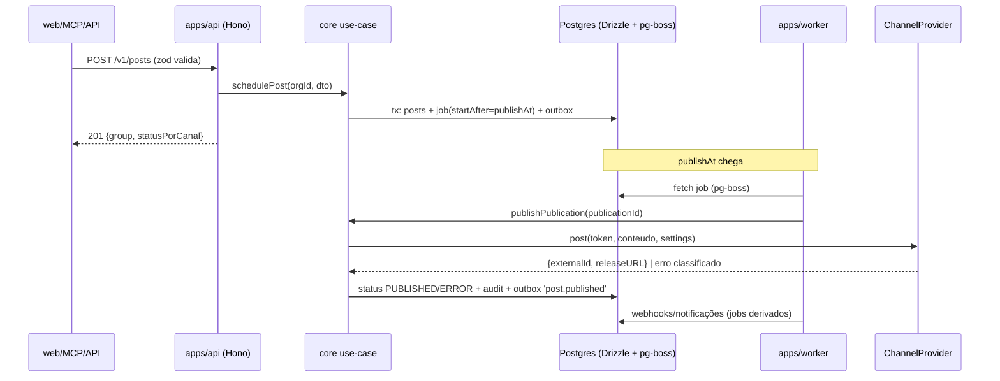

# SPEC_BACKEND.md — manypost: backend Bun + TypeScript

> **Escopo:** `apps/api`, `apps/worker` e `packages/core` do repo núcleo (AGPL). Segue a direção do Postiz onde indicado; melhorias e desvios são explícitos. Depende de: SPEC_ARCHITECTURE (contextos), SPEC_DATA (schema), SPEC_QUEUE_PUBLISHING (jobs), SPEC_INTEGRATIONS (providers), SPEC_API_MCP (superfícies).

## 1. Contexto

O backend do Postiz é NestJS com disciplina `Controller → Service → Repository` e lógica em bibliotecas compartilhadas entre API e workers. O manypost preserva **essa separação e o compartilhamento API/worker** (núcleo AGPL, seguindo a direção do Postiz), mas troca NestJS por Hono + DDD explícito, e decorators por composição funcional tipada.

## 2. Framework HTTP: Hono (decisão)

Avaliados **Hono** e **Elysia** (ambos first-class em Bun):

| Critério | Hono | Elysia |
|---|---|---|
| Acoplamento ao runtime | Agnóstico (Bun, Node, Workers) — rota de fuga se o Bun travar em alguma dependência (ex.: driver, sharp) | Bun-only na prática |
| OpenAPI | `@hono/zod-openapi`: schema zod = validação + doc, maduro | `t.Object` (TypeBox) + plugin swagger; bom, porém ecossistema menor |
| Estabilidade/ecossistema | Grande, API estável, middlewares oficiais (JWT, CORS, secure-headers, timing) | Menor, breaking changes mais frequentes |
| Performance | Excelente (suficiente; gargalo real é IO das redes sociais) | Melhor em micro-bench — irrelevante aqui |
| Magia implícita | Baixa (explícito) | Alta (decorators de tipo, plugins que mutam contexto) |

**Decisão: Hono + `@hono/zod-openapi`.** O contrato OpenAPI é artefato de primeira classe (o frontend e o SDK consomem — SPEC_FRONTEND §3), e a portabilidade de runtime reduz risco do Bun. Elysia fica registrado como alternativa se um dia performance de framework virar gargalo (improvável).

## 3. Estrutura DDD

```
packages/core/src/
├── domain/                     # zero dependências externas
│   ├── content/                #   Post, PostGroup, Thread, Tag, MediaRef (entidades/VOs)
│   ├── channels/               #   Channel, ChannelCapabilities, TokenSet (VO cifrado)
│   ├── publishing/             #   Publication (agregado), PublicationState (máquina de estados)
│   ├── identity/               #   Organization, Member, Role, ApiKeyPolicy
│   └── shared/                 #   Result<T,E>, DomainError, Clock, Id
├── application/
│   ├── use-cases/              # 1 arquivo = 1 caso de uso, função pura + ports
│   │   ├── schedule-post.ts    #   (o coração — ver §5)
│   │   ├── connect-channel.ts
│   │   ├── publish-publication.ts
│   │   ├── refresh-channel-token.ts
│   │   └── ...
│   ├── ports/                  # interfaces: ChannelProviderRegistry, JobScheduler,
│   │                           #   PostRepository, CryptoService, AiProvider, Storage,
│   │                           #   RateLimiter, EventPublisher, Mailer
│   └── dto/                    # zod schemas de entrada/saída (fonte do OpenAPI)
```

```
apps/api/src/
├── http/
│   ├── routes/                 # 1 módulo por contexto: posts.routes.ts, channels.routes.ts,
│   │                           #   auth.routes.ts, media.routes.ts, analytics.routes.ts,
│   │                           #   public-v1.routes.ts, webhooks.routes.ts
│   ├── middleware/             # auth (JWT/API key), org-scope, rate-limit, correlation-id,
│   │                           #   error-mapper (DomainError -> HTTP), audit
│   └── openapi.ts              # composição do doc
├── mcp/                        # servidor MCP (SPEC_API_MCP §5)
├── container.ts                # composition root: instancia adapters e injeta nos use-cases
└── main.ts

apps/worker/src/
├── handlers/                   # publish.handler, refresh-token.handler, recover.handler,
│                               #   analytics-cache.handler, webhook-delivery.handler
├── container.ts                # MESMOS use-cases, adapters de worker
└── main.ts
```

### Injeção de dependência
Sem framework de DI: use-cases são fábricas `makeSchedulePost(deps: {...})` e o `container.ts` faz a fiação explícita. Testes injetam fakes. (Desvio deliberado do NestJS do Postiz: menos magia, melhor tree-shaking no Bun.)

## 4. Padrões obrigatórios

1. **Todo caso de uso recebe `orgId` como primeiro parâmetro** e todo repositório filtra por org — regra de lint customizada (mesma disciplina multi-tenant do Postiz).
2. **Erros de domínio tipados** (`DomainError` com `code` estável: `channel.refresh_required`, `post.invalid_media`, `plan.channel_limit`...) mapeados para HTTP num único middleware. Os codes são contrato público (aparecem no OpenAPI).
3. **Validação dupla-face**: o mesmo zod schema valida a rota (Hono) e o use-case; settings por provider têm schema próprio no pacote do provider (SPEC_INTEGRATIONS §4) — *seguindo a direção do Postiz (DTO compartilhado client/server, núcleo AGPL)*, com zod no lugar de class-validator.
4. **Transações explícitas**: `UnitOfWork` port; agendar post grava `post` + enfileira job **na mesma transação** (outbox — SPEC_QUEUE §5). Corrige o gap do Postiz (start de workflow fora da transação, erros engolidos).
5. **Idempotência**: mutações públicas aceitam `Idempotency-Key`; a chave é persistida com hash do payload e resposta (24h).
6. **Auditoria**: toda mutação registra `audit_log` (actor, org, ação, alvo, origem `WEB|API|MCP` — generalização do `CreationMethod` do Postiz).
7. **Nada de `catch {}` vazio** — lint proíbe; falhas de infra vão para log estruturado + métrica.

## 5. Caso de uso canônico: `schedule-post`

Seguindo a direção do Postiz (validação server-side consolidada + 1 publicação por canal), com outbox:

```
entrada: { orgId, userId, groupContent: {base, perChannel[]}, channels[], publishAt, timezone,
           recurrence?, tags[], idempotencyKey? }

1. carregar canais ativos da org; validar limites do plano (port PlanPolicy)
2. para cada canal:
   a. provider = registry.get(channel.provider)
   b. validar settings com provider.settingsSchema (zod)
   c. validar conteúdo: maxLength(settings), mídia via provider.validateMedia (dimensões/formato)
3. montar agregado PostGroup (1 Post por canal, threads como filhos) — estado DRAFT ou SCHEDULED
4. em UMA transação (UnitOfWork):
   a. persistir grupo/posts
   b. para cada post SCHEDULED: scheduler.enqueue('publish', {publicationId}, {startAfter: publishAt, singletonKey: publicationId})
   c. gravar audit_log + evento outbox 'post.scheduled'
5. retornar grupo com status por canal
```

Editar/cancelar: atualizar linhas + `scheduler.cancel(singletonKey)` + re-enqueue — equivalente funcional do `TERMINATE_EXISTING` do Postiz.

## 6. Diagrama de sequência (agendar → publicar)



## 7. Testes

- **Unit**: domain e use-cases com fakes de ports (`bun test`), cobertura mínima 80% em `packages/core`.
- **Contrato de provider**: suíte compartilhada que todo `ChannelProvider` deve passar (SPEC_INTEGRATIONS §7).
- **Integração**: rotas Hono contra Postgres/Redis efêmeros (testcontainers), incluindo o ciclo agendar→publicar com provider fake.
- **OpenAPI snapshot**: o doc gerado é versionado; mudança não intencional quebra CI.

## 8. Critérios de aceite

1. `bun run dev` sobe api+worker em modo único; `MODE=api|worker|all` por env.
2. OpenAPI 3.1 gerado automaticamente cobre 100% das rotas públicas e autenticadas.
3. Fluxo completo (conectar canal fake → agendar → publicar → webhook) verde em teste de integração.
4. Lint impede: import de `apps/*` dentro de `packages/core`; repositório sem filtro de org; `catch` vazio.
5. Nenhuma dependência externa ou repositório premium fechado (`@manypost-premium`) e nenhuma referência a provedor de IA nominal fora do adaptador `infra/ai/*` (grep no CI).
