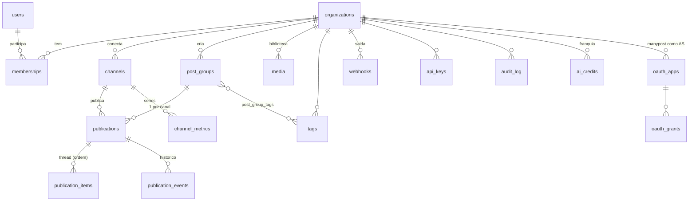

# SPEC_DATA.md — manypost: PostgreSQL + Drizzle

> **Escopo:** `packages/db` [AGPL núcleo]. Modelo derivado do essencial do schema do Postiz (POSTIZ_ANALYSIS §4 — derivação documentada), modernizado: `jsonb` tipado, tokens cifrados, migrations versionadas. Depende de: SPEC_QUEUE_PUBLISHING (estados), SPEC_INTEGRATIONS (channels).

## 1. ORM: Drizzle (justificativa vs Prisma)

| Critério | Drizzle | Prisma (usado pelo Postiz) |
|---|---|---|
| Bun | ✅ TS puro sobre driver `postgres`/`pg` | Funciona, mas engine/geração de client são atrito |
| Migrations | `drizzle-kit generate` → SQL versionado, revisável em PR | Postiz usa `db push --accept-data-loss` (sem histórico!) — o risco que queremos eliminar |
| Controle de SQL | SQL-first: índices parciais, `jsonb`, CTEs, `FOR UPDATE SKIP LOCKED` naturais | DSL própria; SQL avançado via raw |
| Peso | Sem codegen de client, sem binário | Engine + client gerado |
| Ecossistema | drizzle-zod (schemas de validação a partir das tabelas) | Ótimo studio/tooling |

**Decisão: Drizzle.** O domínio precisa de SQL fino (locks de fila, índices parciais por estado, jsonb) e o self-host precisa de migrations auditáveis. pg-boss usa o mesmo banco (schema `pgboss` separado).

## 2. Convenções

- `uuid v7` como PK (ordenável por tempo) — `id uuid primary key default uuidv7()`.
- `org_id` **NOT NULL em toda tabela de tenant** + índice composto começando por `org_id`.
- Timestamps `timestamptz` UTC (`created_at`, `updated_at`); soft-delete `deleted_at` onde a UI precisa de lixeira (posts, channels, media, tags) — *direção do Postiz*.
- JSON sempre `jsonb` validado por zod na borda (nunca `text` com JSON — correção ao Postiz).
- Migrations: `drizzle-kit generate` + `migrate` no boot do container (lock advisory).

## 3. Modelo de dados inicial



### Tabelas (colunas essenciais)

**identity**
- `users`: id, email (citext unique), password_hash (argon2id, null p/ SSO), name, timezone (IANA text, não offset int como o Postiz), locale, created_at…
- `organizations`: id, name, slug, settings jsonb, created_at…
- `memberships`: org_id, user_id, role enum(`OWNER|ADMIN|MEMBER`), unique(org_id,user_id)
- `sessions`: id, user_id, refresh_token_hash, expires_at, rotated_from, user_agent, ip — refresh com rotação e detecção de reuso
- `api_keys`: id, org_id, name, key_hash (sha256), prefix (8 chars visíveis), scopes text[], last_used_at, revoked_at — corrige a key em claro/única do Postiz

**channels** (Integration do Postiz, renomeada)
- `channels`: id, org_id, provider text, external_id text, name, username, avatar_url, **token_enc bytea, refresh_token_enc bytea, token_expires_at**, scopes text[], status enum(`ACTIVE|PENDING_ACCOUNT_SELECTION|REFRESH_REQUIRED|DISABLED`), settings jsonb (posting_times, custom_instance, additional), root_external_id, unique(org_id, provider, external_id), índice parcial `WHERE status='REFRESH_REQUIRED'`

**content + publishing**
- `post_groups`: id, org_id, author_id, base_content jsonb (rich doc), publish_at timestamptz, timezone, state enum(`DRAFT|SCHEDULED|PARTIAL|DONE|CANCELLED`), recurrence jsonb, origin enum(`WEB|API|MCP|AUTOMATION`), idempotency_key unique nullable
- `publications`: id, org_id, group_id FK, channel_id FK, content jsonb (resolvido p/ o canal), settings jsonb (validado pelo provider), state enum (§SPEC_QUEUE 4), external_id, release_url, error_class, error_message, attempt_count, last_published_index int (cursor de thread), attempt_id uuid, published_at; índices: (org_id,state), (state, publish-at p/ scanner), unique(group_id, channel_id)
- `publication_items`: id, publication_id, position, content jsonb, media jsonb[], delay_sec, external_id — itens de thread com resultado individual
- `publication_events`: id, publication_id, from_state, to_state, detail jsonb, created_at — trilha de execução
- `media`: id, org_id, path, mime, byte_size, width, height, duration_sec, thumbnail_path, alt, blurhash, deleted_at
- `tags` + `post_group_tags`; `channel_sets` (sets do Postiz): id, org_id, name, channel_ids uuid[]; `signatures`: id, org_id, content jsonb, auto_add bool
- `approval_links` (DECISIONS v1.1 §12 — aprovação pública sem login): id, org_id, group_id FK, **token_hash** (sha256; token opaco só na URL), status enum(`PENDING|APPROVED|CHANGES_REQUESTED|EXPIRED|REVOKED`), feedback text, approver_name text, approver_ip, expires_at, resolved_at; índice (token_hash) parcial `WHERE status='PENDING'`, unique(group_id) parcial em PENDING (1 link ativo por grupo)

**plataforma**
- `webhooks`: id, org_id, url, secret_enc, events text[], channel_ids uuid[], disabled_at; `webhook_deliveries`: id, webhook_id, event, payload jsonb, status, attempts, next_retry_at
- `notifications`: id, org_id, user_id?, kind, title, body, link, read_at
- `audit_log`: id, org_id, actor_type enum(`USER|API_KEY|MCP|SYSTEM`), actor_id, action, target_type, target_id, detail jsonb, ip, created_at (particionada por mês)
- `channel_metrics`: channel_id, metric text, day date, value numeric, PK(channel_id, metric, day)
- `ai_credits`: id, org_id, kind, granted, used, period_start/end
- `oauth_apps` / `oauth_grants`: manypost como authorization server p/ MCP (client_id, client_secret_hash, redirect_uris, scopes; grants com code_hash + PKCE challenge, access_token_hash, expires) — *direção do Postiz*, com hashes em vez de tokens em claro
- `idempotency_keys`: key, org_id, request_hash, response jsonb, expires_at

Fora do MVP (deliberado, existiam no Postiz): marketplace (orders/messages/payouts), extensão, trending/stars, tabelas de agente (`mastra_*`) — memória de IA premium fica no banco do premium.

## 4. Índices críticos

```sql
-- scanner de recuperação (SPEC_QUEUE §8): parcial e pequeno
CREATE INDEX idx_publications_due ON publications (publish_at)
  WHERE state = 'SCHEDULED';
-- calendário/kanban
CREATE INDEX idx_pub_org_state_date ON publications (org_id, state, publish_at);
-- watchdog de zumbis
CREATE INDEX idx_pub_stuck ON publications (updated_at)
  WHERE state IN ('PUBLISHING','TOKEN_REFRESH');
-- lookup de API key: por prefixo, depois compara hash em tempo constante
CREATE INDEX idx_api_keys_prefix ON api_keys (prefix) WHERE revoked_at IS NULL;
```

## 5. Criptografia de tokens (correção central ao Postiz)

- **AES-256-GCM**, nonce aleatório de 12 bytes por registro, AAD = `channel_id`; armazenado `nonce || ciphertext || tag` em `bytea`.
- Chave dedicada `ENCRYPTION_KEY` (32 bytes) **separada do `JWT_SECRET`**, com `key_version` na coluna para rotação (re-encrypt em background).
- Implementado como port `CryptoService` no core; decrypt apenas no adapter do provider na hora do uso; structured logging com redaction automática de campos `*token*`.
- Racional: no Postiz os tokens de canal ficam em claro e a criptografia disponível é AES-CBC com IV fixo derivado do JWT_SECRET — duas fraquezas que este desenho elimina.

## 6. Migrations e seed

- `0001_init.sql` gerado por drizzle-kit cria tudo do §3; cada mudança futura = migration nova (proibido editar aplicada).
- Seed dev: org demo, usuário demo, provider fake conectado, 20 posts em estados variados (fixture para E2E e para o kanban).
- CI: sobe Postgres efêmero, aplica todas as migrations do zero + smoke de rollback da última.

## 7. Critérios de aceite

1. `bun run db:migrate` idempotente do zero ao head; drift check no CI (`drizzle-kit check`).
2. Round-trip de criptografia testado + teste garantindo que `SELECT` de channels nunca retorna token decifrado por default.
3. Todas as queries de repositório passam por índice (EXPLAIN nos testes das 5 queries quentes: calendário, kanban, scanner, fila de webhooks, lookup de api key).
4. Tabelas de tenant sem `org_id` reprovam no lint de schema.
5. Benchmark: 100k publications — calendário mensal < 50ms, scanner < 20ms.
