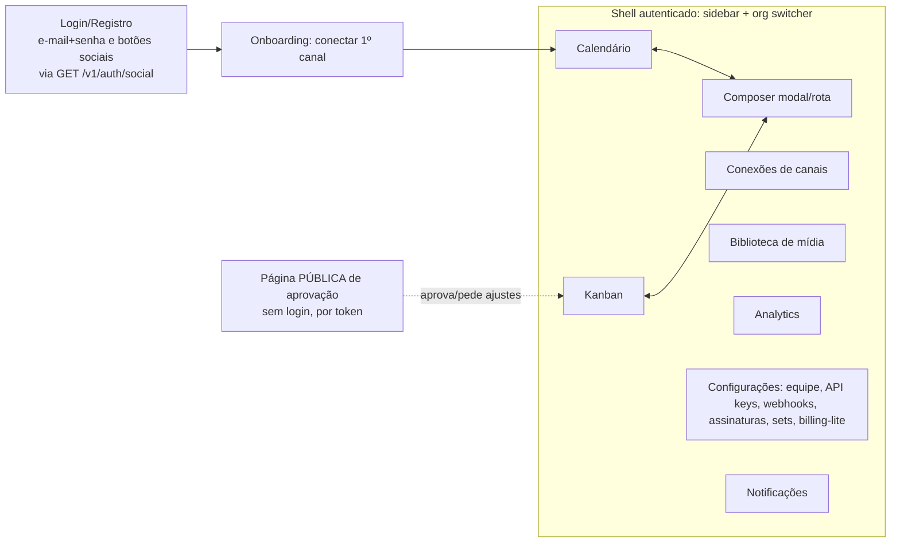

# SPEC_FRONTEND.md — manypost: web app Next.js + shadcn/ui

> **Escopo:** `apps/web` [AGPL núcleo]. Cliente da API via **OpenAPI** (não tRPC). Segue a direção do Postiz (núcleo AGPL) nas telas de composer/calendário/conexões; o kanban é design original nosso (dentro do núcleo). Depende de: SPEC_BACKEND (OpenAPI), SPEC_API_MCP (auth), SPEC_INTEGRATIONS (capacidades por provider).
>
> **Identidade visual (normativo):** todo o frontend segue `docs/brand/BRAND_SYSTEM.md` + o guia de adaptação `docs/brand/README.md` — tokens de cor, tipografia dupla (Inter + Plus Jakarta Sans), botões 3×5, radius 4/6/8px, **zero sombras**, hover estável, wordmark `manypost` minúsculo. Conflito entre esta spec e o brand system → o brand system vence no visual.

## 1. Stack e fundações

- **Next.js (App Router) + React + TypeScript**, `shadcn/ui` + Tailwind com o tema mapeado dos tokens do brand system (`--primary: var(--accent)`, `--border: var(--line)`, `--muted: var(--surface-2)`…; shadows do shadcn **anuladas** — hierarquia por borda/camada de fundo). **Light-only na v1** (a marca é light-first; dark exigirá extensão do brand system). Sem Mantine/SCSS (desvio deliberado da mistura do Postiz).
- **Cliente API gerado do OpenAPI** (`openapi-typescript` + `openapi-fetch`) publicado em `@manypost/contracts` — tipos de request/response sempre sincronizados com o backend; CI quebra se o contrato mudar.
- **TanStack Query** para dados de servidor (o Postiz usa SWR; Query dá mutações/optimistic/invalidations melhores para calendário e kanban). **Zustand** apenas para o estado do composer (mesma escolha do Postiz, que funciona bem).
- Autenticação: cookies httpOnly (access 15min/refresh 30d) — o middleware do Next só verifica presença; autorização é 100% do backend.
- i18n com `next-intl`; datas com `dayjs` + timezone do usuário (armazenamento UTC).
- Páginas autenticadas são client-heavy (SPA-like); SSR real apenas em login/páginas públicas de preview de post — lição do Postiz (o SSR do Next era pouco usado; evitamos pagar seu custo).

## 2. Mapa de telas

## 3. Telas principais

### 3.1 Calendário (*direção do Postiz*)
- Modos **semana | mês | dia | lista** (paridade com o Postiz), navegação por período, fuso do usuário.
- Cada célula mostra chips de publicação (avatar do canal + horário + estado com cor). Clique abre o composer em edição.
- **Drag-and-drop para reagendar** (`@dnd-kit` — não react-dnd): otimista com rollback se a API falhar.
- Filtros persistidos na URL: canais, tags, estados, cliente (quando modo agência existir).
- Slots sugeridos: horários preferidos do canal (`posting_times`) aparecem como marcações; botão "próximo slot livre" (equivalente ao `findFreeDateTime` do Postiz).
- Dados: `GET /v1/publications?from&to` agrupadas por grupo; polling leve (30s) + refetch on-focus.

### 3.2 Kanban (design original, núcleo AGPL)
- Colunas fixas por estado do grupo: **Rascunho → Aguardando aprovação → Agendado → Publicado / Falhou**. (Aprovação multi-estágio configurável é premium; o núcleo tem só o gate simples rascunho→aprovado, permissão de `MEMBER` vs `ADMIN`.)
- Card = grupo (conteúdo truncado, canais como avatares empilhados, horário, tags, badge de origem WEB/API/MCP).
- Drag entre colunas = transição de estado quando permitida (ex.: Falhou → Agendado = retry); transições inválidas rejeitadas com toast explicando.
- Coluna "Falhou" mostra `error_class` legível e ação "tentar novamente" por canal.

### 3.3 Composer (*direção do Postiz: global + por canal*)
- Passo 1: escolher canais (grid com busca; sets de canais em 1 clique).
- Editor **global** (TipTap; toolbar mínima: bold/italic/link/emoji/mention) + **abas por canal** com override de conteúdo e settings específicos do provider.
- Settings por canal renderizados **a partir do `settingsSchema` zod do provider** (form auto-gerado + componentes custom onde precisa — ex.: seletor de board do Pinterest). Mesmo schema valida no submit e no backend.
- Contador de caracteres por canal (`maxLength` dinâmico), validação de mídia client-side espelhando `validateMedia` (feedback imediato; o servidor revalida).
- Mídia: picker da biblioteca + upload direto (presigned URL), alt text, thumbnail de vídeo.
- Thread: itens adicionais com delay configurável (canais com `capabilities.threads`).
- Preview por rede (aproximação visual do post em cada plataforma — como o Postiz).
- Agendamento: data/hora com fuso, "publicar agora", recorrência simples, salvar rascunho.
- Assistente IA embutido (se habilitado): gerar/reescrever/encurtar, gerar imagem — via API do núcleo (SPEC_AI), mostrando créditos restantes.
- Estado: store Zustand com autosave de rascunho (debounce 2s) — não se perde conteúdo ao fechar.

### 3.4 Conexões de canais
- Grid de providers disponíveis (catálogo de `GET /v1/providers` com capacidades) + canais conectados com estado (`ACTIVE`, `REFRESH_REQUIRED` em destaque com CTA de reconexão, `DISABLED`).
- Fluxo OAuth em popup/redirect; passo 2 de seleção de conta quando `twoStepConnect`; formulário de credenciais para self-hosted (gerado do `connectionFieldsSchema`).
- Por canal: horários preferidos, apelido, cliente/grupo, desativar, excluir (com aviso de posts futuros afetados).

### 3.5 Analytics
- Por canal: cards de métricas (followers, impressões, engajamento) com variação percentual + gráfico de série (`channel_metrics` + on-demand do provider).
- Por publicação: métricas do post (quando o provider suporta) na visualização do grupo.
- Vazio elegante quando o provider não tem analytics (capacidade declarada).

### 3.6 Aprovação pública por link (DECISIONS v1.1 §12 — núcleo; gate Pro+ no gerenciado)
- Rota pública `/{locale}/approve/[token]` — **SSR real** (é a exceção junto com login/preview): sem login, sem shell autenticado.
- Mostra o preview do grupo **como será renderizado em cada rede** (mesmos componentes de preview do composer), horário agendado no fuso do aprovador, e as ações **Aprovar** / **Pedir ajustes** (com campo de comentário e nome opcional).
- Estados da página: pendente (ações ativas), já resolvido (mostra resultado, ações desativadas — ação é idempotente), expirado/revogado (mensagem neutra, sem vazar existência do conteúdo).
- Na equipe: criar/copiar/revogar o link a partir do card (kanban) ou do composer; badge "aguardando cliente" usa `--state-review`; resolução vira notificação + move o card.
- Sem qualquer dado da organização além do necessário ao preview; `noindex`; brand system aplicado (é uma vitrine do produto para o cliente da agência).

## 4. Estados e padrões de UI

- **Convenção de dados**: cada recurso tem hook próprio (`usePublications(range)`, `useChannels()`...) — 1 hook = 1 query key (mesma regra do CLAUDE.md do Postiz, que evita bugs de rules-of-hooks).
- Loading: skeletons (nunca spinner de página inteira); Empty states com CTA; erros com `error.code` traduzido + retry.
- Mutações otimistas em: reagendar (calendário), mover card (kanban), marcar notificação lida. Todo o resto pessimista com toasts.
- Realtime: SSE `GET /v1/events` (estado de publicação muda → invalida queries). Fallback: polling.
- Acessibilidade: navegação por teclado no kanban e calendário; `aria` nos drags.
- Design tokens: exclusivamente os do brand system (`docs/brand/BRAND_SYSTEM.md` §3) — nenhum hex ad-hoc. Estados de publicação usam os tokens semânticos `--state-*` propostos em `docs/brand/README.md` §3 (rascunho neutro, agendado roxo/accent, publicando âmbar, publicado verde, falha vermelho, em revisão âmbar-escuro), os mesmos em TODAS as telas e toasts.

## 5. Critérios de aceite

1. `openapi-typescript` roda no CI; nenhum `fetch` manual fora do cliente gerado (lint).
2. Fluxo E2E (Playwright): login → conectar provider fake → compor multi-canal com override → agendar → ver no calendário → mover no kanban → publicar → estado atualiza sem reload (SSE).
3. Composer restaura rascunho após fechar/reabrir; nenhuma perda de conteúdo em refresh.
4. Reagendar por drag reflete a API (rollback visível em falha simulada).
5. Todas as telas funcionam em 1280px e 375px (kanban vira lista empilhada em mobile).
6. Lighthouse a11y ≥ 95 nas telas principais.
7. **Conformidade com o brand system** (checklist de `docs/brand/README.md` §4): zero `shadow-*`, zero transform em hover, cores só via token, radius 4/6/8, fontes via `next/font`, wordmark minúsculo — verificados por lint/grep no CI.
