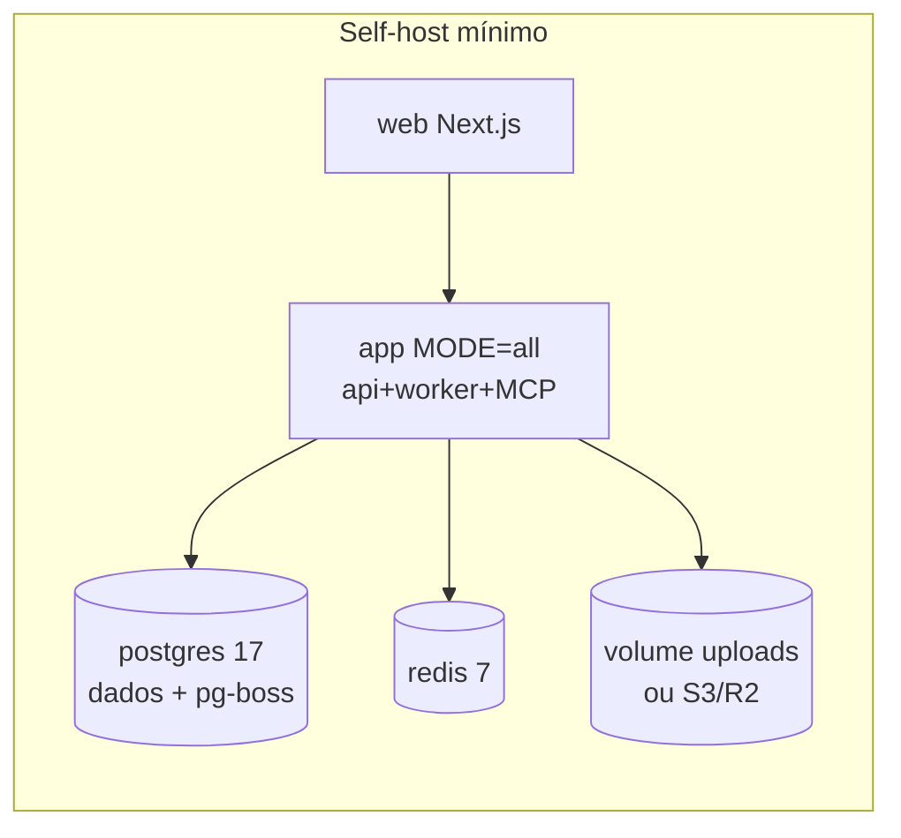

# SPEC_INFRA.md — manypost: Redis, Docker, deploy e observabilidade

> **Escopo:** infraestrutura do núcleo [AGPL]. Meta: self-host em 3 serviços (app, Postgres, Redis) — deliberadamente mais leve que o Postiz atual (que exige stack Temporal + Elasticsearch). Depende de: SPEC_QUEUE_PUBLISHING (pg-boss/rate-limit), SPEC_DATA (migrations), SPEC_ARCHITECTURE (topologia).

## 1. Papéis do Redis

| Uso | Chaves | Notas |
|---|---|---|
| Rate-limit de publicação | `rl:provider:{id}`, `rl:channel:{id}` | token bucket em Lua atômico (SPEC_QUEUE §6) |
| Rate-limit de API | `rl:api:{credencial}` | *direção do Postiz (throttler Redis)* |
| Locks distribuídos | `lock:{recurso}` | SET NX PX + fencing token (ex.: refresh de token por canal — 1 por vez) |
| Cache | `cache:mentions:{provider}:{q}`, `cache:analytics:{channel}:{range}` | TTLs curtos (1h analytics, 24h mentions) |
| Estado OAuth | `oauth:state:{state}` | TTL 10 min, single-use |
| SSE fan-out | pub/sub `events:{orgId}` | invalidações do frontend |

Redis é **descartável por design**: perder o Redis não perde dados de negócio (fila e verdade ficam no Postgres); rate limits se reconstroem. Critério de aceite explícito.

## 2. Docker

- **Imagem única multi-stage** (`oven/bun` slim): `MODE=api|worker|all` decide o processo — 1 container no self-host pequeno, split em escala (*direção do Postiz: imagem única amigável a self-host; sem o supervisor interno deles — 1 processo por container, orquestração fica fora*).
- Web: imagem própria Next standalone (ou export atrás do mesmo domínio `/`).
- `docker-compose.yml` self-host: `app (MODE=all)`, `web`, `postgres:17`, `redis:7`, volume de uploads local; healthchecks; migrations rodam no entrypoint com advisory lock.
- Tags de release semânticas + `latest`; imagens publicadas no GHCR; SBOM + scan (trivy) no CI.

## 3. Deploy

### VPS (documentado como caminho canônico do self-host)
Compose acima + Caddy (TLS automático) na frente; guia com backup (`pg_dump` diário + uploads), upgrade (pull + migrate no boot) e sizing (2 vCPU/4GB para ~10k publicações/mês).

### Railway (gerenciado/desenvolvimento)
- Serviços: `api` (MODE=api), `worker` (MODE=worker), `web`, Postgres e Redis gerenciados; variáveis por reference (`${{Postgres.DATABASE_URL}}`); `railway.toml` no repo (paridade com o Postiz, que já publica um).
- Escala: réplicas de `worker` aumentam vazão sem config extra (rate-limit é global via Redis — sem `EXCLUDE_QUEUE`/dividers manuais do Postiz).

### Config
Env tipada com zod em `packages/config` (fail-fast com mensagem clara na var faltante — equivalente melhorado do `ConfigurationChecker` do Postiz). Secrets mínimos: `DATABASE_URL`, `REDIS_URL`, `JWT_SECRET`, `ENCRYPTION_KEY` (distintos!), `PUBLIC_URL`, storage e credenciais por provider social (opcionais — provider sem env some do catálogo, como no Postiz).

## 4. Observabilidade

- **Logs estruturados JSON** (pino): `{ts, level, msg, correlationId, orgId, module, ...}`; redaction automática (`*token*`, `*secret*`, `authorization`). Correlation id: middleware gera/propaga `X-Request-Id` → use-cases → jobs (persistido no job payload) → webhooks de saída — um agendamento é rastreável do clique à publicação.
- **Métricas Prometheus** em `/metrics` (auth por token interno): HTTP (latência/status por rota), `publishing_publications_total{provider,state}`, `publishing_retry_total{class}`, `publishing_recovered_total`, `rate_limit_denied_total{provider}`, profundidade da fila por queue, créditos IA consumidos. Dashboards Grafana de referência versionados em `docker/observability/`.
- **Tracing OpenTelemetry** (OTLP exporter opcional por env): spans HTTP → use-case → provider fetch → job handler, com `correlationId` como atributo. Sem backend configurado = no-op.
- **Alertas de referência** (regras Prometheus versionadas): publicações `FAILED` > 5% em 15min; scanner recuperando > 0 constantemente (indica bug); fila > N por 10min; `REFRESH_REQUIRED` em massa (indica app OAuth quebrado).
- Sentry-compatible error reporting opcional via env (`SENTRY_DSN`) — paridade com o Postiz sem acoplar.

## 5. CI/CD (GitHub Actions)

1. **ci.yml** (PR): install (bun) → lint (+ regras de arquitetura: dependency-cruiser, greps de fronteira AGPL/premium e de provedores IA) → typecheck → testes unit/integração (services: postgres, redis) → migrations do zero → OpenAPI snapshot → build imagens.
2. **release.yml** (tag): build+push GHCR multi-arch, SBOM, changelog automático, publish `@manypost/contracts`.
3. **e2e.yml** (nightly): compose completo + Playwright + provider fake; smoke de upgrade (volume da versão anterior → head).
4. Repo premium tem CI próprio que consome `@manypost/contracts` publicado — nunca o código do núcleo.

## 6. Critérios de aceite

1. `docker compose up` do zero → onboarding funcional em < 5 min, sem variável premium.
2. Derrubar Redis com posts agendados: publicação continua (com rate-limit degradado p/ default conservador) e nada é perdido.
3. `correlationId` de um agendamento aparece em: log da api, log do worker, span OTel e entrega de webhook.
4. `/metrics` expõe as métricas do §4 e os dashboards de referência renderizam.
5. Upgrade de versão N-1 → N com migrations automáticas sem downtime perceptível (< 30s).
6. Backup/restore documentado e testado no e2e nightly.
