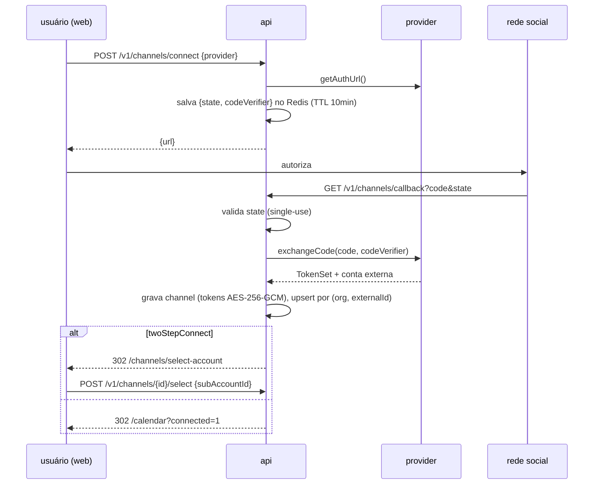

# SPEC_INTEGRATIONS.md — manypost: ChannelProvider e adaptadores por rede

> **Escopo:** contexto **Channels** [AGPL núcleo] — `packages/providers`. Segue a direção do Postiz (núcleo AGPL) no contrato do provider, nos metadados declarativos e na classificação de erros (derivação documentada em POSTIZ_ANALYSIS §8). Depende de: SPEC_QUEUE_PUBLISHING (pipeline), SPEC_DATA (tabela channels), SPEC_BACKEND (ports).

## 1. Contexto

No Postiz, um provider é uma classe que concentra OAuth + publicação + analytics + hints de UI, registrada num manager estático — desenho que escalou para 34 redes. O manypost mantém a ideia (interface única, registry, metadados declarativos) separando responsabilidades em ports componíveis e tipando `settings` com zod.

## 2. Interface `ChannelProvider`

```ts
// packages/contracts — pseudocódigo da forma final
interface ChannelProvider {
  // identidade e capacidades (declarativo)
  readonly id: string;                       // 'x', 'linkedin', 'linkedin-page', ...
  readonly name: string;
  readonly capabilities: {
    editor: 'plain' | 'rich' | 'markdown' | 'html';
    maxLength: (settings?: unknown) => number;
    media: { images: MediaRule; videos: MediaRule };   // formatos, dimensões, contagem
    threads: boolean;                       // suporta thread/comentário encadeado
    mentions: boolean;
    analytics: boolean;
    twoStepConnect: boolean;                // seleção de página/conta após OAuth
    customInstance: boolean;                // Mastodon-like (URL própria)
  };
  readonly rateDefaults: {                  // §5 de SPEC_QUEUE — defaults derivados do Postiz
    maxConcurrent: number;
    perChannelWindow?: { limit: number; windowSec: number };
  };
  readonly settingsSchema: ZodSchema;       // settings de publicação tipados
  readonly connectionFieldsSchema?: ZodSchema; // credenciais p/ self-hosted (WordPress etc.)

  // OAuth (port Auth)
  getAuthUrl(ctx): Promise<{ url: string; state: string; codeVerifier?: string }>;
  exchangeCode(ctx, { code, codeVerifier }): Promise<TokenSet & ExternalAccount>;
  refreshToken(ctx, refreshToken): Promise<TokenSet>;
  listSubAccounts?(ctx, token): Promise<ExternalAccount[]>;   // 2 passos (páginas FB, canais YT)

  // Publicação (port Publish)
  publish(ctx, token, items: PublishItem[], settings): Promise<PublishResult[]>;
  publishReply?(ctx, token, parentExternalId, item): Promise<PublishResult>;
  validateMedia(items): Promise<ValidationResult>;            // server-side, como no Postiz
  classifyError(status: number, body: string): 'transient' | 'refresh-token' | 'permanent';

  // Opcionais
  searchMentions?(ctx, token, query): Promise<Mention[]>;
  formatMention?(m: Mention): string;
  fetchAnalytics?(ctx, token, range): Promise<MetricSeries[]>;
  fetchPostAnalytics?(ctx, token, externalId): Promise<MetricSeries[]>;
}
```

`ctx` carrega `fetch` instrumentado (timeout, retry transitório, métricas, anti-SSRF), `logger`, `clock` e `secrets` do provider (client id/secret via env) — providers **nunca** usam `fetch` global nem leem env diretamente (testabilidade).

Registry: `packages/providers/index.ts` exporta a lista; o core consome via port `ChannelProviderRegistry`. Um provider novo = 1 pasta nova + registro + suíte de contrato verde (§7).

## 3. Fluxo de conexão OAuth (genérico)



Igual à direção do Postiz com três correções: state single-use com TTL, tokens cifrados at-rest (SPEC_DATA §5), e escopos verificados no callback com erro explícito `channel.missing_scopes` (o Postiz lança `NotEnoughScopes` — mantemos o conceito).

## 4. Ondas de implementação por plataforma

**Onda 1 (MVP):** Mastodon (sem gate, ideal p/ desenvolvimento), LinkedIn (pessoal + página), X, Discord, Telegram, Bluesky.
**Onda 2:** Meta (Facebook Pages, Instagram, Threads), YouTube, TikTok, Pinterest, Reddit.
**Onda 3:** GMB, Slack, WordPress, Tumblr, VK, demais conforme demanda.

### Requisitos e gates operacionais por plataforma (pré-requisito de roadmap, não código)

| Plataforma | Publicação (docs oficiais) | Gate de aprovação / custo | Impacto |
|---|---|---|---|
| **Meta (FB/IG/Threads)** | Graph API: Pages `feed/photos/videos`; IG Content Publishing (container → publish, mídia por URL pública!); Threads API | **App Review** obrigatório (permissions `pages_manage_posts`, `instagram_content_publish`...), Business Verification, screencasts | Semanas de processo; exige app em produção demonstrável. IG: mídia precisa estar em URL pública (S3/R2 com URL assinada) |
| **X (Twitter)** | API v2 `POST /2/tweets`, mídia via chunked upload (v1.1/v2) | **Custo**: Free tier ~500 posts/mês/app; Basic ~US$200/mês; write exige app aprovado no portal | **Decidido (DECISIONS §6): traga-sua-chave nos DOIS modos** (self-host e gerenciado) até demanda medida; absorção no COGS é decisão futura (P3) |
| **TikTok** | Content Posting API (`INBOX` vs `DIRECT_POST`) | **Auditoria obrigatória** para Direct Post; sem ela, posts ficam privados/rascunho | Sem auditoria não há publicação real — bloquear feature até aprovação |
| **YouTube** | Data API `videos.insert` | Quota 10k units/dia (upload = 1600); *audit* p/ aumento; vídeos de apps não verificados ficam privados até compliance | Quota é o rate-limit dominante (Postiz usa maxConcurrent=200) |
| **LinkedIn** | Posts API (`w_member_social`, `w_organization_social`) | Community Management API exige programa de parceiro p/ orgs; member post é aberto | Página corporativa pode exigir parceria |
| **Pinterest** | `POST /v5/pins` | Trial access → standard access mediante revisão | Rate baixo em trial |
| **Reddit** | `POST /api/submit` | Sem review formal; rate ~1 req/s, regras por subreddit | maxConcurrent=1 (como Postiz) |
| **Mastodon/Bluesky/Discord/Telegram/Slack** | REST aberto / app password / bot token / webhook | Sem gates | Ideais para MVP e testes E2E reais |
| **GMB** | Business Profile API | Aprovação de acesso à API (form) | Processo lento |

**Requisito operacional:** `docs/platform-gates.md` no repo rastreia o status de cada gate (conta dev, app id, review, custo) como pré-condição de release de cada provider — auditável.

## 5. Two-step connect, instâncias custom e credenciais próprias

- **2 passos** (Meta/YouTube/LinkedIn Page): estado `PENDING_ACCOUNT_SELECTION` no channel até `listSubAccounts` + seleção. *Direção do Postiz (`isBetweenSteps`).* 
- **Instância custom** (Mastodon, Lemmy): `connectionFieldsSchema` pede URL da instância; client_id/secret por instância registrados dinamicamente e cifrados.
- **Credenciais próprias** (WordPress, Bluesky app password): mesmos campos, sem OAuth — armazenadas como TokenSet cifrado.

## 6. Analytics por provider

`fetchAnalytics` on-demand com cache Redis 1h (*direção do Postiz*) **e** persistência diária em `channel_metrics` (job `analytics-cache`) para histórico — série básica (followers, impressões, engajamento). Benchmarking/comparação/alertas vivem na camada avançada do monorepo, consumindo essas séries via API de domínio e sendo controlados por `PlanPolicy` no SaaS.

## 7. Suíte de contrato de provider (qualidade)

Todo provider passa pela mesma suíte (`packages/providers/test-kit`):
1. `settingsSchema` e `connectionFieldsSchema` válidos e serializáveis para OpenAPI.
2. `getAuthUrl` → URL válida com state; `exchangeCode` com mock HTTP → TokenSet completo.
3. `publish` com mock: sucesso mapeado; 429 → `transient`; 401 → `refresh-token`; corpo inválido → `permanent`.
4. `validateMedia` rejeita/aceita fixtures canônicas (dimensões, formato, contagem).
5. Golden tests de payload: request body esperado por rede versionado em fixtures.

## 8. Critérios de aceite

1. Onda 1 completa com conexão, publicação (texto+imagem), thread onde suportado e desconexão.
2. Provider novo adicionável sem tocar no core (só pasta + registro) — validado adicionando um provider fake em teste.
3. Suíte de contrato obrigatória no CI para todo provider.
4. Tokens nunca aparecem em logs (teste de redaction) e estão cifrados no banco.
5. `docs/platform-gates.md` existe e bloqueia release de provider com gate pendente (checklist de PR).
