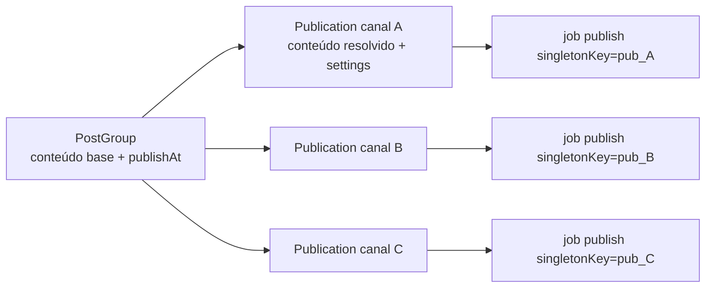
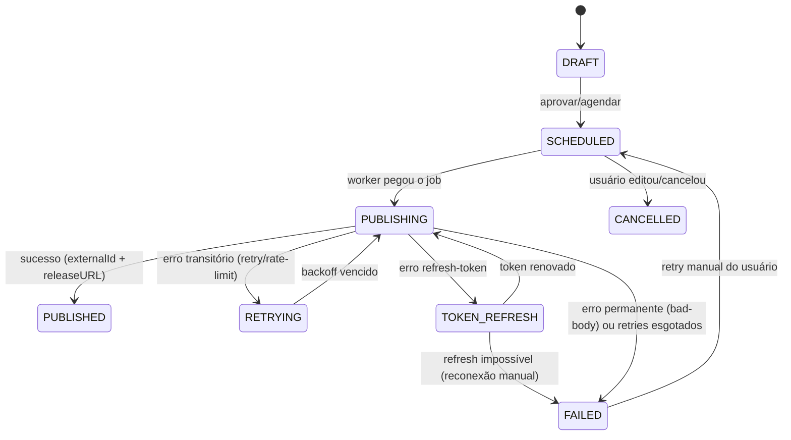

# SPEC_QUEUE_PUBLISHING.md — manypost: fila e pipeline de publicação

[← Índice da documentação](../README.md) · [STATUS do projeto](../principal/STATUS.md) · [Decisões](../principal/DECISIONS.md) · [README do projeto](../../README.md)

> **Escopo:** contexto **Publishing** [AGPL núcleo]. É a spec mais crítica do sistema. Segue a direção do Postiz (núcleo AGPL) no desenho do pipeline, na taxonomia de erros e na recuperação; diverge na tecnologia de fila. Depende de: SPEC_DATA (tabelas), SPEC_INTEGRATIONS (providers), SPEC_BACKEND (use-cases), SPEC_INFRA (Redis).

## 1. Contexto e lições do Postiz

O Postiz começou com BullMQ e **migrou para Temporal** — evidência forte de que o domínio exige: (a) timers duráveis de dias/semanas; (b) retry com estado e histórico; (c) idempotência por identidade de execução; (d) concorrência global por provider; (e) recuperação de execuções perdidas. O manypost reimplementa **essas garantias** (a direção), escolhendo infraestrutura mais leve para o self-host.

## 2. Avaliação: Temporal vs River vs pg-boss vs NATS JetStream vs BullMQ

| Critério | Temporal | River | pg-boss | NATS JetStream | BullMQ |
|---|---|---|---|---|---|
| Timer durável longo (semanas) | ✅ nativo | ✅ (`scheduled_at`) | ✅ (`startAfter`, job no Postgres) | ⚠️ inexistente p/ delay longo (gambiarras) | ⚠️ delayed jobs em Redis (perda se Redis falhar; fila de delayed degrada com volume) |
| Enfileirar na MESMA transação do domínio | ❌ (RPC externo) | ✅ (mesmo PG) | ✅ **(mesmo PG, mesma tx)** | ❌ | ❌ |
| Retry/backoff configurável | ✅ rico | ✅ | ✅ (retryLimit, backoff exponencial) | ✅ (redelivery) | ✅ |
| Idempotência/dedup | ✅ workflow id | ✅ unique | ✅ `singletonKey` | ⚠️ msg-id window | ⚠️ jobId |
| Cancelamento de agendado | ✅ terminate | ✅ | ✅ cancel por id/singleton | ⚠️ | ✅ remove |
| Rate-limit por recurso | ⚠️ via concorrência de queue | ❌ (manual) | ❌ (manual) | ⚠️ | ✅ limiter por queue (global) |
| Infra extra p/ self-host | 🚨 server + PG próprio + Elasticsearch + UI | Go binário (workers em Go — **mismatch de stack**) | **zero** (usa o Postgres do app) | servidor NATS | Redis (já temos, mas vira fonte de verdade de jobs) |
| Compatibilidade Bun | 🚨 `@temporalio/worker` é Node+Rust/napi, não suportado oficialmente em Bun | cliente TS ok, worker Go | ✅ JS puro + driver pg | ✅ | ⚠️ ioredis ok, mas worker pesado |
| Observabilidade | ✅ excelente (UI) | ✅ boa | ⚠️ tabelas SQL (fácil de expor) | ⚠️ | ⚠️ |

**Decisão: pg-boss** como fila do núcleo, por três razões decisivas:
1. **Transacionalidade** — agendar post e enfileirar job na *mesma transação Postgres* elimina a classe inteira de bugs "linha criada sem job / job sem linha" (que o Postiz mitiga com o scanner de posts perdidos; nós teremos scanner **e** outbox).
2. **Self-host mínimo** — zero containers extras; o operador do núcleo AGPL roda só Postgres+Redis (o Temporal do Postiz adiciona 4 containers, incl. Elasticsearch).
3. **Bun-safe** — JS puro sobre o driver pg.

O que o pg-boss **não** dá e será construído por cima (é o trabalho desta spec): rate-limit por conta/rede (Redis token bucket, §6), máquina de estados por publicação (§4), recuperação ativa (§8). A interface é o port `JobScheduler`.

> **Decisão ratificada (DECISIONS v1 §2):** pg-boss no núcleo AGPL; o gerenciado **pode** adotar um adapter Temporal Cloud na v2+ sem tocar o domínio — a rota de fuga é requisito do port, coberta por teste de contrato do `JobScheduler`.

## 3. Modelo: post agendado → N publicações

Seguindo a direção do Postiz (1 linha por canal), com nome explícito: o agregado **Publication** é a unidade de execução.

Cada Publication tem seu próprio job, seu próprio status e seus próprios erros — falha no canal B não afeta A e C (comportamento do Postiz preservado).

## 4. Máquina de estados por publicação

Estende os 4 estados do Postiz (`QUEUE/PUBLISHED/ERROR/DRAFT`) para dar visibilidade operacional:

Transições são **UPDATEs condicionais** (`WHERE state = $expected`) — proteção contra dois workers no mesmo job (fencing). Toda transição grava `publication_events` (histórico consultável, substituto leve do histórico do Temporal).

## 5. Idempotência e outbox

- `singletonKey = publicationId` no pg-boss: 1 job ativo por publicação, sempre. Re-agendar = `cancel` + novo enqueue (equivalente ao `TERMINATE_EXISTING` do Postiz).
- **Chave de idempotência na rede**: antes de chamar o provider, o worker grava `attempt_id` na publication; se o worker morrer após publicar e antes de confirmar, a re-execução consulta `provider.findRecentPost?` (quando a rede permite) ou aplica janela de dedup por conteúdo-hash nas últimas 24h; se indeterminado, marca `NEEDS_REVIEW` em vez de repostar. (Dupla publicação é o pior failure mode do domínio — nunca repostar às cegas.)
- Enqueue sempre dentro da transação que muda o estado (outbox nativo por a fila SER o Postgres).
  > **Nota de implementação (fase 0):** o enqueue atual é pós-commit (a API pública do pg-boss v10 não expõe executor transacional); a linha da publication é a fonte de verdade e o scanner (§8) + fencing de estados garantem entrega sem duplicação — coberto por teste. Insert transacional direto na tabela do pg-boss fica como melhoria rastreada.

## 6. Rate-limit por conta e por rede

O Postiz usa concorrência de fila por provider (X=1, Reddit=1, LinkedIn=2, Pinterest=3, YouTube=200, Instagram=400, Facebook=500 — mapa que seguimos como default, núcleo AGPL). O manypost implementa **dois níveis reais** via Redis (algoritmo token bucket, script Lua atômico):

1. **Por provider global** (`rl:provider:{id}`): N publicações simultâneas + X por janela (ex.: X/Twitter: 1 concorrente, máx 300/3h por app).
2. **Por conta conectada** (`rl:channel:{channelId}`): janelas da rede por usuário (ex.: Instagram ~25 posts/24h/conta, LinkedIn ~150/dia) — defaults por provider, sobrescrevíveis.

Worker, ao pegar job: tenta adquirir tokens; se negado, reagenda o job para `now + retryAfter` (sem consumir retry) e registra métrica. `Retry-After` de respostas 429 alimenta o bucket. Isso é **mais correto** que o proxy por concorrência do Postiz e funciona com N réplicas de worker sem `EXCLUDE_QUEUE`/divisores manuais.

## 7. Retry, backoff e classificação de erros

Taxonomia derivada do Postiz (núcleo AGPL): todo erro do provider é classificado em

| Classe | Exemplos | Ação |
|---|---|---|
| `transient` | 429, 5xx, timeout, rede | retry com backoff exponencial + jitter (30s, 2m, 8m, 30m, 2h — máx 5), respeitando `Retry-After` |
| `refresh-token` | 401, token expirado (padrões por provider via `classifyError`) | 1 refresh + retry imediato; falhou → `FAILED` + `channel.refresh_required` + notificação |
| `permanent` (`bad-body`) | mídia rejeitada, texto longo, política da rede | `FAILED` imediato, erro legível + corpo da resposta truncado (4k) persistido |

Cada provider implementa `classifyError(status, body)` (equivalente ao `handleErrors` do Postiz). O pipeline de thread/comentários: itens já publicados de uma thread **não** são republicados no retry — o cursor (`lastPublishedIndex`) fica na publication.

## 8. Recuperação de falha

1. **Scanner de perdidos** (job cron a cada 5 min): `SELECT` publications `SCHEDULED` com `publishAt < now() - interval '3 min'` sem job ativo → re-enqueue + métrica `publishing_recovered_total`. *Seguindo a direção do Postiz (missing-posts das últimas 3h), núcleo AGPL.*
2. **Zumbis**: `PUBLISHING`/`TOKEN_REFRESH` com `updated_at < now() - 15 min` → aplicar protocolo de idempotência do §5 (verificar antes de repostar).
3. pg-boss `expireInSeconds`/`retentionDays` configurados; jobs mortos vão para `failed` e alarmam.
4. Tudo re-executável manualmente pela UI (botão "tentar novamente" em `FAILED`).

## 9. Outros jobs do sistema (mesma infraestrutura)

| Job | Gatilho | Observações |
|---|---|---|
| `publish` | `startAfter=publishAt` | pipeline principal |
| `publish-thread-item` | encadeado | delay configurável entre itens |
| `refresh-token` | cron por provider com `refreshCron` | proativo, antes de `tokenExpiration` |
| `recover-scan` | cron 5 min | §8 |
| `recurrence` | ao publicar com `recurrence` | cria próximo PostGroup (equivalente ao child workflow do Postiz) |
| `webhook-delivery` | outbox `post.published`/`post.failed` | retries próprios, assinatura HMAC |
| `analytics-cache` | cron/demanda | SPEC_INTEGRATIONS §6 |
| `media-process` | upload | thumbnail, conversão (ex.: JPEG p/ redes que exigem) |

## 10. Critérios de aceite

1. Agendar post para +30 dias, derrubar e religar o worker: publica no horário (±1 min).
2. Matar o worker no meio de uma publicação: nenhuma dupla publicação (teste com provider fake que confirma na segunda chamada).
3. 100 publicações simultâneas para provider com limite 1: execução serializada, nenhuma perda, ordem por `publishAt`.
4. Erro 429 com `Retry-After: 120`: próximo attempt ≥ 120s.
5. Token expirado: refresh automático 1x; refresh falho → `FAILED` + notificação + canal marcado `refresh_required`.
6. Editar post agendado: job antigo cancelado, novo criado (nunca dois jobs ativos por publication — invariante testada).
7. Apagar a fila inteira (tabela pg-boss): scanner recupera 100% dos `SCHEDULED` futuros em ≤ 5 min.
8. Dashboard/endpoint expõe: fila por provider, publicações por estado, taxa de erro por classe.

---

**Specs irmãs:** [ARCHITECTURE](SPEC_ARCHITECTURE.md) · [BACKEND](SPEC_BACKEND.md) · [FRONTEND](SPEC_FRONTEND.md) · [DATA](SPEC_DATA.md) · [INTEGRATIONS](SPEC_INTEGRATIONS.md) · [API_MCP](SPEC_API_MCP.md) · [AI](SPEC_AI.md) · [INFRA](SPEC_INFRA.md) · [ROADMAP](SPEC_ROADMAP.md)

**Navegação:** [Índice da documentação](../README.md) · [STATUS](../principal/STATUS.md) · [Decisões](../principal/DECISIONS.md) · [Marca](../brand/BRAND_SYSTEM.md) · [README do projeto](../../README.md) · [Contribuir](../../CONTRIBUTING.md)
