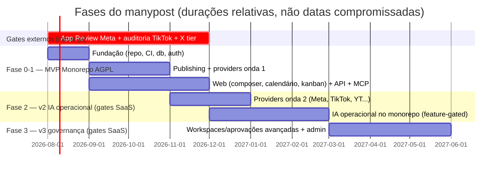

# SPEC_ROADMAP.md — manypost: fases de entrega

[← Índice da documentação](../README.md) · [STATUS do projeto](../principal/STATUS.md) · [Decisões](../principal/DECISIONS.md) · [README do projeto](../../README.md)

> **Escopo:** sequenciamento de MVP → v2 → v3, com critérios de saída por fase. As fases respeitam o controle de portas comerciais (SPEC_ARCHITECTURE) e os gates de plataforma (SPEC_INTEGRATIONS §4), que têm lead time próprio e devem ser iniciados **no dia 1**.

## Fase 0 — Fundação (Monorepo AGPL)

Repo `manypost` com estrutura da SPEC_ARCHITECTURE §4, `NOTICE`/`ATTRIBUTION.md`, CI completo (lint de fronteiras, testes, migrations, OpenAPI snapshot), schema inicial (SPEC_DATA), auth JWT access/refresh + API keys, env tipada (`IS_SELF_HOSTED`, `HIDE_BILLING`), compose self-host, provider **fake** (rede social simulada para dev/testes E2E).

Tarefas não-código da fase 0 (caminho crítico externo):
- Abrir App Review Meta, auditoria TikTok, portal do X, quota YouTube (SPEC_INTEGRATIONS §4).
- **✅ RESOLVIDO P1 (DECISIONS §1c e v1.2): licença AGPL-3.0 no monorepo** — `@manypost/contracts` está licenciado como open source junto com toda a aplicação.

**Saída:** compose sobe; login; conectar provider fake; CI verde com as regras de arquitetura ativas.

## Fase 1 — MVP monorepo (AGPL): publicar + agendar + kanban + API + MCP

- **Publishing completo** (SPEC_QUEUE): pipeline, estados, retry/backoff, rate-limit Redis, idempotência anti-dupla-publicação, scanner de recuperação, webhooks de saída.
- **Providers onda 1** (SPEC_INTEGRATIONS): Mastodon, LinkedIn, X, Discord, Telegram, Bluesky — com suíte de contrato.
- **Web** (SPEC_FRONTEND): onboarding, conexões, composer global/por-canal, calendário (4 modos, drag), **kanban**, notificações, configurações (equipe básica, API keys, webhooks).
- **Aprovação por link público** (DECISIONS v1.1 §12): token + página pública de preview + aprovar/pedir adjustments — liberado no self-hosted, feature Pro+ no SaaS.
- **API pública + MCP** (SPEC_API_MCP): recursos de posts/channels/media/analytics, OAuth p/ MCP, tools de agendamento.
- **IA de criação** (SPEC_AI): legenda/reescrita/hashtags/alt text com créditos e `AI_PROVIDER=none` suportado; `ai.bestTimes` (heurística, sem LLM).
- Analytics on-demand + série diária básica.

**Saída (critérios de aceite do MVP):** os critérios de aceite de todas as specs do monorepo verdes; um usuário self-host publica em 6 redes reais via web, API e MCP; E2E nightly verde; release `v1.0` com imagens públicas.

**Posicionamento do MVP (DECISIONS §5):** a onda 1 **valida e capta** early adopters (dev/open-source; LinkedIn/X/Bluesky/Mastodon). O público principal — criador brasileiro, que vive de Instagram e TikTok — só é atendido na onda 2: tratar Instagram/TikTok como **o marco que "abre" o produto**, e comunicar o MVP como acesso antecipado, não como produto completo para criadores. X: traga-sua-chave no self-host; no gerenciado o plano Pro **inclui X** (DECISIONS v1.1 §13 — com sub-limite de uso justo e monitoramento do teto do app, PLANS §4).

## Fase 2 — v2: onda 2 de providers + IA operacional (Monorepo Open Source / gates SaaS)

- **Providers:** Meta/Instagram/Threads, YouTube, TikTok, Pinterest, Reddit; ingestão de menções (`mention.received`) onde a API permitir; séries de analytics enriquecidas.
- **IA Operacional (monorepo 100% open source — escopo = lista do plano Premium no SaaS):** respostas de comentários/DMs com aprovação humana, classificação/roteamento de mensagens, relatórios de campanha, alerta de perda de engajamento, otimização do calendário semanal — com enforcement comercial via `PlanPolicy` no SaaS ou BYO-key em modo `IS_SELF_HOSTED=true`. Governador de custo com teto por org/operação via BudgetGuard.
- Billing do SaaS e planos com franquia de créditos (ativo quando `IS_SELF_HOSTED=false`).

**Saída:** monorepo unificado executando localmente (`IS_SELF_HOSTED=true`) ou como SaaS com cobrança (`IS_SELF_HOSTED=false`).

## Fase 3 — v3: governança e workspaces (Monorepo Open Source / gates SaaS)

- Workspaces hierárquicos (org → times → clientes), papéis customizados, fluxos de aprovação multi-estágio com trilha completa, políticas por canal/horário/conteúdo via `PlanPolicy`, auditoria estendida com exportação, SSO/SAML.
- Admin do gerenciado: métricas por tenant, suspensão, suporte.

**Saída:** conta enterprise com aprovação em 2 estágios operando; em modo `IS_SELF_HOSTED=true` todas as capacidades são liberadas para a comunidade sem restrição.

## Riscos e mitigação

| Risco | Mitigação |
|---|---|
| Gates de plataforma (Meta/TikTok/X) atrasam onda 2 | iniciar processos na fase 0; MVP com onda 1 sem gates; self-host usa keys do operador |
| Maturidade do Bun em produção | Hono é portável a Node (SPEC_BACKEND §2); CI roda a suíte também em Node 1x/semana |
| Dupla publicação | protocolo do SPEC_QUEUE §5 + testes de kill do worker como gate de release |
| Monorepo 100% aberto regride para uma dependência fechada | lints de CI (`dependency-cruiser` / `grep -rn "@manypost-premium"`) + revisão em PRs |
| Escopo do composer explodir | paridade Postiz primeiro (global + per-canal + preview); recursos extras só pós-MVP |

---

**Specs irmãs:** [ARCHITECTURE](SPEC_ARCHITECTURE.md) · [BACKEND](SPEC_BACKEND.md) · [FRONTEND](SPEC_FRONTEND.md) · [DATA](SPEC_DATA.md) · [QUEUE_PUBLISHING](SPEC_QUEUE_PUBLISHING.md) · [INTEGRATIONS](SPEC_INTEGRATIONS.md) · [API_MCP](SPEC_API_MCP.md) · [AI](SPEC_AI.md) · [INFRA](SPEC_INFRA.md)

**Navegação:** [Índice da documentação](../README.md) · [STATUS](../principal/STATUS.md) · [Decisões](../principal/DECISIONS.md) · [Marca](../brand/BRAND_SYSTEM.md) · [README do projeto](../../README.md) · [Contribuir](../../CONTRIBUTING.md)
