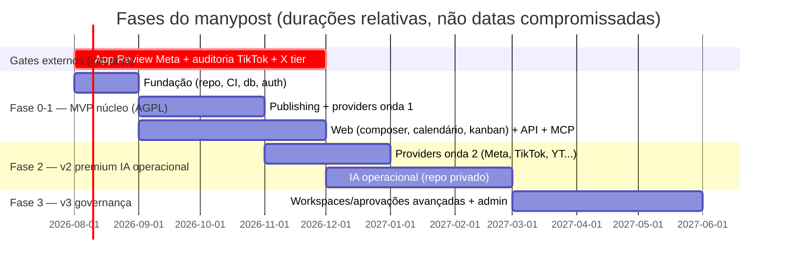

# SPEC_ROADMAP.md — manypost: fases de entrega

> **Escopo:** sequenciamento de MVP → v2 → v3, com critérios de saída por fase. As fases respeitam a fronteira AGPL/premium (SPEC_ARCHITECTURE) e os gates de plataforma (SPEC_INTEGRATIONS §4), que têm lead time próprio e devem ser iniciados **no dia 1**.

## Fase 0 — Fundação (núcleo AGPL)

Repo `manypost` com estrutura da SPEC_ARCHITECTURE §4, `NOTICE`/`ATTRIBUTION.md`, CI completo (lint de fronteiras, testes, migrations, OpenAPI snapshot), schema inicial (SPEC_DATA), auth JWT access/refresh + API keys, env tipada, compose self-host, provider **fake** (rede social simulada para dev/testes E2E).

Tarefas não-código da fase 0 (caminho crítico externo):
- Abrir App Review Meta, auditoria TikTok, portal do X, quota YouTube (SPEC_INTEGRATIONS §4).
- **P1 (DECISIONS §1c): validação jurídica da licença dos contratos** — até o parecer, `@manypost/contracts` fica não-publicado e restrito a tipos/schemas.

**Saída:** compose sobe; login; conectar provider fake; CI verde com as regras de arquitetura ativas.

## Fase 1 — MVP núcleo (AGPL): publicar + agendar + kanban + API + MCP

- **Publishing completo** (SPEC_QUEUE): pipeline, estados, retry/backoff, rate-limit Redis, idempotência anti-dupla-publicação, scanner de recuperação, webhooks de saída.
- **Providers onda 1** (SPEC_INTEGRATIONS): Mastodon, LinkedIn, X, Discord, Telegram, Bluesky — com suíte de contrato.
- **Web** (SPEC_FRONTEND): onboarding, conexões, composer global/por-canal, calendário (4 modos, drag), **kanban**, notificações, configurações (equipe básica, API keys, webhooks).
- **Aprovação por link público** (DECISIONS v1.1 §12): token + página pública de preview + aprovar/pedir ajustes — feature Pro do gerenciado, código no núcleo.
- **API pública + MCP** (SPEC_API_MCP): recursos de posts/channels/media/analytics, OAuth p/ MCP, tools de agendamento.
- **IA de criação** (SPEC_AI): legenda/reescrita/hashtags/alt text com créditos e `AI_PROVIDER=none` suportado; `ai.bestTimes` (heurística, sem LLM).
- Analytics on-demand + série diária básica.

**Saída (critérios de aceite do MVP):** os critérios de aceite de todas as specs de núcleo verdes; um usuário self-host publica em 6 redes reais via web, API e MCP; E2E nightly verde; release `v1.0` com imagens públicas.

**Posicionamento do MVP (DECISIONS §5):** a onda 1 **valida e capta** early adopters (dev/open-source; LinkedIn/X/Bluesky/Mastodon). O público principal — criador brasileiro, que vive de Instagram e TikTok — só é atendido na onda 2: tratar Instagram/TikTok como **o marco que "abre" o produto**, e comunicar o MVP como acesso antecipado, não como produto completo para criadores. X: traga-sua-chave no self-host; no gerenciado o plano Pro **inclui X** (DECISIONS v1.1 §13 — com sub-limite de uso justo e monitoramento do teto do app, PLANS §4).

## Fase 2 — v2: onda 2 de providers + IA operacional (premium)

- **Núcleo:** providers Meta/Instagram/Threads, YouTube, TikTok, Pinterest, Reddit (dependem dos gates da fase 0 — se App Review atrasar, lançar atrás de flag "beta por operador", já que no self-host cada operador usa as próprias keys); ingestão de menções (`mention.received`) onde a API permitir; séries de analytics enriquecidas.
- **Código fechado (repo privado, original) — escopo = lista do plano Premium em `docs/PLANS.md`:** respostas de comentários/DMs com aprovação humana, classificação/roteamento de mensagens, relatórios de campanha, alerta de perda de engajamento, otimização do calendário semanal (benchmarking/concorrentes na sequência, PL4) — tudo consumindo só `@manypost/contracts` + webhooks; governador de custo com teto por org/operação (SPEC_AI §4).
- Billing do gerenciado (premium) e planos com franquia de créditos.

**Saída:** premium deployável contra um núcleo self-hosted intocado (prova da fronteira); primeiros clientes gerenciados.

## Fase 3 — v3: governança e workspaces (premium)

- Workspaces hierárquicos (org → times → clientes), papéis customizados, fluxos de aprovação multi-estágio com trilha completa, políticas por canal/horário/conteúdo (via extension point de policy check do núcleo), auditoria estendida com exportação, SSO/SAML.
- Admin do gerenciado: métricas por tenant, suspensão, suporte.

**Saída:** conta enterprise com aprovação em 2 estágios operando; núcleo AGPL permanece 100% funcional sem nada disso.

## Riscos e mitigação

| Risco | Mitigação |
|---|---|
| Gates de plataforma (Meta/TikTok/X) atrasam onda 2 | iniciar processos na fase 0; MVP com onda 1 sem gates; self-host usa keys do operador |
| Maturidade do Bun em produção | Hono é portável a Node (SPEC_BACKEND §2); CI roda a suíte também em Node 1x/semana |
| Dupla publicação | protocolo do SPEC_QUEUE §5 + testes de kill do worker como gate de release |
| Fronteira AGPL/premium contaminada | lints de CI + revisão obrigatória em PRs que tocam `contracts` |
| Escopo do composer explodir | paridade Postiz primeiro (global + per-canal + preview); recursos extras só pós-MVP |
